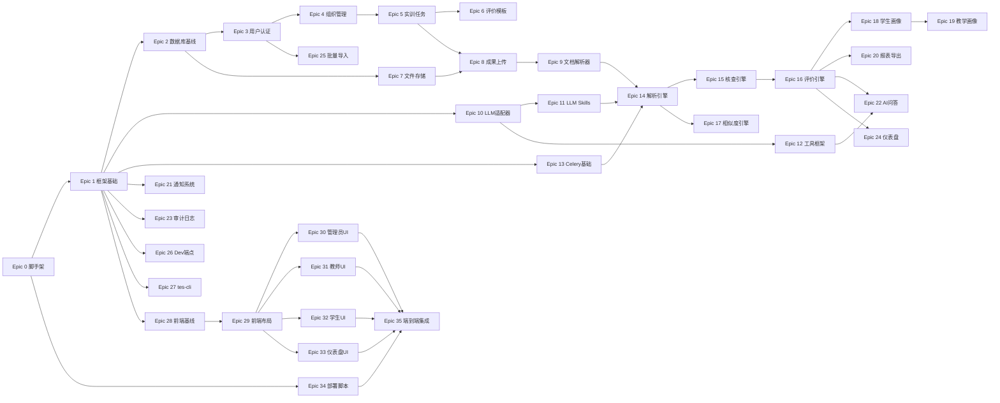

# Implementation Plan

## Overview

智能实训评价管理系统的完整实施任务清单。每个 Task 都附带可自动化的测试验收标准。所有 Task 遵循统一模板（Given-When-Then），并按架构分层匹配测试类型（Domain 单元 / Application 编排 / Infrastructure 集成 / Interface 契约）。

总 Epic 数：36，预估 Task 数：220+。

## 阅读说明

本文档按 Epic 组织，每个 Epic 包含若干 Task。Task 是最小工作单元，**对应一次可独立提交的 PR**。

### Epic 总览

| Epic | 内容 | 大致 Task 数 |
|------|------|------------|
| Epic 0  | 项目脚手架（前后端工程初始化） | 8 |
| Epic 1  | 核心框架基础设施（配置/日志/加密/中间件） | 10 |
| Epic 2  | 数据库基线（SQLAlchemy/Alembic/连接池） | 5 |
| Epic 3  | 用户与认证（含锁定与会话） | 9 |
| Epic 4  | 组织管理（课程/班级/学生归属） | 7 |
| Epic 5  | 实训任务（状态机+维度+权重校验） | 8 |
| Epic 6  | 评价模板库 | 5 |
| Epic 7  | 文件存储抽象 | 4 |
| Epic 8  | 实训成果上传（含断点续传/SHA256） | 8 |
| Epic 9  | 文档解析器层（Parser Protocol + 实现） | 6 |
| Epic 10 | LLM 抽象适配器（含重试/熔断/Metrics） | 8 |
| Epic 11 | LLM Skills 框架（注册/版本/Golden Set） | 6 |
| Epic 12 | Function Calling 工具框架 | 6 |
| Epic 13 | Celery 异步任务基础 | 5 |
| Epic 14 | 解析引擎主流程 | 7 |
| Epic 15 | 智能核查引擎 | 6 |
| Epic 16 | 评价引擎（评分计算+评价 API） | 9 |
| Epic 17 | 相似度检测引擎（SimHash + pgvector） | 7 |
| Epic 18 | 学生薄弱点画像 | 5 |
| Epic 19 | 教学质量画像（含物化视图） | 5 |
| Epic 20 | 报表生成与导出（PDF/Excel） | 6 |
| Epic 21 | 通知系统 | 6 |
| Epic 22 | AI 问答助手（Function Calling 编排） | 8 |
| Epic 23 | 审计日志（含 DB 触发器） | 6 |
| Epic 24 | 仪表盘聚合 | 4 |
| Epic 25 | 批量导入导出 | 5 |
| Epic 26 | Dev 调试端点 + Fakes | 8 |
| Epic 27 | tes-cli 管理工具 | 7 |
| Epic 28 | 前端基线（Vite+Tailwind+shadcn-vue） | 8 |
| Epic 29 | 前端认证与布局 | 6 |
| Epic 30 | 前端管理员模块 | 7 |
| Epic 31 | 前端教师模块（批改工作台为重点） | 9 |
| Epic 32 | 前端学生模块（含 AI 问答 UI） | 8 |
| Epic 33 | 前端仪表盘与图表 | 5 |
| Epic 34 | 部署脚本与 LoongArch 验证 | 6 |
| Epic 35 | 端到端集成与赛题交付物 | 6 |

**总计预估**：220+ Task

---

## Task 编写约定

### 统一模板

每个 Task 遵循以下结构：

```
### Task X.Y: <动词起始的简短任务名>

- **所属 Epic**: Epic X
- **架构层**: Domain | Application | Infrastructure | Interface | Frontend | DevOps
- **前置依赖**: Task A.B, Task C.D（可并行则标"无"）
- **关联需求**: 需求 N.N
- **关联设计章节**: <章节锚点>

#### 实施要点
- 文件位置: <相对路径>
- 关键接口/类: <名称与签名>
- 关键约束: <提示>

#### 测试验收标准

**主路径 (Happy Path)**
- **Given**: <具体数据状态>
- **When**: <精确到方法签名的调用>
- **Then**: <可执行的断言>

**异常路径 (Error Path)**
- **Given**: ...
- **When**: ...
- **Then**: <抛出指定异常或返回指定错误码>

**边界路径 (Boundary Path)**
- **Given**: <空值/最大值/并发/时序颠倒>
- **When**: ...
- **Then**: ...

#### 测试文件位置
- Unit: `tests/unit/test_<module>.py::test_<task>_<scenario>`
- Integration（如有）: `tests/integration/...`
- Contract（接口层）: `tests/contract/...`

#### 验收检查清单
- [ ] 所有 Given-When-Then 已翻译为具体测试代码
- [ ] 边界值已列出具体输入
- [ ] 异常类型已精确到类名
- [ ] 不依赖未完成的下游 Task
- [ ] 业务代码 mypy --strict 通过
- [ ] 结构化日志覆盖入口/出口/异常/关键决策点
- [ ] 配置全部外置（`Settings` 或 `system_config`）
```

### 测试数据约定

**所有测试数据必须通过 Factory 生成**，禁止在测试代码或 Task 描述里写死字面值。

约定如下 Factory（在 `tests/factories/` 提供）：

| Factory | 默认产出 |
|---------|---------|
| `UserFactory` | `User(role="student", is_active=True, ...)` |
| `TeacherFactory` | `User(role="teacher")` |
| `AdminFactory` | `User(role="admin")` |
| `CourseFactory` | `Course(is_archived=False)` |
| `ClassFactory` | `Class(course=CourseFactory(), teacher=TeacherFactory())` |
| `TrainingTaskFactory` | `TrainingTask(status="published", deadline=now+7d)` |
| `DimensionFactory` | `Dimension(weight=随机使总和=100)` |
| `UploadFactory` | `Upload(file_type="docx", size=10000, status="parsed")` |
| `EvaluationFactory` | 完整评分（每维度 obj=80/subj=85） |
| `LLMResponseFactory` | 预设 LLM 返回 JSON |

**调用示例**：`student = UserFactory.create(role="student", failed_login_count=4)`。

### 异常类约定

业务代码所有异常继承自 `app.core.exceptions.BusinessError`，HTTP 层统一捕获。

| 异常类 | HTTP 映射 | 触发场景 |
|-------|----------|---------|
| `ValidationFailedError` | 422 | Pydantic 校验失败 |
| `AuthenticationError` | 401 | 未登录或 token 无效 |
| `AuthorizationError` | 403 | 角色不足或越权 |
| `ResourceNotFoundError` | 404 | 资源不存在 |
| `ConflictError` | 409 | 状态冲突（如重复提交）|
| `BusinessRuleError` | 400 | 业务规则违反（含 error_code）|
| `RateLimitedError` | 429 | 超限 |
| `ExternalServiceError` | 503 | LLM/OCR 不可用 |

### 验收前提

**任何 Task 在以下任一情形不通过**视为未完成：

- ruff check 报错
- mypy --strict 报错
- 单元测试失败
- 测试覆盖率低于约定（核心算法 100%、其他 ≥70%）
- 缺少结构化日志
- 配置硬编码

---


## Task Dependency Graph

按依赖关系将 Epic 切成可并行的"波次"（wave）。同一 wave 内 Epic 可并行开发，下一 wave 必须等上一 wave 完成。

```json
{
  "waves": [
    {
      "id": "wave-1",
      "epics": ["E0"],
      "description": "项目脚手架，前后端工程初始化"
    },
    {
      "id": "wave-2",
      "epics": ["E1", "E2", "E28"],
      "description": "核心框架、数据库基线、前端基线（可并行）"
    },
    {
      "id": "wave-3",
      "epics": ["E3", "E7", "E10", "E13", "E26", "E27", "E29"],
      "description": "用户认证、文件存储、LLM 适配器、Celery、Dev 端点、CLI、前端布局"
    },
    {
      "id": "wave-4",
      "epics": ["E4", "E11", "E12", "E21", "E23", "E25"],
      "description": "组织管理、Skills、Tools、通知、审计、批量导入"
    },
    {
      "id": "wave-5",
      "epics": ["E5", "E6", "E9"],
      "description": "实训任务、评价模板、文档解析器"
    },
    {
      "id": "wave-6",
      "epics": ["E8"],
      "description": "成果上传"
    },
    {
      "id": "wave-7",
      "epics": ["E14"],
      "description": "解析引擎主流程"
    },
    {
      "id": "wave-8",
      "epics": ["E15", "E17"],
      "description": "核查引擎、相似度引擎"
    },
    {
      "id": "wave-9",
      "epics": ["E16"],
      "description": "评价引擎"
    },
    {
      "id": "wave-10",
      "epics": ["E18", "E20", "E22", "E24"],
      "description": "学生画像、报表、AI 问答、仪表盘"
    },
    {
      "id": "wave-11",
      "epics": ["E19", "E30", "E31", "E32", "E33", "E34"],
      "description": "教学画像、前端各模块、部署脚本"
    },
    {
      "id": "wave-12",
      "epics": ["E35"],
      "description": "端到端集成与赛题交付物"
    }
  ]
}
```



## Tasks


## Epic 0: 项目脚手架

建立后端 Python 项目结构、前端 Vue 项目结构、Git 仓库、CI 占位。所有后续 Epic 必须在此基础上展开。

- [x] 0.1. 初始化后端 Python 项目骨架

  **架构层**: DevOps  
  **前置依赖**: 无  
  **关联需求**: 需求 1.3  
  **关联设计章节**: Project Structure - backend/

  **实施要点**

  - 使用 `pyproject.toml` 管理依赖，禁止 `requirements.txt`
  - Python ≥ 3.10，目标 LoongArch 兼容
  - 创建空目录骨架（含 `__init__.py`）：`app/{api,core,schemas,models,repositories,services,llm,tasks,parsers,reporting,storage,utils}`
  - 配置 ruff、mypy、pytest 三件套
  - 安装核心依赖：`fastapi`、`uvicorn[standard]`、`pydantic`、`pydantic-settings`、`sqlalchemy[asyncio]`、`alembic`、`structlog`、`celery[redis]`、`httpx`、`pytest`、`pytest-asyncio`、`mypy`、`ruff`

  **测试验收标准**

  _主路径 (Happy Path)_
  - **Given**: 全新克隆的仓库根目录
  - **When**: 执行 `cd backend && pip install -e ".[dev]" && python -c "import app"`
  - **Then**: 命令退出码 == 0，且 `app` 包成功导入无 ImportError

  _异常路径 (Error Path)_
  - **Given**: 仓库根目录但缺少 `pyproject.toml`
  - **When**: 执行 `pip install -e ".[dev]"`
  - **Then**: 命令退出码 != 0，错误输出包含 "No matching distribution" 或 "pyproject.toml not found"

  _边界路径 (Boundary Path)_
  - **Given**: Python 3.9 环境
  - **When**: 执行 `pip install -e .`
  - **Then**: 命令退出码 != 0，错误输出包含 "requires-python"

  **验收检查清单**

  - 所有 `app/` 子目录均含 `__init__.py`
  - `ruff check app/` 通过（空文件零警告）
  - `mypy --strict app/` 通过
  - `pytest` 命令可执行（即使无测试也返回 0）


- [x] 0.2. 初始化前端 Vue 项目骨架

  - **架构层**: Frontend / DevOps
  - **前置依赖**: 无
  - **关联需求**: 需求 10.1, 10.7
  - **关联设计章节**: Frontend 目录结构、12 前端开发约定


  **实施要点**

  - `pnpm create vite frontend --template vue-ts`
  - 节点版本 ≥ 20 LTS（pnpm/Vite 要求）
  - 加入 `tsconfig.json` 启用 strict
  - 加入 ESLint + Prettier（规则与后端 ruff 风格一致：2 空格缩进、无分号、单引号）
  - 安装基础依赖：`vue@^3.4`、`vue-router@^4`、`pinia`、`@vueuse/core`、`axios`


  **测试验收标准**


  _主路径 (Happy Path)_
  - **Given**: 全新克隆仓库
  - **When**: 执行 `cd frontend && pnpm install && pnpm build`
  - **Then**: 命令退出码 == 0，`frontend/dist/index.html` 文件存在，`dist/assets/` 目录至少包含 1 个 `.js` 与 1 个 `.css`


  _异常路径 (Error Path)_
  - **Given**: `tsconfig.json` 中 `strict: true`，但源码包含 `let x: any = 1`
  - **When**: 执行 `pnpm typecheck`
  - **Then**: 命令退出码 != 0，stderr 包含 `error TS7006` 或 `error TS2322`


  _边界路径 (Boundary Path)_
  - **Given**: Node.js 18.x 环境
  - **When**: 执行 `pnpm install`
  - **Then**: 命令终端输出至少 1 条 `engines.node` 警告，但允许继续；后续 `pnpm build` 必须能产出 dist


  **测试文件位置**

  - DevOps 验证脚本：`scripts/verify_frontend.sh`


  **验收检查清单**

  - [ ] `pnpm install` 全程零 ERR
  - [ ] `pnpm typecheck` 通过
  - [ ] `pnpm lint` 通过
  - [ ] `pnpm build` 产出 dist/
  - [ ] `tsconfig.json` 中 `strict: true`
  - [ ] 不引入任何 UI 库（shadcn-vue 在 Epic 28 安装）


- [x] 0.3. 配置 ruff、mypy、pytest 工具链

  - **架构层**: DevOps
  - **前置依赖**: Task 0.1
  - **关联需求**: 工程规范（横切）
  - **关联设计章节**: Engineering Principles 2、Testing Strategy


  **实施要点**

  - `[tool.ruff]`: line-length=100, target-version=py310, select=["E","F","W","I","B","UP","SIM","RUF"]
  - `[tool.ruff.format]`: quote-style="double", indent-style="space"
  - `[tool.mypy]`: strict=true, plugins=["pydantic.mypy","sqlalchemy.ext.mypy.plugin"], disallow_any_generics=true, warn_return_any=true
  - `[tool.pytest.ini_options]`: asyncio_mode="auto", addopts="-ra --strict-markers --cov=app --cov-fail-under=70"
  - 所有规则集中在 `pyproject.toml`，禁止单独 `.ruff.toml`


  **测试验收标准**


  _主路径 (Happy Path)_
  - **Given**: `app/_demo.py` 内容为 `def hello() -> str: return "world"`
  - **When**: 执行 `ruff check app/` 与 `mypy --strict app/` 与 `pytest`
  - **Then**: 三条命令退出码均 == 0


  _异常路径 (Error Path)_
  - **Given**: `app/_demo.py` 内容为 `def hello(): return "world"`（缺返回类型）
  - **When**: 执行 `mypy --strict app/`
  - **Then**: 退出码 != 0，stderr 包含 `error: Function is missing a return type annotation`


  _边界路径 (Boundary Path)_
  - **Given**: 文件包含 `import os; os.system("ls")`（被 ruff B 规则拦截）
  - **When**: 执行 `ruff check app/`
  - **Then**: 退出码 != 0，输出包含 `B602` 或 `S605`


  **测试文件位置**

  - `scripts/lint_all.sh`：CI 入口脚本，依次运行 ruff/mypy/pytest


  **验收检查清单**

  - [ ] `pyproject.toml` 包含 `[tool.ruff]` `[tool.mypy]` `[tool.pytest.ini_options]` 三段
  - [ ] coverage 阈值 70% 写入配置
  - [ ] CI 脚本 `scripts/lint_all.sh` 任一步失败即整体失败
  - [ ] `pre-commit` 钩子安装文档已写入 README


- [x] 0.4. 设置 Git 仓库与提交规范

  - **架构层**: DevOps
  - **前置依赖**: 无
  - **关联需求**: 工程规范
  - **关联设计章节**: -


  **实施要点**

  - `.gitignore`: 含 `.env`、`__pycache__`、`*.pyc`、`node_modules`、`dist`、`.venv`、`.pytest_cache`、`.mypy_cache`、`coverage.xml`、`/data/`
  - `.gitattributes`: 强制 `* text=auto eol=lf`，二进制扩展名标 `binary`
  - 安装 `pre-commit`，配置含：ruff、ruff-format、prettier、mypy、`detect-secrets`
  - 提交规范：Conventional Commits，强制类型 `feat|fix|docs|test|chore|refactor|perf|build|ci`
  - 主分支保护：禁止直接推 `main`


  **测试验收标准**


  _主路径 (Happy Path)_
  - **Given**: 工作区干净
  - **When**: 执行 `git commit -m "feat: add user model"`
  - **Then**: commit 成功，pre-commit 全部 PASS


  _异常路径 (Error Path)_
  - **Given**: 提交消息为 `update files`（不符合 Conventional Commits）
  - **When**: 执行 `git commit -m "update files"`
  - **Then**: commit 失败，stderr 包含 commit-msg 钩子错误信息


  _边界路径 (Boundary Path)_
  - **Given**: 暂存区文件包含 `password = "secret123"` 字面值
  - **When**: 执行 `git commit`
  - **Then**: commit 失败，`detect-secrets` 报告匹配高熵字符串


  **测试文件位置**

  - `.pre-commit-config.yaml`
  - `.github/workflows/ci.yml`（占位，Epic 35 完善）


  **验收检查清单**

  - [ ] `.gitignore` 不会忽略 `tasks.md` 等设计文档
  - [ ] `.env.example` 进入 git，`.env` 被忽略
  - [ ] `pre-commit run --all-files` 全部 PASS
  - [ ] 任一硬编码密钥提交被拦截


- [x] 0.5. 设置 Docker 开发环境

  - **架构层**: DevOps
  - **前置依赖**: 无
  - **关联需求**: 需求 1.1, 1.2
  - **关联设计章节**: Architecture - 部署架构


  **实施要点**

  - `docker-compose.dev.yml`: 服务 `postgres`（postgres:14-alpine）、`redis`（redis:7-alpine）、`adminer`（DB 可视化）
  - PostgreSQL 启动脚本预装 pgvector 扩展（基于 `pgvector/pgvector:pg14` 镜像）
  - 暴露端口：postgres=5432、redis=6379、adminer=8080
  - 卷映射：postgres 数据持久化到 `./data/pg/`，redis 到 `./data/redis/`
  - 不为生产部署用，仅本地开发使用


  **测试验收标准**


  _主路径 (Happy Path)_
  - **Given**: Docker Engine ≥ 20.x 已安装
  - **When**: 执行 `docker compose -f docker-compose.dev.yml up -d`，等待 30 秒
  - **Then**: `docker compose ps` 输出三服务状态均为 `running`，且 `psql -h localhost -U tes -c "SELECT 1"` 返回 `1`


  _异常路径 (Error Path)_
  - **Given**: 5432 端口已被其他进程占用
  - **When**: 执行 `docker compose up -d`
  - **Then**: 退出码 != 0，stderr 包含 "port is already allocated" 或 "address already in use"


  _边界路径 (Boundary Path)_
  - **Given**: PostgreSQL 容器启动 60 秒后
  - **When**: 在容器内执行 `psql -c "CREATE EXTENSION IF NOT EXISTS vector;" && psql -c "SELECT extversion FROM pg_extension WHERE extname='vector'"`
  - **Then**: 输出非空版本号，且大于等于 `0.5.0`


  **测试文件位置**

  - `scripts/dev_up.sh`（启动）
  - `scripts/dev_down.sh`（停止）
  - `scripts/health_check.sh`（健康探测，CI 中复用）


  **验收检查清单**

  - [ ] `docker compose up -d` 30 秒内三服务全部 healthy
  - [ ] pgvector 扩展可创建成功
  - [ ] 数据卷持久化（重启容器数据不丢）
  - [ ] 提供一键 `dev_down.sh` 清理脚本（含 `--volumes` 选项）


- [x] 0.6. 编写 README 与 CONTRIBUTING

  - **架构层**: DevOps / Docs
  - **前置依赖**: Task 0.1 ~ 0.5
  - **关联需求**: 文档要求
  - **关联设计章节**: -


  **实施要点**

  - `README.md`：项目简介、技术栈、5 分钟快速启动、常用命令清单
  - `CONTRIBUTING.md`：分支策略、Conventional Commits 示例、PR 模板
  - `docs/handbook/00-INDEX.md` 链接已存在，README 中链接指向


  **测试验收标准**


  _主路径 (Happy Path)_
  - **Given**: 一名新工程师 clone 仓库
  - **When**: 按 README 步骤执行命令
  - **Then**: 能在 10 分钟内启动 docker-compose 与后端 dev server，并访问 `http://localhost:8000/docs` 看到 Swagger UI（即使是空的）


  _异常路径 (Error Path)_
  - **Given**: README 中所有外链
  - **When**: 运行 `markdown-link-check README.md`
  - **Then**: 退出码 == 0，无 dead link


  _边界路径 (Boundary Path)_
  - **Given**: README 中代码示例命令
  - **When**: 在 fresh 环境逐条粘贴执行
  - **Then**: 每条命令均成功（含可选小标题"故障排查"覆盖常见错误）


  **测试文件位置**

  - `scripts/check_docs.sh`：CI 中检查文档链接


  **验收检查清单**

  - [ ] README 含目录、技术栈表、快速启动、常见命令
  - [ ] CONTRIBUTING 含 PR 模板
  - [ ] 无死链
  - [ ] 文档使用中文，技术术语保留英文


- [x] 0.7. 设置 GitHub Actions CI 占位

  - **架构层**: DevOps
  - **前置依赖**: Task 0.3, 0.4
  - **关联需求**: 工程规范
  - **关联设计章节**: Testing Strategy - CI 流水线


  **实施要点**

  - `.github/workflows/ci.yml`：
    - 触发：push、pull_request
    - 矩阵：python-version=[3.10, 3.11]、os=[ubuntu-latest]
    - 步骤：checkout → setup-python → pip install → lint → typecheck → pytest
  - `.github/workflows/frontend.yml`：node 20 → pnpm install → typecheck → lint → build
  - 缓存依赖（pip、pnpm）
  - 失败任一步即中断


  **测试验收标准**


  _主路径 (Happy Path)_
  - **Given**: 推送一个无业务代码的提交（仅修改 README）
  - **When**: GitHub Actions 触发
  - **Then**: 后端与前端两个 workflow 均 PASS（即使无业务代码，骨架步骤跑通）


  _异常路径 (Error Path)_
  - **Given**: 推送一个会导致 mypy 报错的代码
  - **When**: GitHub Actions 触发
  - **Then**: 后端 workflow 在 `Type Check` 步骤红色失败，PR 显示 "Required" 阻断合入


  _边界路径 (Boundary Path)_
  - **Given**: 推送一个跨 Python 版本兼容性问题（如使用了 `match` 语法但目标 3.9）
  - **When**: 矩阵中 Python 3.10 任务运行
  - **Then**: 仅 3.10 PASS，未来扩展到 3.9 矩阵时该版本失败（此 Task 内仅断言 3.10 PASS）


  **测试文件位置**

  - `.github/workflows/ci.yml`
  - `.github/workflows/frontend.yml`


  **验收检查清单**

  - [ ] CI 在 5 分钟内完成（缓存生效）
  - [ ] 失败信息可定位到具体步骤
  - [ ] PR 页面显示 CI 状态徽章
  - [ ] 缓存命中率 ≥ 80%（第二次运行）


- [x] 0.8. 创建测试 Factory 与 conftest.py 骨架

  - **架构层**: DevOps / Test
  - **前置依赖**: Task 0.1, 0.3
  - **关联需求**: 工程规范
  - **关联设计章节**: Testing Strategy - 测试隔离与替身


  **实施要点**

  - 安装 `factory-boy` 与 `Faker`
  - 创建 `tests/conftest.py`：注入 `event_loop`、`db_session`（占位，真实实现见 Epic 2）、`http_client` fixture
  - 创建 `tests/factories/__init__.py`：占位，后续 Epic 各自补充对应 Factory
  - 注册 pytest markers: `unit`、`integration`、`contract`、`e2e`、`real_llm`、`slow`


  **测试验收标准**


  _主路径 (Happy Path)_
  - **Given**: `tests/_smoke/test_smoke.py` 内含 `def test_factory_imports(): from tests import factories`
  - **When**: 执行 `pytest tests/_smoke/`
  - **Then**: 退出码 == 0，且输出包含 `1 passed`


  _异常路径 (Error Path)_
  - **Given**: 测试代码使用了未注册的 marker `@pytest.mark.bad_marker`
  - **When**: 执行 `pytest --strict-markers`
  - **Then**: 退出码 != 0，输出包含 `'bad_marker' not found in markers configuration`


  _边界路径 (Boundary Path)_
  - **Given**: 空的 `tests/` 目录（无任何测试文件）
  - **When**: 执行 `pytest`
  - **Then**: 退出码 == 5（pytest 约定的 "no tests collected"），CI 不应将退出码 5 视为失败


  **测试文件位置**

  - `tests/conftest.py`
  - `tests/factories/__init__.py`
  - `tests/_smoke/test_smoke.py`


  **验收检查清单**

  - [ ] markers 在 `pyproject.toml` 中显式注册
  - [ ] `pytest --markers` 输出含全部 6 个 markers
  - [ ] CI 脚本对退出码 5 单独处理
  - [ ] factory-boy 与 Faker 已加入 `pyproject.toml` 的 dev 依赖


## Epic 1: 核心框架基础设施

实现配置体系、结构化日志、加密工具、异常类层级、中间件、分布式锁、健康检查等所有横切能力。**这是后续所有 Epic 的依赖底座**。

- [x] 1.1. 实现 Settings 配置类

  - **架构层**: Infrastructure
  - **前置依赖**: Task 0.1, 0.3
  - **关联需求**: 工程规范 - 配置外置
  - **关联设计章节**: Configuration Management - L2 部署级


  **实施要点**

  - 文件位置: `app/core/config.py`
  - 类名: `Settings(BaseSettings)`
  - env 前缀: `TES_`，env_file=".env"
  - 字段含 `env`、`db_url`、`redis_url`、`jwt_secret`、`llm_key_master`、`upload_root`、`max_upload_size_mb` 等（参见 handbook 08 完整清单）
  - 使用 `field_validator` 校验：jwt_secret 长度 ≥ 32、llm_key_master 长度 ≥ 44、env ∈ {dev,test,prod}
  - 模块末尾创建单例 `settings = Settings()`，但**通过函数 `get_settings()` 暴露**（方便测试 override）


  **测试验收标准**


  _主路径 (Happy Path)_
  - **Given**: 环境变量 `TES_ENV=dev`、`TES_DB_URL=postgresql+asyncpg://u:p@h:5432/d`、`TES_JWT_SECRET=` + 32 字符、`TES_LLM_KEY_MASTER=` + 44 字符
  - **When**: 调用 `settings = Settings()`
  - **Then**: `settings.env == "dev"`、`settings.db_url.scheme == "postgresql+asyncpg"`、`settings.max_upload_size_mb == 50`（默认值生效）


  _异常路径 (Error Path)_
  - **Given**: 环境变量 `TES_JWT_SECRET=short`（长度 < 32）
  - **When**: 调用 `Settings()`
  - **Then**: 抛出 `pydantic.ValidationError`，错误消息包含 `String should have at least 32 characters`


  _边界路径 (Boundary Path)_
  - **Given**: 环境变量 `TES_MAX_UPLOAD_SIZE_MB=0`
  - **When**: 调用 `Settings()`
  - **Then**: 抛出 `ValidationError`，包含 `Input should be greater than or equal to 1`
  - **Given**: 环境变量 `TES_MAX_UPLOAD_SIZE_MB=501`
  - **When**: 调用 `Settings()`
  - **Then**: 抛出 `ValidationError`，包含 `Input should be less than or equal to 500`


  **测试文件位置**

  - `tests/unit/core/test_config.py::test_settings_load_with_valid_env`
  - `tests/unit/core/test_config.py::test_settings_reject_short_jwt_secret`
  - `tests/unit/core/test_config.py::test_settings_reject_invalid_upload_size`


  **验收检查清单**

  - [ ] 所有字段有显式类型注解
  - [ ] 字段范围/格式校验通过 `field_validator`
  - [ ] 测试用 `monkeypatch.setenv` 注入环境变量
  - [ ] `get_settings()` 在测试中可被 override（`@lru_cache` + dependency injection）
  - [ ] 单元测试覆盖率 ≥ 90%（针对本文件）


- [x] 1.2. 实现业务异常类层级

  - **架构层**: Domain（无依赖纯类）
  - **前置依赖**: Task 0.1
  - **关联需求**: 工程规范 - 错误处理与降级
  - **关联设计章节**: Error Handling、Engineering Principles 6


  **实施要点**

  - 文件位置: `app/core/exceptions.py`
  - 基类: `class BusinessError(Exception): error_code: str; http_status: int; field: str | None`
  - 子类清单：`ValidationFailedError(422)`、`AuthenticationError(401)`、`AuthorizationError(403)`、`ResourceNotFoundError(404)`、`ConflictError(409)`、`BusinessRuleError(400)`、`RateLimitedError(429)`、`ExternalServiceError(503)`、`LLMUnavailableError(ExternalServiceError)`、`UploadTooLargeError(BusinessRuleError)`、`TaskClosedError(ConflictError)`、`WeightSumInvalidError(BusinessRuleError)`、`PermissionDeniedError(AuthorizationError)`、`SkillOutputError(BusinessRuleError)`
  - 每个子类必须设置 `error_code`（大写下划线），如 `WEIGHT_SUM_INVALID`


  **测试验收标准**


  _主路径 (Happy Path)_
  - **Given**: -
  - **When**: 实例化 `WeightSumInvalidError(message="sum=85", field="dimensions")`
  - **Then**: `e.error_code == "WEIGHT_SUM_INVALID"`、`e.http_status == 400`、`e.field == "dimensions"`、`str(e) == "sum=85"`


  _异常路径 (Error Path)_
  - **Given**: 自定义子类 `class FooError(BusinessError): pass` 但未设置 `error_code`
  - **When**: 在模块导入时
  - **Then**: 触发类装饰器或元类校验，抛出 `TypeError`，消息包含 `error_code is required`


  _边界路径 (Boundary Path)_
  - **Given**: `LLMUnavailableError("timeout")`
  - **When**: 检查 `isinstance(e, ExternalServiceError)` 与 `isinstance(e, BusinessError)`
  - **Then**: 两者均为 `True`，体现继承层级正确


  **测试文件位置**

  - `tests/unit/core/test_exceptions.py::test_business_error_attributes`
  - `tests/unit/core/test_exceptions.py::test_subclass_must_define_error_code`
  - `tests/unit/core/test_exceptions.py::test_inheritance_chain`


  **验收检查清单**

  - [ ] 全部异常类有 docstring 说明
  - [ ] error_code 全大写下划线，唯一不重复
  - [ ] HTTP 映射表与 handbook 02 一致
  - [ ] 测试覆盖每个异常类的 `error_code` 与 `http_status`


- [x] 1.3. 实现结构化日志

  - **架构层**: Infrastructure
  - **前置依赖**: Task 1.1
  - **关联需求**: 工程规范 - 日志可观测
  - **关联设计章节**: Logging & Observability Specification


  **实施要点**

  - 文件位置: `app/core/logging.py`
  - 函数: `def configure_logging(level: str, env: str) -> None`
  - processors 链：`add_log_level`、`TimeStamper(iso=True)`、`add_trace_id`（自定义，从 contextvars 读）、`SensitiveFilter`（自定义，过滤 password/api_key/token）、`JSONRenderer`
  - 暴露 `get_logger(name: str) -> structlog.BoundLogger`
  - contextvars: `trace_id_ctx: ContextVar[str]`、`user_id_ctx: ContextVar[int | None]`，提供 `bind_request_context(...)` 辅助函数


  **测试验收标准**


  _主路径 (Happy Path)_
  - **Given**: 已 `configure_logging(level="INFO", env="dev")`，且通过 `bind_request_context(trace_id="abc-123", user_id=42)`
  - **When**: `log = get_logger("test"); log.info("upload.create.start", file_size=1024)`
  - **Then**: 捕获的 stdout 包含合法 JSON，且 `parsed["trace_id"] == "abc-123"`、`parsed["user_id"] == 42`、`parsed["event"] == "upload.create.start"`、`parsed["file_size"] == 1024`、`parsed["level"] == "info"`


  _异常路径 (Error Path)_
  - **Given**: -
  - **When**: `log.info("user.login", password="secret123", api_key="sk-abc")`
  - **Then**: 输出 JSON 中 `password` 字段值为 `"***"`、`api_key` 字段值为 `"***"`，原始字符串 "secret123"、"sk-abc" 不出现在日志中


  _边界路径 (Boundary Path)_
  - **Given**: 未调用 `bind_request_context` 直接记录
  - **When**: `log.info("event")`
  - **Then**: 输出 JSON 含 `trace_id` 字段且值为空字符串或 `null`，**不抛 LookupError**


  **测试文件位置**

  - `tests/unit/core/test_logging.py::test_logger_outputs_json_with_trace_id`
  - `tests/unit/core/test_logging.py::test_sensitive_fields_redacted`
  - `tests/unit/core/test_logging.py::test_no_trace_context_returns_empty`


  **验收检查清单**

  - [ ] 日志输出能被 `json.loads` 成功解析
  - [ ] 敏感字段过滤覆盖 password、password_hash、api_key、secret_key、token、authorization、jwt_secret、llm_key_master（不区分大小写）
  - [ ] 单元测试用 `capsys` 或 `caplog` 捕获输出
  - [ ] 性能：单次日志 < 1ms（CI 中加性能断言）


- [x] 1.4. 实现 AES-256-GCM 加密工具

  - **架构层**: Domain
  - **前置依赖**: Task 1.1
  - **关联需求**: 需求 8.5、需求 11.1
  - **关联设计章节**: Engineering Principles - 配置外置、Property 6


  **实施要点**

  - 文件位置: `app/core/crypto.py`
  - 依赖: `cryptography` 库
  - 函数: `encrypt(plaintext: str, master_key: bytes) -> str`、`decrypt(ciphertext: str, master_key: bytes) -> str`
  - master_key 长度必须为 32 字节（256 位），从 base64 字符串解码得到
  - 输出格式：`base64(nonce || ciphertext || tag)`，nonce 12 字节随机
  - 提供便捷封装: `EncryptedField` 描述符，自动从 `settings.llm_key_master` 取主密钥


  **测试验收标准**


  _主路径 (Happy Path)_
  - **Given**: `master_key = secrets.token_bytes(32)`、`plaintext = "sk-1234567890"`
  - **When**: 执行 `cipher = encrypt(plaintext, master_key); decoded = decrypt(cipher, master_key)`
  - **Then**: `decoded == plaintext`，且 `cipher != plaintext`，且 `len(base64.b64decode(cipher)) >= 12 + len(plaintext) + 16`（nonce + ct + tag）


  _异常路径 (Error Path)_
  - **Given**: 用 `master_key_a` 加密，用 `master_key_b` 解密（两个密钥不同）
  - **When**: 执行 `decrypt(cipher, master_key_b)`
  - **Then**: 抛出 `cryptography.exceptions.InvalidTag`


  _边界路径 (Boundary Path)_
  - **Given**: master_key 长度为 16 字节（不足 32）
  - **When**: 执行 `encrypt(plaintext, master_key)`
  - **Then**: 抛出 `ValueError`，消息包含 "key must be 32 bytes"
  - **Given**: 同一 plaintext 加密 1000 次
  - **When**: 收集所有 cipher 输出
  - **Then**: 1000 个 cipher 全部互不相同（nonce 随机性验证）


  **测试文件位置**

  - `tests/unit/core/test_crypto.py::test_encrypt_decrypt_roundtrip`
  - `tests/unit/core/test_crypto.py::test_decrypt_with_wrong_key_raises`
  - `tests/unit/core/test_crypto.py::test_short_key_rejected`
  - `tests/unit/core/test_crypto.py::test_nonce_uniqueness`


  **验收检查清单**

  - [ ] 使用 AES-256-GCM（不允许 CBC）
  - [ ] nonce 长度 12 字节，每次随机
  - [ ] 不依赖外部网络
  - [ ] 主密钥永不打印日志（即使 DEBUG 级别）
  - [ ] 单元测试覆盖率 100%


- [x] 1.5. 实现 trace_id 中间件与 contextvars

  - **架构层**: Infrastructure
  - **前置依赖**: Task 1.3
  - **关联需求**: 工程规范 - 日志可观测
  - **关联设计章节**: Logging & Observability - Trace ID 透传


  **实施要点**

  - 文件位置: `app/core/middleware.py`
  - 函数: `class TraceIdMiddleware(BaseHTTPMiddleware)`
  - 流程：从 `X-Trace-Id` 请求头读取，缺失则 `uuid.uuid4()`；调用 `bind_request_context(trace_id=...)`；响应头回写 `X-Trace-Id`
  - 同步提供 `get_current_trace_id() -> str` 工具函数


  **测试验收标准**


  _主路径 (Happy Path)_
  - **Given**: FastAPI 应用挂载 TraceIdMiddleware，客户端发起 `GET /healthz`，请求头携带 `X-Trace-Id: my-trace-001`
  - **When**: 服务端处理后返回响应
  - **Then**: 响应头 `X-Trace-Id == "my-trace-001"`，且本次请求处理期间 `get_current_trace_id() == "my-trace-001"`


  _异常路径 (Error Path)_
  - **Given**: 客户端不带 `X-Trace-Id` 头
  - **When**: 服务端处理请求
  - **Then**: 响应头 `X-Trace-Id` 是 36 字符的 UUID4 格式（满足正则 `^[0-9a-f]{8}-[0-9a-f]{4}-4[0-9a-f]{3}-[89ab][0-9a-f]{3}-[0-9a-f]{12}$`）


  _边界路径 (Boundary Path)_
  - **Given**: 客户端发送 `X-Trace-Id: <长度=300 的字符串>`
  - **When**: 服务端处理
  - **Then**: 响应头中的 `X-Trace-Id` 被截断到 ≤ 64 字符，仍可正常处理请求（不抛异常）


  **测试文件位置**

  - `tests/integration/core/test_trace_middleware.py::test_trace_id_passthrough`
  - `tests/integration/core/test_trace_middleware.py::test_trace_id_generated_when_missing`
  - `tests/integration/core/test_trace_middleware.py::test_oversized_trace_id_truncated`


  **验收检查清单**

  - [ ] 使用 `httpx.AsyncClient` + ASGI transport 测试
  - [ ] contextvars 在请求结束后清理（避免污染下一个请求）
  - [ ] trace_id 过长时仅截断不报错
  - [ ] 中间件加入 FastAPI 应用实例（在 app/main.py 注册占位，由 Task 1.10 完善）


- [x] 1.6. 实现全局异常处理器

  - **架构层**: Interface
  - **前置依赖**: Task 1.2, Task 1.3
  - **关联需求**: 工程规范 - 错误处理
  - **关联设计章节**: Error Handling - 统一错误响应格式


  **实施要点**

  - 文件位置: `app/core/middleware.py`（与 Trace 同模块）或 `app/core/exception_handlers.py`
  - 提供 `register_exception_handlers(app: FastAPI) -> None`
  - 处理：`BusinessError` → 用其 `http_status` + 标准格式响应；`RequestValidationError` → 422 + field errors；其他未捕获异常 → 500 + 日志记录 + trace_id


  **测试验收标准**


  _主路径 (Happy Path)_
  - **Given**: 任意路由抛出 `WeightSumInvalidError("权重和为85", field="dimensions")`
  - **When**: HTTP 客户端调用该路由
  - **Then**: 响应状态 == 400，响应 JSON 等于 `{"error_code": "WEIGHT_SUM_INVALID", "message": "权重和为85", "field": "dimensions", "trace_id": "<uuid>"}`


  _异常路径 (Error Path)_
  - **Given**: 路由抛出未捕获的 `ZeroDivisionError("x / 0")`
  - **When**: HTTP 客户端调用该路由
  - **Then**: 响应状态 == 500，响应 JSON 含 `error_code == "INTERNAL_ERROR"`、`message` 为通用提示而非 raw stacktrace（生产模式）；同时日志记录包含 `traceback` 与 `error_type=="ZeroDivisionError"`


  _边界路径 (Boundary Path)_
  - **Given**: 路由抛出 `RequestValidationError`（Pydantic body 校验失败）
  - **When**: HTTP 客户端发送非法 body
  - **Then**: 响应状态 == 422，响应 JSON 含 `error_code == "VALIDATION_FAILED"`、`details`（数组）至少含 1 项，每项含 `loc / msg / type`


  **测试文件位置**

  - `tests/integration/core/test_exception_handlers.py::test_business_error_response`
  - `tests/integration/core/test_exception_handlers.py::test_unhandled_exception_returns_500_safe_message`
  - `tests/integration/core/test_exception_handlers.py::test_validation_error_response`


  **验收检查清单**

  - [ ] 生产模式下未捕获异常不暴露 stacktrace 给客户端
  - [ ] dev 模式下可在响应中加入 `traceback` 字段（通过 settings.env 控制）
  - [ ] 所有 5xx 响应都有日志记录
  - [ ] 响应格式与 Error Handling 章节定义一致


- [x] 1.7. 实现 Redis 连接池与分布式锁

  - **架构层**: Infrastructure
  - **前置依赖**: Task 1.1
  - **关联需求**: 工程规范 - 并发安全
  - **关联设计章节**: Engineering Principles 5


  **实施要点**

  - 文件位置: `app/core/redis.py`、`app/core/lock.py`
  - 使用 `redis.asyncio.Redis` + 全局连接池单例
  - `redis_lock(key: str, ttl_seconds: int = 30, blocking: bool = True, blocking_timeout: float = 5.0)` async context manager
  - 实现：`SET NX EX` + 唯一 token，释放时用 Lua 脚本原子比较 token + DEL
  - 提供 FastAPI 生命周期 hook：startup 初始化、shutdown 关闭


  **测试验收标准**


  _主路径 (Happy Path)_
  - **Given**: Redis testcontainer 启动
  - **When**: 协程 A 与协程 B 同时争抢 `async with redis_lock("k1", ttl=10):`，A 持锁 0.5 秒
  - **Then**: B 在等待 0.5 秒后获得锁；A 释放成功；两个协程都不抛异常


  _异常路径 (Error Path)_
  - **Given**: 协程 A 持锁，协程 B 调用 `redis_lock("k1", blocking_timeout=0.1)`，A 持锁 1 秒
  - **When**: B 等待 0.1 秒未获锁
  - **Then**: B 抛出 `LockAcquireTimeoutError`（自定义业务异常）


  _边界路径 (Boundary Path)_
  - **Given**: 协程 A 持锁未释放，但 TTL=2 秒已过期
  - **When**: 协程 B 在 TTL 过期后调用 `redis_lock("k1")`
  - **Then**: B 立即获得锁；A 退出 `async with` 时**不应误删 B 的锁**（token 比较保护）


  **测试文件位置**

  - `tests/integration/core/test_redis_lock.py::test_lock_serializes_concurrent_holders`
  - `tests/integration/core/test_redis_lock.py::test_lock_timeout_raises`
  - `tests/integration/core/test_redis_lock.py::test_expired_lock_does_not_get_stolen`


  **验收检查清单**

  - [ ] 使用 testcontainers 启动 Redis 进行集成测试
  - [ ] Lua 脚本保证释放原子性
  - [ ] 锁 token 使用 `secrets.token_urlsafe(16)`
  - [ ] 连接池配置：`max_connections=settings.redis_max_connections`
  - [ ] 集成测试覆盖率 ≥ 90%


- [x] 1.8. 实现 system_config 服务

  - **架构层**: Application
  - **前置依赖**: Task 1.7, Epic 2 完成
  - **关联需求**: 需求 7.6, 需求 8.2
  - **关联设计章节**: Configuration Management - L3 业务级


  **实施要点**

  - 文件位置: `app/core/system_config.py`
  - 类: `SystemConfig`，提供 `get(key: str, default: T) -> T`、`get_int / get_float / get_bool / get_list`、`set(key, value, category, updated_by)`、`invalidate(key)`
  - DB 表 `system_config` 由 Epic 2 创建迁移
  - Redis 缓存键 `sysconf:{key}`，TTL 60 秒；`set` 时主动 `invalidate`


  **测试验收标准**


  _主路径 (Happy Path)_
  - **Given**: DB 中有记录 `key="evaluation.objective_ratio", value=0.7, category="evaluation"`
  - **When**: 调用 `await SystemConfig.get_float("evaluation.objective_ratio", default=0.6)`
  - **Then**: 返回值 `== 0.7`，且 Redis 中存在键 `sysconf:evaluation.objective_ratio` 值为 `"0.7"`


  _异常路径 (Error Path)_
  - **Given**: DB 中无该 key
  - **When**: 调用 `await SystemConfig.get_float("nonexistent", default=0.6)`
  - **Then**: 返回值 `== 0.6`（fallback 到 default）


  _边界路径 (Boundary Path)_
  - **Given**: DB 中 value 为 `"abc"`（非数字）
  - **When**: 调用 `await SystemConfig.get_float("bad_key", default=0.6)`
  - **Then**: 返回 `0.6`（fallback），并记录 WARNING 日志事件名 `system_config.cast_failed`、字段 `key="bad_key"`、`value="abc"`


  **测试文件位置**

  - `tests/integration/core/test_system_config.py::test_get_existing_key_returns_db_value`
  - `tests/integration/core/test_system_config.py::test_missing_key_returns_default`
  - `tests/integration/core/test_system_config.py::test_invalid_cast_falls_back_with_warning`
  - `tests/integration/core/test_system_config.py::test_set_invalidates_cache`


  **验收检查清单**

  - [ ] 使用 testcontainers 启动 PG + Redis
  - [ ] cache TTL 由 Settings.system_config_cache_ttl_seconds 配置
  - [ ] 类型转换失败不抛异常，仅 fallback + 日志告警
  - [ ] 修改方法须传 `updated_by` 参数（用于审计）


- [x] 1.9. 实现 JWT 编解码与密码哈希工具

  - **架构层**: Domain
  - **前置依赖**: Task 1.1
  - **关联需求**: 需求 2.1, 需求 11.1
  - **关联设计章节**: Property 6, Property 8


  **实施要点**

  - 文件位置: `app/core/security.py`
  - 依赖: `python-jose[cryptography]`、`passlib[bcrypt]`
  - 函数：
    - `hash_password(plain: str) -> str`（bcrypt cost=settings.password_bcrypt_rounds）
    - `verify_password(plain: str, hashed: str) -> bool`
    - `create_access_token(subject: str, role: str, ttl_minutes: int) -> str`
    - `create_refresh_token(subject: str, ttl_days: int) -> str`
    - `decode_token(token: str) -> TokenPayload`
  - TokenPayload 是 Pydantic 模型：`sub`、`role`、`exp`、`iat`、`jti`、`type`（access|refresh）


  **测试验收标准**


  _主路径 (Happy Path)_
  - **Given**: 调用 `token = create_access_token(subject="42", role="teacher", ttl_minutes=60)`
  - **When**: 调用 `payload = decode_token(token)`
  - **Then**: `payload.sub == "42"`、`payload.role == "teacher"`、`payload.type == "access"`、`payload.exp > time.time()`


  _异常路径 (Error Path)_
  - **Given**: token 已过期（`ttl_minutes=-1` 创建）
  - **When**: 调用 `decode_token(token)`
  - **Then**: 抛出 `AuthenticationError`，error_code == `TOKEN_EXPIRED`


  _边界路径 (Boundary Path)_
  - **Given**: 用 secret_a 签发，用 secret_b 验证
  - **When**: 调用 `decode_token(token)`（secret 在 Settings 中改变）
  - **Then**: 抛出 `AuthenticationError`，error_code == `TOKEN_INVALID`
  - **Given**: bcrypt 哈希同一密码 100 次
  - **When**: 比较所有哈希结果
  - **Then**: 100 个哈希互不相同（盐随机性验证），且 `verify_password(plain, h)` 对每个均返回 True


  **测试文件位置**

  - `tests/unit/core/test_security.py::test_password_hash_verify_roundtrip`
  - `tests/unit/core/test_security.py::test_password_salt_uniqueness`
  - `tests/unit/core/test_security.py::test_jwt_create_decode_roundtrip`
  - `tests/unit/core/test_security.py::test_expired_token_raises`
  - `tests/unit/core/test_security.py::test_tampered_token_raises`


  **验收检查清单**

  - [ ] bcrypt rounds 从 settings 读取
  - [ ] JWT 算法 HS256，密钥从 settings.jwt_secret
  - [ ] 不在日志中记录明文密码或 token
  - [ ] `TokenPayload.jti` 是 uuid4，便于将来支持 token 黑名单
  - [ ] 单元测试覆盖率 100%


- [x] 1.10. 实现 FastAPI 应用入口与健康检查

  - **架构层**: Interface
  - **前置依赖**: Task 1.1, 1.3, 1.5, 1.6, 1.7
  - **关联需求**: 需求 1.4, 工程规范
  - **关联设计章节**: Logging & Observability - 健康检查端点


  **实施要点**

  - 文件位置: `app/main.py`
  - 内容：创建 `FastAPI(title="TES API", openapi_url="/openapi.json", docs_url="/docs" if settings.env != "prod" else None)`
  - 注册：CORS、TraceIdMiddleware、异常处理器、生命周期 hook（startup 配置日志、初始化 Redis 池；shutdown 清理）
  - 路由：`GET /healthz` → 200 直接返回 `{"status":"ok"}`；`GET /readyz` → 探测 DB（`SELECT 1`）、Redis（`PING`），任一失败返回 503


  **测试验收标准**


  _主路径 (Happy Path)_
  - **Given**: 应用已启动，DB 与 Redis 健康
  - **When**: 客户端 `GET /healthz` 与 `GET /readyz`
  - **Then**: 两者均返回 200，body 含 `status == "ok"`，readyz 额外含 `checks` 对象，`checks.db == "ok"`、`checks.redis == "ok"`


  _异常路径 (Error Path)_
  - **Given**: Redis 服务被关闭
  - **When**: 客户端 `GET /readyz`
  - **Then**: 返回 503，body 含 `checks.redis == "fail"`、`checks.db == "ok"`


  _边界路径 (Boundary Path)_
  - **Given**: settings.env == "prod"
  - **When**: 客户端 `GET /docs`
  - **Then**: 返回 404（dev/test 环境则返回 200）


  **测试文件位置**

  - `tests/integration/test_app_lifecycle.py::test_healthz_returns_ok`
  - `tests/integration/test_app_lifecycle.py::test_readyz_with_redis_down`
  - `tests/integration/test_app_lifecycle.py::test_docs_disabled_in_prod`


  **验收检查清单**

  - [ ] App 启动时间 < 2 秒（不含 DB 迁移）
  - [ ] `/openapi.json` 在所有环境可访问
  - [ ] `/docs` 仅在非 prod 环境暴露
  - [ ] 启动期间任何 startup hook 失败必须导致进程退出码 != 0
  - [ ] CORS 配置从 settings 读取允许的 origin 列表


## Notes

- 本文件由设计文档 `design.md` 与需求文档 `requirements.md` 共同驱动，任何 Task 描述与需求/设计冲突时，**以需求与设计为准**，并应反向更新本文件
- 每个 Task 完成后在 checkbox 处打勾（`[x]`），且在 PR 描述中链接对应 Task 编号
- Task 的依赖关系参见 Task Dependency Graph 章节的 wave 划分，**禁止跨 wave 提前开始**
- Task 测试用例编写约定：
  - Factory 命名：`<EntityName>Factory`，统一放在 `tests/factories/`
  - 测试函数命名：`test_<scenario>_<expected_outcome>`
  - 异常断言使用 `pytest.raises(<ExceptionClass>)` 而非字符串匹配
- Task 验收无法通过时，禁止合并 PR；如需妥协必须新增 Task 跟踪债务
- 本文件中"X.Y"编号风格代表 Epic.Task，子任务用"X.Y.Z"扩展（目前未使用）

## Epic 2: 数据库基线

建立 SQLAlchemy 2.0 异步引擎、Alembic 迁移、Base 模型、初始迁移、连接池配置。**核心业务实体在后续各 Epic 中分别建模**。

- [x] 2.1. 配置 SQLAlchemy 2.0 异步引擎与 Session 工厂

  **位置**: `app/core/db.py`  
  **依赖**: Task 1.1

  **实施要点**

  - `create_async_engine(settings.db_url, pool_size, max_overflow, echo=settings.debug)`
  - `async_sessionmaker(autocommit=False, autoflush=False, expire_on_commit=False)`
  - 提供 `get_db_session()` 依赖（FastAPI Depends）
  - 在 `app/main.py` lifespan 内启动时连通性测试 `SELECT 1`，失败则进程退出码 != 0

  **测试验收**

  - 启动时 DB 不可达 → 应用退出码 != 0
  - 连接池满后下一个请求等待，不抛 PoolTimeoutError（max_overflow 生效）
  - `get_db_session()` 在请求结束自动 close

- [x] 2.2. 建立 Alembic 迁移与 ORM Base

  **位置**: `app/models/base.py`、`alembic/`  
  **依赖**: Task 2.1

  **实施要点**

  - `class Base(DeclarativeBase, AsyncAttrs)` + 全局 naming_convention 防止迁移冲突
  - `class TimestampMixin: created_at, updated_at`（DB 默认值）
  - `alembic init alembic`，env.py 配置异步 engine + 自动 metadata 引用
  - 第一次迁移：仅创建 `pgvector` 扩展 + 空表（验证迁移机制可用）

  **测试验收**

  - `alembic upgrade head` → 退出码 0，DB 中 pg_extension 含 vector
  - `alembic downgrade base` → 退出码 0，扩展被删除
  - 添加新字段后 `alembic revision --autogenerate` 生成的 SQL 不包含 naming convention 冲突

- [x] 2.3. 实现通用 Repository 基类

  **位置**: `app/repositories/base.py`  
  **依赖**: Task 2.2

  **实施要点**

  - `class BaseRepository(Generic[ModelT])`：`get_by_id / list / create / update / delete / count`
  - 所有方法接受 `session: AsyncSession`（不在 repo 内创建 session，由 service 注入）
  - `list()` 必须支持分页（offset/limit）+ 排序参数
  - 不提供 `get_or_404`（业务异常由 service 抛）

  **测试验收**

  - 单元测试：使用 SQLite in-memory + AsyncSession 验证 CRUD 基本流程
  - count 与 list 返回的 total 一致
  - 删除不存在 id 返回 0 affected_rows

- [x] 2.4. 创建 system_config 表迁移

  **位置**: `app/models/system_config.py` + alembic 新迁移  
  **依赖**: Task 2.2

  **实施要点**

  - 字段如 handbook 08 所列：key (PK)、value (JSONB)、category、description、updated_by、updated_at
  - 在迁移内 INSERT 默认配置项（evaluation.objective_ratio=0.6 等，参见 handbook 08 默认 key 清单）

  **测试验收**

  - 迁移后查询默认 key 返回预期值
  - 主键冲突重试 → 抛 IntegrityError
  - JSONB 字段可存储数字/字符串/数组/对象

- [x] 2.5. 配置 testcontainers 集成测试基础

  **位置**: `tests/conftest.py`  
  **依赖**: Task 2.1, 2.2

  **实施要点**

  - fixture `pg_container`（session scope，启动 pgvector/pgvector:pg14）
  - fixture `db_engine`（绑定容器 URL）
  - fixture `db_session`（function scope，每个测试用 transaction rollback 隔离）
  - fixture `redis_container`、`redis_client` 同理

  **测试验收**

  - 两个测试函数互不影响（rollback 隔离）
  - session-scoped 容器在整个测试 session 内只启动一次（CI 时间敏感）

## Epic 3: 用户与认证

实现用户实体、登录/登出、JWT 刷新、错误锁定、会话超时。**直接对接 Property 6/7/8**。

- [x] 3.1. User 模型与迁移

  **位置**: `app/models/user.py`  
  **依赖**: Task 2.2

  **实施要点**

  - 字段：id, username (unique), password_hash, role (Enum: admin|teacher|student), display_name, is_active, failed_login_count, locked_until, last_login_at, created_at, updated_at
  - role 用 PG ENUM 类型（迁移中 CREATE TYPE）
  - 唯一索引：username（不区分大小写：`func.lower(username)`）

  **测试验收**

  - 重复 username（大小写不同）插入第二条 → IntegrityError
  - role 写入非法值 → DataError

- [x] 3.2. UserRepository

  **位置**: `app/repositories/user_repo.py`  
  **依赖**: Task 2.3, 3.1

  **实施要点**

  - 继承 BaseRepository[User]
  - 扩展方法：`get_by_username(username)`、`increment_failed_login(user_id)`、`reset_failed_login(user_id)`、`lock_until(user_id, until)`
  - 全部用 `SELECT ... FOR UPDATE` 防止并发计数错乱

  **测试验收**

  - 并发两个 increment_failed_login → 计数 +2 而非 +1
  - get_by_username 大小写不敏感

- [x] 3.3. AuthService（登录核心逻辑）

  **位置**: `app/services/auth_service.py`  
  **依赖**: Task 1.9, 3.2

  **实施要点**

  - `login(username, password) -> tuple[access_token, refresh_token, user]`
  - 流程：取用户 → 检查 is_active 与 locked_until → verify_password
  - 失败：increment_failed_login，达到 5 次 → lock_until = now + 15min；抛 AuthenticationError
  - 成功：reset_failed_login，更新 last_login_at，签发 access (60min) + refresh (7d)
  - 全程结构化日志事件：`auth.login.start/success/failed/lockout_triggered`

  **测试验收（重点）**

  - 5 次错密码后第 6 次必须返回 `AuthenticationError(error_code="ACCOUNT_LOCKED")`
  - 锁定期内成功密码也被拒
  - 锁定到期后第一次成功登录 → reset 计数器
  - is_active=False 用户登录被拒
  - 单元测试用 mock UserRepository 与 mock Clock（FrozenClock）

- [x] 3.4. RefreshTokenService

  **位置**: `app/services/auth_service.py` 同模块  
  **依赖**: Task 3.3

  **实施要点**

  - `refresh(refresh_token) -> access_token`
  - 校验 token type=="refresh"、未过期、用户仍 is_active
  - 不维护服务端黑名单（简化），refresh 不轮换

  **测试验收**

  - 用 access_token 调 refresh → 抛 AuthenticationError(error_code="TOKEN_TYPE_INVALID")
  - 过期 refresh → AuthenticationError(error_code="TOKEN_EXPIRED")
  - 用户被禁用后 refresh → AuthenticationError(error_code="USER_DISABLED")

- [x] 3.5. 当前用户依赖项 + 角色守卫

  **位置**: `app/core/deps.py`  
  **依赖**: Task 3.3

  **实施要点**

  - `get_current_user(token: Annotated[str, Depends(oauth2_scheme)]) -> User`
  - `require_role(*roles)` factory：返回依赖函数，校验 user.role ∈ roles
  - 校验失败抛 AuthenticationError / AuthorizationError，由全局处理器映射

  **测试验收**

  - 无 token → 401
  - role=student 访问 require_role("teacher") 路由 → 403
  - 用户在 token 签发后被禁用 → 401（每次请求都查 DB 验活，可加 30 秒缓存）

- [x] 3.6. Auth API 端点

  **位置**: `app/api/auth.py`、`app/schemas/auth.py`  
  **依赖**: Task 3.3, 3.4

  **实施要点**

  - `POST /api/auth/login`：body LoginRequest{username, password} → AuthResponse{access_token, refresh_token, user}
  - `POST /api/auth/refresh`：body RefreshRequest → AccessTokenResponse
  - `POST /api/auth/logout`：仅前端清除 token，本端不维护黑名单（返回 204）
  - 速率限制：登录端点 IP 维度 10次/分钟（利用 slowapi 或自实现 Redis 计数）

  **测试验收（契约）**

  - schemathesis 跑通该 router 的 OpenAPI fuzz
  - 错误响应符合 `ErrorResponse` schema
  - rate limit 触发时返回 429 + error_code="RATE_LIMITED"

- [x] 3.7. Users CRUD API（管理员）

  **位置**: `app/api/users.py`、`app/services/user_service.py`  
  **依赖**: Task 3.5

  **实施要点**

  - `GET /api/users` 分页列表（仅 admin）
  - `POST /api/users` 创建（仅 admin），密码强度校验（≥8 字符且含字母与数字）
  - `PATCH /api/users/{id}` 编辑（仅 admin），支持禁用 is_active
  - 密码字段从不返回，schema 中 `exclude={"password_hash"}`
  - 创建/编辑/禁用必须发审计事件（Epic 23 实现，此处仅触发）

  **测试验收**

  - 弱密码（"abc12345" 只有数字+小写）→ 422
  - 重复 username 创建 → 409
  - 普通教师调用任一接口 → 403

- [x] 3.8. SessionTimeoutMiddleware（30分钟无操作自动登出）

  **位置**: `app/core/middleware.py`  
  **依赖**: Task 3.5

  **实施要点**

  - 用 Redis 键 `session:last_active:{user_id}` 记录最后活动时间，TTL 31 分钟
  - 每次受保护请求成功后更新该键
  - 若 token 校验通过但 Redis 键已过期（说明超过 30 分钟无操作）→ 抛 AuthenticationError(error_code="SESSION_TIMEOUT")
  - 配合 Settings.session_idle_minutes 配置，便于测试

  **测试验收**

  - 连续请求间隔 < 30 分钟 → 不超时
  - 用 FrozenClock 推进 31 分钟后下一个请求 → 401 SESSION_TIMEOUT
  - logout 后 Redis 键被立即删除

- [x] 3.9. UserFactory 测试夹具

  **位置**: `tests/factories/user_factory.py`  
  **依赖**: Task 3.1

  **实施要点**

  - factory_boy 实现：UserFactory（默认 role=student）、TeacherFactory、AdminFactory
  - 默认密码 hash 用预生成的常量（避免每次跑 bcrypt 拖慢测试）
  - 提供 trait：`locked`（locked_until=now+15min）、`disabled`（is_active=False）

  **测试验收**

  - `UserFactory.create_batch(50)` 在 < 1 秒完成
  - 默认产出 username 不重复（用 sequence）

## Epic 4: 组织管理（课程/班级/学生归属）

实现 Course、Class、ClassMembership 三个实体，支持教师管理班级、批量加学生。**为 Property 13（班级归属一致性）打基础**。

- [x] 4.1. Course / Class / ClassMembership 模型与迁移

  **位置**: `app/models/org.py`  
  **依赖**: Task 3.1

  **实施要点**

  - Course: id, code(UK), name, description, is_archived, timestamps
  - Class: id, course_id(FK), teacher_id(FK→users), name, semester, is_archived, timestamps
  - ClassMembership: class_id(FK), student_id(FK), joined_at；联合主键
  - 索引：Class(course_id, is_archived)、ClassMembership(student_id)（查学生所有班级）

  **测试验收**

  - course.code 重复插入 → IntegrityError
  - 删除 Class 时 ClassMembership 级联删除（ON DELETE CASCADE）

- [x] 4.2. OrgRepository（课程/班级/成员）

  **位置**: `app/repositories/org_repo.py`  
  **依赖**: Task 4.1

  **实施要点**

  - CourseRepo: 标准 CRUD + `archive(course_id)`
  - ClassRepo: 标准 CRUD + `list_by_teacher(teacher_id)`、`list_by_student(student_id)`、`bulk_add_students(class_id, student_ids)`（批量 INSERT，冲突 ON CONFLICT DO NOTHING）
  - 提供 `is_student_in_class(student_id, class_id) -> bool`（Property 13 校验用）

  **测试验收**

  - bulk_add_students 重复 student_id 不报错
  - is_student_in_class 对已归档 Class 仍返回 True（归档不影响关系）

- [x] 4.3. OrgService

  **位置**: `app/services/org_service.py`  
  **依赖**: Task 4.2

  **实施要点**

  - 课程：`create_course / update_course / archive_course`
  - 班级：`create_class / update_class / archive_class / add_students_bulk`
  - 权限规则在 service 层做：admin 全权；teacher 只能操作自己创建的 Class（teacher_id == current_user.id）
  - bulk 加学生上限 200（参见需求 12.3），超出抛 BusinessRuleError(error_code="BULK_LIMIT_EXCEEDED")

  **测试验收**

  - teacher A 编辑 teacher B 创建的 Class → AuthorizationError
  - 添加 201 个学生 → BusinessRuleError
  - 添加列表中含不存在 user_id → 仅有效项写入，无效项作为 result.failed 返回（不抛异常）

- [x] 4.4. Org API 端点

  **位置**: `app/api/orgs.py`、`app/schemas/org.py`  
  **依赖**: Task 4.3

  **实施要点**

  - `GET/POST /api/courses`、`PATCH /api/courses/{id}`
  - `GET/POST /api/classes`（list 支持 ?teacher_id 参数，默认教师只看自己的）
  - `PATCH /api/classes/{id}`、`POST /api/classes/{id}/students`
  - 所有响应使用 Pydantic 的 from_attributes 转 ORM

  **测试验收**

  - schemathesis 跑通契约
  - admin GET /api/classes 看到全部；teacher 只看到自己的
  - 已归档 Class 仍可 GET，但 PATCH 抛 ConflictError(error_code="CLASS_ARCHIVED")

- [x] 4.5. CourseFactory / ClassFactory

  **位置**: `tests/factories/org_factory.py`  
  **依赖**: Task 4.1

  **实施要点**

  - CourseFactory: code 用 sequence，name 用 Faker
  - ClassFactory: course=SubFactory(CourseFactory), teacher=SubFactory(TeacherFactory)
  - trait `with_students(n=20)` post-generation 加学生

  **测试验收**

  - `ClassFactory.create(with_students=10)` 后 `len(class.memberships) == 10`
  - 不重复 course.code

- [x] 4.6. 班级归属校验工具（供 Property 13 使用）

  **位置**: `app/services/permissions.py`  
  **依赖**: Task 4.2

  **实施要点**

  - `async def assert_student_can_submit_to_task(student_id, task_id, session)`
  - 实现：查询 task.classes 中是否任一 class 含该 student
  - 失败抛 AuthorizationError(error_code="NOT_ASSIGNED")
  - 此函数在 Epic 8（上传）中调用，本 Task 仅实现+单测

  **测试验收**

  - 学生属于某 class，task 关联此 class → 通过
  - 学生属于某 class 但 task 关联另一 class → AuthorizationError
  - task.classes 为空（理论不该出现）→ AuthorizationError(error_code="TASK_HAS_NO_CLASS")

## Epic 5: 实训任务（状态机 + 维度 + 权重）

实现 TrainingTask、Dimension 实体，及任务状态机（draft→published→closed）、维度权重总和守恒（Property 1）。

- [x] 5.1. TrainingTask 与 Dimension 模型

  **位置**: `app/models/task.py`  
  **依赖**: Task 4.1

  **实施要点**

  - TrainingTask: id, teacher_id(FK), course_id(FK), name(varchar 100), description(text), requirements(text), evaluation_criteria(text), deadline(timestamptz), status(Enum: draft|published|closed), timestamps
  - 关联表 task_classes (task_id, class_id) 多对多
  - Dimension: id, task_id(FK), name, description, weight(int 1-100), order_index
  - DB 约束：CHECK(weight >= 1 AND weight <= 100)
  - 索引：TrainingTask(teacher_id, status)、Dimension(task_id)

  **测试验收**

  - weight=0 或 101 写入 → IntegrityError
  - status 写入非法枚举值 → DataError

- [x] 5.2. TaskRepository / DimensionRepository

  **位置**: `app/repositories/task_repo.py`  
  **依赖**: Task 5.1

  **实施要点**

  - TaskRepo: 标准 CRUD + `list_by_class(class_id, status)`、`list_by_teacher(teacher_id)`
  - DimensionRepo: `list_by_task(task_id)`、`replace_all_for_task(task_id, dimensions)`（事务内删全部+插入新的）
  - `sum_weights(task_id) -> int` 用于 Property 1 校验

  **测试验收**

  - replace_all_for_task 是原子操作（中途异常→回滚）
  - sum_weights 在并发修改下读到一致快照（用 FOR UPDATE）

- [x] 5.3. TaskService（任务状态机 + 权重校验）

  **位置**: `app/services/task_service.py`  
  **依赖**: Task 5.2

  **实施要点**

  - `create_task(teacher, payload)` → status=draft
  - `publish_task(task_id)`：校验维度数 ≥ 2 且 ≤ 10、权重和 == 100、deadline > now、关联 ≥1 个 class；状态转 published
  - `close_task(task_id)`：published → closed
  - 状态转移：单向 draft → published → closed，逆向抛 ConflictError(error_code="INVALID_STATUS_TRANSITION")
  - 编辑规则：published 状态仅允许改 description/requirements/deadline；name 与 dimensions 锁定（需求 3.7）

  **测试验收（重点 - Property 1, 4）**

  - 权重和 99 → publish 抛 WeightSumInvalidError
  - 维度数 1 或 11 → publish 抛 BusinessRuleError(error_code="DIMENSION_COUNT_INVALID")
  - deadline = now → BusinessRuleError(error_code="DEADLINE_INVALID")
  - closed → published 转移 → ConflictError
  - published 状态修改 dimensions → BusinessRuleError(error_code="DIMENSIONS_LOCKED")

- [x] 5.4. DimensionService（维度配置）

  **位置**: `app/services/task_service.py` 同模块  
  **依赖**: Task 5.3

  **实施要点**

  - `set_dimensions(task_id, dimensions: list[DimensionInput])`
  - 仅 task.status == draft 时可调用
  - 单事务内：校验权重和+条数 → replace_all
  - 单维度权重 ≥ 5（需求 7.1）

  **测试验收**

  - 维度权重 [4, 96] → BusinessRuleError(error_code="DIMENSION_WEIGHT_TOO_LOW")
  - 已 publish 的任务调用 → BusinessRuleError(error_code="DIMENSIONS_LOCKED")

- [x] 5.5. Task API 端点

  **位置**: `app/api/tasks.py`、`app/schemas/task.py`  
  **依赖**: Task 5.3, 5.4

  **实施要点**

  - `GET /api/tasks`（教师只看自己；学生看所属班级关联的 published 任务）
  - `POST /api/tasks` 创建草稿
  - `PATCH /api/tasks/{id}`、`POST /api/tasks/{id}/publish`、`POST /api/tasks/{id}/close`
  - `PUT /api/tasks/{id}/dimensions` 批量配置维度

  **测试验收**

  - 学生能否看到 task 完全由 Property 13 决定
  - 教师 publish 流程端到端测试覆盖：建草稿→设维度→发布→学生可见

- [x] 5.6. TrainingTaskFactory / DimensionFactory

  **位置**: `tests/factories/task_factory.py`  
  **依赖**: Task 5.1

  **实施要点**

  - TrainingTaskFactory（默认 status=published, deadline=now+7d）
  - 提供 trait `with_dimensions(count, weights=auto_split)`：自动拆 100 给指定数量维度
  - DimensionFactory 支持 `__sequence__` 给 order_index

  **测试验收**

  - `TrainingTaskFactory.create(with_dimensions=4)` 后 sum_weights == 100
  - 默认 task.deadline 总是未来时间

- [x] 5.7. 任务关闭定时检查（截止时间触发自动关闭）

  **位置**: `app/tasks/deadline_reminder.py`（与提醒同模块）  
  **依赖**: Task 5.3, Epic 13 完成

  **实施要点**

  - Celery Beat 每 10 分钟扫描 `status=published AND deadline < now()` 的任务
  - 自动调用 close_task（系统操作，operator_id=null）
  - 写审计日志 action="task.auto_close"

  **测试验收**

  - 用 FrozenClock 推进时间 + 手动调度 beat 任务 → 已过期 task 被关
  - close 时已关闭的 task 被跳过（幂等）

- [x] 5.8. 任务草稿编辑权限边界

  **位置**: `app/services/task_service.py` 内  
  **依赖**: Task 5.3

  **实施要点**

  - draft 状态：可改全部字段
  - published 状态：仅可改 description / requirements / deadline
  - closed 状态：所有字段不可改，DELETE 也禁止
  - 越权修改抛 BusinessRuleError(error_code="FIELD_LOCKED")，response 中 field 字段指明被锁字段名

  **测试验收**

  - 单元测试覆盖 3 种状态 × 5 种字段的修改组合（共 15 个用例参数化）

## Epic 6: 评价模板库

支持教师保存评价指标方案为模板、复用、共享。**Property 19（模板独立性）核心**。

- [x] 6.1. EvaluationTemplate / TemplateDimension 模型

  **位置**: `app/models/template.py`  
  **依赖**: Task 5.1

  **实施要点**

  - EvaluationTemplate: id, owner_id(FK→users), name, description, visibility(Enum: private|team|system), course_id(FK 可空，team 共享时按课程范围), timestamps
  - TemplateDimension: id, template_id(FK), name, description, weight, order_index
  - 校验规则与 Dimension 一致（DB CHECK weight 1-100）

  **测试验收**

  - 同 owner 下重复 template name 允许（不强制唯一）
  - 删除 EvaluationTemplate 级联删除 TemplateDimension

- [x] 6.2. TemplateService

  **位置**: `app/services/template_service.py`  
  **依赖**: Task 6.1

  **实施要点**

  - `create_template(owner, payload)` / `update_template / delete_template`
  - `list_visible(user)`：返回该用户可见模板（own + team 共享 + system 预置）
  - `apply_to_task(template_id, task_id)`：拷贝 template_dimensions 到 task 的 dimensions（关键：值拷贝，不留 FK 关联）
  - `save_from_task(task_id, name, visibility)`：反向，从 task.dimensions 创建模板
  - **Property 19**：apply 后修改 task.dimensions 不影响原 template

  **测试验收（重点 - Property 19）**

  - apply 后修改 task dimension.weight → template 不变
  - 删除 template 后 task 仍正常工作
  - team 模板对同 course 其他教师可见，不同 course 不可见
  - 普通教师创建 visibility=system 的模板 → AuthorizationError

- [x] 6.3. 系统预置模板初始化

  **位置**: alembic 迁移 + `app/services/template_service.py`  
  **依赖**: Task 6.1

  **实施要点**

  - 迁移内 INSERT 三个 system 模板：
    1. "代码质量评价"：代码质量(40), 文档完整(20), 功能实现(40)
    2. "文档规范性评价"：结构清晰(30), 内容完整(40), 表达规范(30)
    3. "综合实训评价"：代码(30), 文档(20), 功能(30), 创新(20)
  - 这些 template owner_id 设为 NULL，visibility=system

  **测试验收**

  - 全新 DB 迁移后存在 3 个 system 模板
  - 任意教师 list_visible 必含此 3 个模板

- [x] 6.4. Template API 端点

  **位置**: `app/api/templates.py`、`app/schemas/template.py`  
  **依赖**: Task 6.2

  **实施要点**

  - `GET /api/templates`（按 visibility 过滤）
  - `POST /api/templates`、`PATCH /api/templates/{id}`、`DELETE /api/templates/{id}`
  - `POST /api/templates/{id}/apply` body: {task_id}
  - `POST /api/templates/from-task` body: {task_id, name, visibility}

  **测试验收**

  - 越权操作他人 private 模板 → 403
  - apply 到非 draft 任务 → BusinessRuleError(error_code="TASK_NOT_DRAFT")

- [x] 6.5. EvaluationTemplateFactory

  **位置**: `tests/factories/template_factory.py`  
  **依赖**: Task 6.1

  **实施要点**

  - 默认 visibility=private，自动产 3 个维度（权重均分）
  - trait `system`、`team`

## Epic 7: 文件存储抽象

抽象 FileStorage Protocol，提供本地文件系统实现。后续上传/解析/报表生成都通过此接口访问文件。

- [x] 7.1. FileStorage Protocol 与异常

  **位置**: `app/services/interfaces/storage.py`、`app/storage/base.py`  
  **依赖**: Task 1.2

  **实施要点**

  - Protocol 接口：`save(path, data) / open(path) -> AsyncIterator[bytes] / exists / delete / size / sha256`
  - 文件路径策略：`task_{task_id}/student_{student_id}/{uuid}.{ext}`
  - 异常：`FileNotFoundError(StorageError)` / `FileSizeExceededError` / `FileWriteError`

  **测试验收**

  - 仅定义接口与异常，无实现细节，类型校验通过即可

- [x] 7.2. LocalFileStorage 实现

  **位置**: `app/storage/local_fs.py`  
  **依赖**: Task 7.1, Task 1.1

  **实施要点**

  - 用 aiofiles 实现 async IO
  - 根目录从 settings.upload_root 读，启动时确保目录存在
  - save 写入采用临时文件 + os.replace 原子重命名（避免半截文件）
  - sha256 边写边算，落盘后返回 hash

  **测试验收**

  - 写一个 1MB 文件，sha256 与 hashlib 直接计算一致
  - 写过程中模拟异常 → 临时文件被清理，目标文件不存在
  - exists() 对不存在路径返回 False 不抛异常
  - 路径含 `..` 被拒绝（path traversal 防护）

- [x] 7.3. 文件头 magic number 校验工具

  **位置**: `app/utils/magic_check.py`  
  **依赖**: Task 1.2

  **实施要点**

  - 函数 `detect_file_type(head_bytes: bytes) -> str | None` 返回 "docx" | "doc" | "pdf" | "png" | "jpg" 之一
  - 使用 `python-magic` 或纯 Python 实现头部字节匹配（首选无 C 依赖方案，便于 LoongArch）
  - 函数 `assert_extension_matches(filename, content_head)` 校验扩展名与文件头一致，不匹配抛 `BusinessRuleError(error_code="FILE_TYPE_MISMATCH")`

  **测试验收**

  - 真 docx 文件被识别为 "docx"
  - 把 .exe 改名为 .pdf 上传 → assert_extension_matches 抛异常
  - 空文件 → detect_file_type 返回 None

- [x] 7.4. InMemoryStorage（测试替身）

  **位置**: `tests/fakes/fake_storage.py`  
  **依赖**: Task 7.1

  **实施要点**

  - 用 dict 模拟磁盘，所有 IO 操作内存内完成
  - 与 LocalFileStorage 接口一致
  - 提供 `clear()` 在每个测试结束清空

  **测试验收**

  - 替换 LocalFileStorage 后所有 service 测试不受影响（接口兼容性）

## Epic 8: 实训成果上传（含断点续传）

实现学生上传文件到对应实训任务的全流程。**Property 5/9/13 验证重点**。

- [x] 8.1. Upload / ParseResult / VerifyResult 模型

  **位置**: `app/models/upload.py`  
  **依赖**: Task 5.1, 7.1

  **实施要点**

  - Upload: id, task_id, student_id, filename, file_type, file_size, file_path, sha256, status(Enum: pending|parsing|parsed|failed), timestamps
  - ParseResult: id, upload_id(UK), structured_content(JSONB), raw_text(text), simhash(bigint), embedding(vector(512)), error_message, parsed_at
  - VerifyResult: id, upload_id(UK), match_rate(numeric 5,2), checkpoints(JSONB), missing_items(JSONB), logic_issues(JSONB), overall_confidence(int), verified_at
  - 索引：Upload(task_id, student_id)、Upload(status)、ParseResult.simhash hash 索引、ParseResult USING ivfflat (embedding vector_cosine_ops)

  **测试验收**

  - Upload 与 ParseResult 是 1:1（DB 唯一约束保证）
  - vector(512) 字段写入 size != 512 → DataError

- [x] 8.2. UploadRepository

  **位置**: `app/repositories/upload_repo.py`  
  **依赖**: Task 8.1

  **实施要点**

  - 标准 CRUD + `list_by_task_student(task_id, student_id)`、`count_by_task_student`、`find_by_sha256(student_id, sha256)`
  - `update_status(upload_id, new_status)` 带状态校验：仅允许特定流转

  **测试验收**

  - find_by_sha256 在跨学生时不冲突（仅同 student_id 范围内查重）
  - status 非法流转（如 parsed → pending）抛 ConflictError

- [x] 8.3. UploadService

  **位置**: `app/services/upload_service.py`  
  **依赖**: Task 7.2, 8.2, 4.6

  **实施要点**

  - `create_upload(student_id, task_id, file: UploadFile)`
  - 流程顺序（事务内）：
    1. 加载 task，校验 status=published 且 deadline > now
    2. assert_student_can_submit_to_task（Property 13）
    3. 校验文件大小 1KB ~ 50MB（settings 配置）
    4. 读首 4KB → magic 校验扩展名一致
    5. 写入 storage，记录 file_path 与 sha256
    6. 检查同 (task, student, sha256) 是否已存在 → 存在则替换原 upload 而非新建
    7. 单 task 同学生 upload 数 ≤ 20，超过抛 BusinessRuleError(error_code="UPLOAD_LIMIT_EXCEEDED")
    8. 创建 Upload 记录 status=pending
    9. enqueue parse_task（Epic 14 实现）

  **测试验收（重点）**

  - deadline 已过 → BusinessRuleError(error_code="TASK_CLOSED_FOR_SUBMISSION")
  - 文件 0.5KB（< 1KB）→ UploadTooSmallError
  - 文件 60MB → UploadTooLargeError
  - 把 .exe 改名 .pdf → BusinessRuleError(error_code="FILE_TYPE_MISMATCH")
  - 学生不属任务班级 → AuthorizationError(error_code="NOT_ASSIGNED")
  - 上传第 21 个 → UPLOAD_LIMIT_EXCEEDED
  - 重复上传相同内容（同 sha256）→ 复用原 file_path 不新建文件

- [x] 8.4. 断点续传支持（chunked upload）

  **位置**: `app/services/upload_service.py`、`app/api/uploads.py`  
  **依赖**: Task 8.3

  **实施要点**

  - 协议：HTTP `Content-Range: bytes start-end/total` + `X-Upload-Id`
  - Redis 临时目录 `upload:chunks:{upload_id}` 存已收到 chunk 的 byte range，TTL 24 小时
  - 接收逻辑：append chunk → 完整后合并 → 校验 sha256 与客户端声明 → 移交 LocalFileStorage
  - 客户端可发 `HEAD /api/uploads/{upload_id}/status` 查询已上传字节，决定从哪续传

  **测试验收**

  - 分 5 片上传，中间 1 片重发不影响结果
  - 客户端声明 sha256 与最终拼接结果不符 → BusinessRuleError(error_code="CHECKSUM_MISMATCH")
  - 24 小时未完成 → TTL 过期，已收 chunk 被清理

- [x] 8.5. Upload API 端点

  **位置**: `app/api/uploads.py`、`app/schemas/upload.py`  
  **依赖**: Task 8.3, 8.4

  **实施要点**

  - `POST /api/tasks/{task_id}/uploads`：multipart/form-data，调用 UploadService
  - `GET /api/uploads/{id}/parse-status`：返回 status + 进度（从 Redis 读）
  - `POST /api/uploads/{id}/reparse`：仅教师可触发，重置 status=pending 并重新 enqueue
  - `DELETE /api/uploads/{id}`：仅 deadline 前学生本人可删（删 storage + 软删 DB 行）

  **测试验收**

  - 401 / 403 / 404 / 409 / 422 全部覆盖各错误码
  - 上传同时返回 upload_id，前端可凭此立刻订阅 WS

- [x] 8.6. UploadFactory + Sample 文件夹

  **位置**: `tests/factories/upload_factory.py`、`tests/fixtures/samples/`  
  **依赖**: Task 8.1

  **实施要点**

  - UploadFactory（默认 file_type=docx, status=parsed）
  - tests/fixtures/samples/ 内放 5 个示例文件：sample.docx、sample.pdf、sample.png、tampered.pdf（实际是 png 改名）、large.bin（10KB）
  - factory 提供 `from_sample(name)` 助手：读取 sample 文件后调用 UploadService

  **测试验收**

  - sample 文件被纳入 git（小尺寸）
  - tampered.pdf 触发 magic check 异常

- [x] 8.7. 解析进度 WebSocket 推送

  **位置**: `app/api/websockets.py`  
  **依赖**: Task 8.5, Task 1.7

  **实施要点**

  - 端点 `/ws/progress/{token}`，握手时校验 JWT
  - 用户订阅 `Redis Pub/Sub` 频道 `progress:{user_id}`
  - 业务侧 publish 消息格式 `{upload_id, status, progress: 0-100, error?}`
  - 心跳 30 秒 ping，60 秒无 pong 服务端断开

  **测试验收**

  - 多客户端同时订阅同 user_id 都能收到消息
  - 业务侧 publish 后客户端在 1 秒内收到
  - 跨用户订阅他人 user_id → 401（仅服务端按 JWT 注入 user_id，前端无法指定）

- [x] 8.8. 文件清理任务（孤儿文件 + TTL）

  **位置**: `app/tasks/cleanup_tasks.py`  
  **依赖**: Task 7.2, 8.2, Epic 13 完成

  **实施要点**

  - Celery Beat 每日执行：扫描 storage 目录，找出无 DB 记录的文件 → 移到 `_orphan/` 子目录保留 7 天后删除
  - 同时清理 status=failed 且 90 天未更新的 upload 记录及对应文件

  **测试验收**

  - 在 InMemoryStorage 中模拟孤儿文件 → 被识别并标记
  - 90 天内的 failed upload 不被清理

## Epic 9: 文档解析器层

实现 docx / pdf / image OCR 三种 parser。**这是非 LLM 部分，纯本地处理**，输出统一的 `ParsedDocument` 结构。

- [x] 9.1. Parser Protocol 与 ParsedDocument schema

  **位置**: `app/parsers/base.py`、`app/schemas/upload.py`  
  **依赖**: Task 1.2

  **实施要点**

  - `class ParsedDocument(BaseModel)`：title_tree(嵌套结构)、paragraphs(list[str])、images(list[ImageRef])、tables(list[TableData])、raw_text(str)
  - `class Parser(Protocol)`：`async def parse(self, file_bytes: bytes) -> ParsedDocument`
  - `class ParserError(BusinessError)` 含错误细分类（CORRUPTED / UNSUPPORTED / TIMEOUT）

  **测试验收**

  - schema 序列化/反序列化无损
  - title_tree 支持 6 级标题嵌套

- [x] 9.2. DocxParser（python-docx）

  **位置**: `app/parsers/docx_parser.py`  
  **依赖**: Task 9.1

  **实施要点**

  - 用 python-docx 提取段落，按 style.name 识别标题级别（Heading 1~6）
  - 表格用 cell text 拼成 list[list[str]]
  - 图片：保留 ref 与 alt text，不解码图片内容
  - 异常包装：python-docx 抛 `PackageNotFoundError` → ParserError(CORRUPTED)

  **测试验收**

  - sample.docx 解析后 title_tree 至少含 1 个 H1
  - 损坏的 docx → ParserError(CORRUPTED)
  - 空 docx → ParsedDocument(paragraphs=[]) 不抛异常

- [x] 9.3. PdfParser（PyMuPDF）

  **位置**: `app/parsers/pdf_parser.py`  
  **依赖**: Task 9.1

  **实施要点**

  - 用 fitz (PyMuPDF) 按页提取文本
  - 标题识别：基于字体大小启发式（最大字号视为 H1，依次递减）
  - 表格：用 `page.find_tables()` 提取
  - 加密 PDF → ParserError(UNSUPPORTED, message="PDF 加密")

  **测试验收**

  - sample.pdf 解析后 raw_text 长度 > 0
  - 加密 PDF（用 sample 加密版）→ UNSUPPORTED
  - 扫描版 PDF（无文本层）→ raw_text 为空，但不抛异常（后续路由到 OCR）

- [x] 9.4. ImageOcrParser（Tesseract）

  **位置**: `app/parsers/ocr_parser.py`  
  **依赖**: Task 9.1

  **实施要点**

  - 用 pytesseract 调本地 tesseract 二进制
  - 语言包：`chi_sim+eng`
  - 超时控制：30 秒未返回 → ParserError(TIMEOUT)
  - 在 service init 时 `pytesseract.get_tesseract_version()` 探活，失败则记 warning

  **测试验收**

  - 中文截图 OCR 准确率 ≥ 80%（用准备好的 ground truth）
  - tesseract 未安装时 → 应用启动 warning，但不阻断启动
  - 极小图片（10x10 px）→ raw_text 为空但不抛

- [x] 9.5. ParserFactory（按 file_type 路由）

  **位置**: `app/parsers/factory.py`  
  **依赖**: Task 9.2, 9.3, 9.4

  **实施要点**

  - `get_parser(file_type: str) -> Parser`
  - 路由：docx/doc → DocxParser；pdf → PdfParser（若 raw_text 为空则二次路由 OCR 每页转图）；png/jpg/jpeg → ImageOcrParser
  - 不支持类型 → ParserError(UNSUPPORTED)

  **测试验收**

  - 扫描版 PDF 自动 fallback 到 OCR
  - 大小写文件类型（.DOCX）正常匹配

- [x] 9.6. FakeOcr / FakeParser 测试替身

  **位置**: `tests/fakes/fake_parser.py`  
  **依赖**: Task 9.1

  **实施要点**

  - FakeParser 接受预设 ParsedDocument 作为返回值
  - 测试侧用 `monkeypatch` 替换 ParserFactory 的实现
  - 提供 `make_parsed(title="X", paragraphs=[...])` helper

  **测试验收**

  - 替换后 service 测试不再依赖真实 docx/pdf 文件

## Epic 10: LLM 抽象适配器

实现统一 LLM Provider 接口（OpenAI 兼容协议），含重试、熔断、Metrics、配置存储。**所有后续 LLM 调用入口**。

- [x] 10.1. LLMProvider 抽象与数据模型

  **位置**: `app/llm/base.py`  
  **依赖**: Task 1.2

  **实施要点**

  - `class LLMMessage(BaseModel)`：role(system|user|assistant|tool), content, tool_call_id?, name?
  - `class ToolCall(BaseModel)`：id, name, arguments(dict)
  - `class LLMResponse(BaseModel)`：content, model, prompt_tokens, completion_tokens, tool_calls?, finish_reason
  - `class LLMProvider(ABC)`：四个抽象方法 chat / chat_with_tools / chat_stream / embed / health_check（参见 design.md 接口定义）

  **测试验收**

  - schema 字段类型完整
  - 子类未实现抽象方法 → 实例化时 TypeError

- [x] 10.2. OpenAICompatProvider 实现

  **位置**: `app/llm/openai_compat.py`  
  **依赖**: Task 10.1, Task 1.4

  **实施要点**

  - 用 httpx.AsyncClient 单例（settings.llm_timeout_seconds）
  - 构造请求：`POST {base_url}/chat/completions` body 严格遵循 OpenAI 协议
  - tool_calls 解析：从 response.choices[0].message.tool_calls 还原 ToolCall 列表
  - chat_stream：SSE 解析 `data: {...}` 行，yield delta.content
  - embed：`POST {base_url}/embeddings`，返回 list[list[float]]
  - health_check：调用 `chat([sys, user="ping"], max_tokens=5)`，5 秒超时

  **测试验收**

  - mock httpx 返回标准 OpenAI 响应 → 正确解析
  - tool_calls 字段缺失时 LLMResponse.tool_calls = None
  - SSE 流断流（无 [DONE]）→ 抛 ExternalServiceError(error_code="STREAM_INCOMPLETE")

- [x] 10.3. 重试 + 熔断装饰器

  **位置**: `app/llm/retry.py`  
  **依赖**: Task 10.1

  **实施要点**

  - 用 tenacity 实现指数退避：`stop_after_attempt(3)`、`wait_exponential(min=1, max=10)`
  - 仅对网络/5xx/429 重试，4xx（除 429）不重试
  - 熔断器（自实现轻量版或用 `purgatory-circuitbreaker`）：连续 5 次失败开启 30 秒熔断
  - 熔断态调用直接抛 LLMUnavailableError，不消耗外部 API quota

  **测试验收**

  - mock 连续抛 3 次 timeout 后第 4 次成功 → 总调用方累计接收 1 次成功
  - 连续 5 次失败后第 6 次立刻 LLMUnavailableError（不发请求）
  - 熔断 30 秒后半开 → 一次试探调用通过则关闭
  - 4xx (400) 错误不重试

- [x] 10.4. LLMMetrics 装饰器（耗时 + tokens）

  **位置**: `app/llm/metrics.py`  
  **依赖**: Task 10.1, Task 1.3

  **实施要点**

  - 包装 chat / chat_with_tools / chat_stream / embed
  - 记录字段：duration_ms、prompt_tokens、completion_tokens、provider、model、success
  - 输出到日志（事件 `llm.call.success` / `llm.call.failed`）+ Prometheus 指标 `tes_llm_call_duration_seconds`、`tes_llm_tokens_total`

  **测试验收**

  - 单次调用 → 日志 1 条 success + Prometheus 计数器 +1
  - 失败调用 → 日志 1 条 failed + 计数器仍 +1，labels.success="false"

- [x] 10.5. LLMConfig 模型 + 加密 API Key 存储

  **位置**: `app/models/llm_config.py`、`app/repositories/llm_config_repo.py`  
  **依赖**: Task 1.4, 2.2

  **实施要点**

  - 表 `llm_config`：id(单行单例 id=1), provider_type(varchar), base_url, api_key_encrypted(text), chat_model, embed_model, updated_by, updated_at
  - api_key_encrypted 用 Task 1.4 的 encrypt() 写入，读取时 decrypt
  - 提供 `LLMConfigRepository.get_active() / update(payload, operator_id)`

  **测试验收**

  - 写入明文 API key 后 DB 中 api_key_encrypted 不含原文
  - decrypt 后与原文一致
  - DB 中只允许一行（DDL `CHECK(id=1)`）

- [x] 10.6. LLMFactory（运行时热切换）

  **位置**: `app/llm/factory.py`  
  **依赖**: Task 10.2, 10.5

  **实施要点**

  - `class LLMFactory`：`current() -> LLMProvider`
  - 内部缓存当前 Provider 实例，watch system_config / llm_config 更新（基于 Redis Pub/Sub 通知）
  - 配置变更时重建实例，已在途请求不受影响

  **测试验收**

  - 修改 llm_config 后 factory.current() 返回新实例
  - 切换过程中老请求继续完成，不抛异常

- [x] 10.7. LLM 配置 API + 连通性测试

  **位置**: `app/api/llm_config.py`、`app/schemas/llm.py`  
  **依赖**: Task 10.5, 10.6

  **实施要点**

  - `GET /api/llm/config`（仅 admin）→ 返回配置但 api_key 用 mask（如 `sk-***...***xxxx`）
  - `PUT /api/llm/config`（仅 admin）
  - `POST /api/llm/test`：调用 health_check，15 秒超时
  - `GET /api/llm/usage`：从 Prometheus 或日志聚合最近 24 小时 tokens 与成功率

  **测试验收**

  - api_key 在响应中永远是 mask
  - 提交非法 base_url（如 "not-a-url"）→ 422
  - test 返回 {success: bool, latency_ms, error?}

- [x] 10.8. FakeLLM 测试替身

  **位置**: `tests/fakes/fake_llm.py`  
  **依赖**: Task 10.1

  **实施要点**

  - 接受预设 dict[scenario_name, LLMResponse] 字典
  - 调用时按 messages 内容计算 hash → 匹配 scenario，无匹配则返回默认 stub
  - 提供 `set_response(matcher: callable, response: LLMResponse)`、`fail_next(exception)`
  - 记录所有调用历史供断言

  **测试验收**

  - 替换 LLMFactory.current() 后所有 service 测试不联网
  - fail_next(LLMUnavailableError) → 下次调用抛指定异常

## Epic 11: LLM Skills 框架

实现 Skill 抽象、注册中心、Jinja2 模板加载、容错 JSON 解析、Golden Set 评估机制。**所有具体 Skill 在 Epic 14/15/16/18/22 中实现**。

- [x] 11.1. Skill 抽象基类与异常

  **位置**: `app/llm/skills/base.py`  
  **依赖**: Task 10.1

  **实施要点**

  - 完整定义见 design.md Skill Catalog 章节
  - `class Skill[InputT, OutputT](ABC)`：含 name/version/category/input_schema/output_schema/tools/temperature/max_tokens
  - 抽象方法：render_prompt、parse_output
  - `async execute(input_, llm)`：渲染 → 调用（普通或带工具）→ 解析 → 失败重试 3 次 → 记录 metrics
  - `class SkillOutputError(BusinessRuleError)`：输出 schema 校验失败
  - 每次 execute 在日志中记录 skill.execute.start/success/failed + skill_name + version

  **测试验收**

  - 子类未设置 name/version → 实例化抛 ValueError
  - 输出 schema 校验失败 3 次后抛 SkillOutputError
  - 输出含杂乱文本但能提取 JSON 块 → 容错解析成功

- [x] 11.2. SkillRegistry 注册中心

  **位置**: `app/llm/skills/registry.py`  
  **依赖**: Task 11.1

  **实施要点**

  - `SkillRegistry.register(skill)` 类方法（在子类定义后立即调用，或在 `__init__.py` 自动扫描）
  - `get(name, version)` 默认返回最新版（按语义化版本排序）
  - `list_by_category(category)`
  - 全局唯一 `(name, version)` 不允许重复注册

  **测试验收**

  - 重复注册同 name+version → ValueError
  - 注册 v1.0.0 与 v1.1.0，get(name) 返回 v1.1.0
  - 不存在 name → ResourceNotFoundError(error_code="SKILL_NOT_FOUND")

- [x] 11.3. Jinja2 模板加载与渲染工具

  **位置**: `app/llm/skills/template_loader.py`  
  **依赖**: Task 11.1

  **实施要点**

  - 用 `jinja2.Environment(loader=PackageLoader("app.llm.skills"), autoescape=False)`
  - `render(skill_name: str, **kwargs) -> str`，模板路径 `{name.replace('.','/')}.j2`，例 `score.dimension` → `app/llm/skills/score/dimension.j2`
  - 缺失模板 → ResourceNotFoundError(error_code="TEMPLATE_NOT_FOUND")
  - 启用 strict_undefined：模板用了未传入变量 → UndefinedError

  **测试验收**

  - 缺变量 → 抛 UndefinedError
  - 大文本（≥ 100KB 输入）渲染时间 < 500ms

- [x] 11.4. 容错 JSON 提取工具

  **位置**: `app/llm/skills/json_parser.py`  
  **依赖**: Task 11.1

  **实施要点**

  - `extract_json_block(text: str) -> str`
  - 实现：先尝试 `json.loads(text)`；失败用正则 `\{.*\}` 找最大块；再失败按 markdown ```json``` 块；都失败抛 ValueError
  - `parse_with_schema(text, schema)`：提取 + Pydantic 校验

  **测试验收**

  - 纯 JSON 字符串 → 直接成功
  - "下面是结果：```json\n{...}\n```" → 成功
  - "score=85" 格式（无 JSON）→ 抛 ValueError

- [x] 11.5. Skill Golden Set 评估机制

  **位置**: `app/cli/commands/skill_eval.py`、`tests/skills/golden/`  
  **依赖**: Task 11.2

  **实施要点**

  - golden 目录结构：`tests/skills/golden/{skill_name}/{case_id}/{input.json,expected.json}`
  - CLI: `tes-cli skill-eval --skill=score.dimension --version=1.0.0 [--llm=fake|real]`
  - 输出：每个 case 的 input → actual output → expected output 对比，计算精确匹配率与字段级相似度
  - 默认用 FakeLLM 跑（断言提示词渲染稳定）；加 `--llm=real` 才调真 LLM 验证质量

  **测试验收**

  - 空 golden 目录 → CLI 报告 "no cases found" 退出码 0
  - 任一 case 失败 → CLI 退出码 != 0，便于 CI 拦截

- [x] 11.6. Skill 单元测试基础

  **位置**: `tests/unit/llm/test_skill_base.py`  
  **依赖**: Task 11.1, 10.8

  **实施要点**

  - 用 FakeLLM + DummySkill（仅做最简单 echo）验证 Skill.execute 全流程
  - 覆盖：成功/输出格式错误重试/3次失败/工具调用直通

  **测试验收**

  - DummySkill 测试覆盖率 ≥ 95%
  - 验证 metrics 正确记录

## Epic 12: Function Calling 工具框架

实现 Tool 抽象、ToolRegistry、ToolContext、调用安全护栏。**具体工具集在 Epic 22 实现**。

- [x] 12.1. Tool 抽象 + ToolContext

  **位置**: `app/llm/tools/base.py`  
  **依赖**: Task 10.1

  **实施要点**

  - `class ToolContext(BaseModel, arbitrary_types_allowed=True)`：current_user, db_session, trace_id, evaluation_id?, additional?
  - `class Tool[InputT, OutputT](ABC)`：name(必须 ^[a-z_][a-z0-9_]*$)、description、input_schema、output_schema、requires_role、async invoke(ctx, input_)
  - 抽出 `to_openai_schema()` 自动从 Pydantic schema 转换为 OpenAI tools 数组项

  **测试验收**

  - 非法 name（含大写/连字符）→ ValueError
  - to_openai_schema 输出包含 type/function/parameters 三层结构
  - input_schema 字段 description 自动作为 OpenAI parameters 的 description

- [x] 12.2. ToolRegistry + dispatch

  **位置**: `app/llm/tools/registry.py`  
  **依赖**: Task 12.1

  **实施要点**

  - `register(tool)` / `get(name)` / `to_openai_schemas(names)` / `async dispatch(name, args, ctx)`
  - dispatch 流程：1. 查工具 2. 校验 ctx.current_user.role ∈ requires_role 3. Pydantic 校验 args 4. invoke 5. 输出 schema 校验 6. 序列化为 dict
  - 任一环节失败抛 BusinessRuleError，error_code 区分 TOOL_NOT_FOUND / TOOL_AUTH_DENIED / TOOL_ARG_INVALID / TOOL_OUTPUT_INVALID

  **测试验收**

  - 无权限角色调用 → TOOL_AUTH_DENIED
  - args 缺必填字段 → TOOL_ARG_INVALID
  - 工具内部异常 → ExternalServiceError 包装 + 日志记录

- [x] 12.3. 工具结果大小护栏

  **位置**: `app/llm/tools/registry.py`  
  **依赖**: Task 12.2

  **实施要点**

  - dispatch 末尾对结果 JSON 序列化字节数检查，超 8KB（settings 配置）→ 截断字符串字段，添加 `_truncated: true` 标记
  - 截断时记录 WARNING 日志事件 `tool.result.truncated`

  **测试验收**

  - 单工具返回 50KB 字符串 → 实际给 LLM 的 ≤ 8KB 且含 _truncated 标记
  - 数字与小字符串结果保持原样

- [x] 12.4. 黑名单（运行时禁用工具）

  **位置**: `app/llm/tools/registry.py`  
  **依赖**: Task 1.8 (system_config)

  **实施要点**

  - dispatch 内首先查 system_config["chat.disabled_tools"]
  - 在禁用名单内 → 直接抛 BusinessRuleError(error_code="TOOL_DISABLED")
  - admin 后台修改 disabled_tools 后通过 system_config TTL 60 秒生效

  **测试验收**

  - 把工具加入 disabled → 下次 dispatch 立即被拦
  - 60 秒后自动失效（不需重启）

- [x] 12.5. 工具调用审计联动

  **位置**: `app/llm/tools/registry.py`  
  **依赖**: Task 12.2, Epic 23 完成

  **实施要点**

  - dispatch 成功后异步 emit audit 事件：`audit.tool.invoked` + tool_name + args(摘要) + result(摘要) + user_id + trace_id
  - 异步入 Redis Stream，由审计 worker 落库
  - 失败也 emit：`audit.tool.failed`

  **测试验收**

  - 调用工具 → audit_log 表多 1 行
  - 异步落库延迟 < 5 秒（集成测试用 polling 等待）

- [x] 12.6. Tool 单元测试基础 + DummyTool

  **位置**: `tests/unit/llm/test_tool_base.py`  
  **依赖**: Task 12.1

  **实施要点**

  - 实现 DummyTool（输入 {x: int} 输出 {y: int = x*2}）
  - 测试覆盖：注册/dispatch/角色拦截/参数校验/输出校验/错误包装

  **测试验收**

  - 单文件覆盖率 ≥ 95%

## Epic 13: Celery 异步任务基础

配置 Celery app、Beat、任务幂等装饰器、trace_id 透传。**所有 Celery 任务在后续 Epic 中具体实现**。

- [x] 13.1. Celery App 配置

  **位置**: `app/tasks/celery_app.py`  
  **依赖**: Task 1.1, 1.7

  **实施要点**

  - broker_url / result_backend 从 settings 读取
  - 任务自动发现：include `app.tasks.parse_tasks`、`verify_tasks`、`evaluate_tasks`、`similarity_tasks`、`profile_tasks`、`notification_tasks`、`deadline_reminder`、`backup_tasks`、`matview_refresh`、`cleanup_tasks`
  - serializer="json"，enable_utc=True，timezone="Asia/Shanghai"
  - acks_late=True、reject_on_worker_lost=True（保证幂等基础）
  - 任务默认重试：max_retries=3, default_retry_delay=10 (指数退避在装饰器实现)

  **测试验收**

  - `celery -A app.tasks.celery_app inspect active` 在 worker 启动后正常返回
  - 任务被 publish 但 worker 未启动 → 重启后能消费

- [x] 13.2. trace_id 在 Celery 间透传

  **位置**: `app/tasks/celery_app.py`、`app/core/trace.py`  
  **依赖**: Task 13.1, 1.5

  **实施要点**

  - 用 Celery signal `before_task_publish` 把当前 contextvars trace_id 写入 task headers
  - signal `task_prerun` 从 headers 读 trace_id 并 bind 到本进程 contextvars
  - 失败 fallback：缺失 trace_id 时生成新的，不阻断任务

  **测试验收**

  - HTTP 请求触发 Celery 任务 → 任务日志的 trace_id 与 HTTP 日志一致
  - 直接通过 CLI delay 任务 → 任务日志含自动生成的 trace_id

- [x] 13.3. 任务幂等装饰器

  **位置**: `app/tasks/idempotent.py`  
  **依赖**: Task 13.1, 1.7

  **实施要点**

  - 装饰器 `@idempotent(key_func: callable, ttl: int = 86400)`
  - 任务执行前用 Redis SET NX 锁住业务 key（如 `idem:parse:{upload_id}`），TTL=ttl
  - 锁已存在 → 直接 return 之前结果（如果有）或日志告警跳过
  - 任务结束（成功或失败）不删锁，TTL 自动到期；这样短时间重试不会重复执行

  **测试验收**

  - 同一 upload_id 触发 parse_task 两次 → 第二次直接 skip，日志事件 `task.idempotent.skipped`
  - 不同 upload_id 不互相影响
  - TTL 后再 enqueue → 正常执行

- [x] 13.4. Celery Beat 调度

  **位置**: `app/tasks/celery_app.py` 内  
  **依赖**: Task 13.1

  **实施要点**

  - beat_schedule 配置：
    - deadline_reminder: 每 1 小时
    - matview_refresh: 每 10 分钟（mv_class_progress）/ 每 1 小时（mv_course_metrics）/ 每 6 小时（mv_school_overview）
    - cleanup_orphans: 每日 03:00
    - backup_db: 每日 02:00
    - audit_anomaly_scan: 每 1 分钟
  - 用 redbeat 或 db-backed scheduler 防止单点漂移

  **测试验收**

  - beat 进程启动后日志中能看到 next_run_at
  - 杀掉 beat 重启 → 不重复触发已执行的周期任务

- [x] 13.5. 任务失败处理 + 死信队列

  **位置**: `app/tasks/celery_app.py` 内  
  **依赖**: Task 13.1

  **实施要点**

  - 全局 task_failure signal handler：记录失败任务到 `failed_tasks` 表（id, task_name, args_hash, exception_message, traceback, occurred_at）
  - 超过 max_retries 后任务进入死信状态，不再重试
  - admin API 可查看死信任务（Epic 24 仪表盘内入口）

  **测试验收**

  - 强制让任务抛异常 3 次 → failed_tasks 表新增 1 行
  - 死信任务可手动 requeue（API: POST /api/_dev/celery/requeue）

## Epic 14: 解析引擎主流程

将 Parser（Epic 9）+ Skill（Epic 11）+ Celery（Epic 13）串起来，实现 Upload → ParseResult 全流程。**Property 12（进度可观测且必终结）核心**。

- [x] 14.1. 解析类 Skills 实现

  **位置**: `app/llm/skills/parse/{docx_to_structure,pdf_to_structure,image_to_text}.py` + 同名 .j2 模板  
  **依赖**: Task 11.1, 11.2

  **实施要点**

  - 三个 Skill 输入都包含 raw_text + 局部结构（titles/paragraphs），输出统一为 `ParseSkillOutput(summary: str, key_points: list[str], structure_json: dict)`
  - 提示词聚焦：让 LLM 输出实训成果的核心摘要（≤300 字）+ 关键步骤列表（≤10 项）+ 结构化大纲
  - 全部注册为 v1.0.0

  **测试验收**

  - 用 sample.docx 跑全流程，输出 summary 长度在 100-300 字
  - 输出 schema 严格匹配（FakeLLM 设定预期，验证 parse_output 健壮性）
  - 异常文本（全是数字符号）→ Skill 返回 summary 但 key_points 可为空数组

- [x] 14.2. ParseEngine（编排：Parser + Skill + 持久化）

  **位置**: `app/services/parse_engine.py`  
  **依赖**: Task 8.2, 9.5, 14.1, 7.2

  **实施要点**

  - 核心方法 `async run(upload_id)`：
    1. 加载 Upload，校验 status ∈ {pending, failed}
    2. 标记 status=parsing，发 WS 进度 10%
    3. 从 storage 读文件，调 ParserFactory 解析 → ParsedDocument
    4. 发 WS 进度 50%
    5. 计算 simhash（Epic 17 工具）+ 调 LLM Skill 生成 ParseSkillOutput
    6. 调 LLM embed 生成 embedding(512)
    7. 写 ParseResult 表，更新 status=parsed
    8. 发 WS 进度 100%
    9. enqueue verify_task（Epic 15）+ similarity_task（Epic 17）
  - 任一步骤失败：status=failed，error_message 入库，发 WS error
  - 整个 run 必须在 120 秒内完成或超时（用 asyncio.wait_for）

  **测试验收（重点 - Property 12）**

  - 全流程成功 → ParseResult 行存在 + 5 条 WS 消息（10/30/50/80/100）
  - Parser 抛 CORRUPTED → status=failed，error_message="文件已损坏..."
  - LLM 调用超时 → status=failed，error_code="LLM_TIMEOUT"
  - 整体超时 120 秒 → 强制中断 + status=failed
  - 同 upload_id 重入 → 第二次直接 return 已有结果（幂等）

- [x] 14.3. parse_task Celery 包装

  **位置**: `app/tasks/parse_tasks.py`  
  **依赖**: Task 14.2, 13.3

  **实施要点**

  - 装饰 `@idempotent(key_func=lambda upload_id: f"parse:{upload_id}", ttl=600)`
  - 失败重试 3 次 + 指数退避
  - 超过 max_retries 后写 failed_tasks（Task 13.5）+ 通知 task 教师（Epic 21）

  **测试验收**

  - 模拟 LLM 临时不可用 → 任务自动重试 3 次后成功
  - 同 upload_id 并发 enqueue 两次 → 仅一次执行

- [x] 14.4. 解析超时看门狗

  **位置**: `app/tasks/watchdog_tasks.py`  
  **依赖**: Task 14.3

  **实施要点**

  - Beat 任务每 5 分钟扫描：`Upload WHERE status='parsing' AND updated_at < now()-interval '5 minutes'`
  - 找到的记录置为 failed + error_message="解析超时强制终止"
  - Property 12 保证：不存在永久 parsing 中间态

  **测试验收**

  - 人工把 upload status=parsing 且 updated_at=10 分钟前 → 看门狗执行后状态变 failed
  - 正在执行的合法 parsing 任务不被误杀（updated_at 必须每 30 秒被 ParseEngine 心跳刷新）

- [x] 14.5. ParseEngine 心跳

  **位置**: `app/services/parse_engine.py`  
  **依赖**: Task 14.2

  **实施要点**

  - 在 run() 内启动一个后台 task 每 30 秒 UPDATE upload.updated_at = now()
  - run 退出时取消该 task
  - 心跳失败不阻断主流程（仅日志 WARN）

  **测试验收**

  - 长耗时任务（mock 90 秒）期间 updated_at 至少被刷新 2 次

- [x] 14.6. 解析重试 API（教师手动触发）

  **位置**: `app/api/uploads.py`（reparse 端点）  
  **依赖**: Task 14.3

  **实施要点**

  - `POST /api/uploads/{id}/reparse` 仅教师，且仅当 status ∈ {failed, parsed} 可调
  - 重置 status=pending，清除旧 ParseResult/VerifyResult，re-enqueue
  - 写审计 action="upload.reparse"

  **测试验收**

  - status=parsing 时调用 → ConflictError(error_code="PARSE_IN_PROGRESS")
  - 学生角色调用 → 403

- [x] 14.7. 解析端到端集成测试

  **位置**: `tests/integration/test_parse_flow.py`  
  **依赖**: Task 14.3, 14.4, 8.6

  **实施要点**

  - 用 testcontainer + FakeLLM + sample.docx
  - 验证 upload → parse_task → ParseResult 写入 → WS 推送
  - 覆盖路径：成功 / Parser 失败 / LLM 失败 / 超时

  **测试验收**

  - happy path 在 30 秒内完成
  - 故障路径 status=failed 且 error_message 字段精确匹配

## Epic 15: 智能核查引擎

把 ParseResult 与 TrainingTask.requirements 比对，输出覆盖度核查、逻辑漏洞、置信度。

- [x] 15.1. 核查类 Skills 实现

  **位置**: `app/llm/skills/verify/{coverage_check,logic_audit}.py` + .j2  
  **依赖**: Task 11.2

  **实施要点**

  - `coverage_check`：输入 task_requirements + parse_summary + parse_key_points → 输出 `CoverageOutput(checkpoints: list[Checkpoint])`，每项含 requirement / matched (bool) / evidence / confidence (0-100)
  - `logic_audit`：输入同上 → 输出 `LogicAuditOutput(issues: list[LogicIssue])`，每项含 description, severity (low|medium|high)
  - 模板要求 LLM 严格输出 JSON，附若干示例（few-shot）提升稳定性

  **测试验收**

  - 用准备好的 Golden Set 验证：5 个不同实训成果 → 90% 检查点匹配率正确
  - 输出 confidence 不在 0-100 → SkillOutputError + 重试

- [x] 15.2. VerifyEngine（编排）

  **位置**: `app/services/verify_engine.py`  
  **依赖**: Task 14.2, 15.1

  **实施要点**

  - 输入 upload_id，加载 ParseResult + Task.requirements
  - 并行调用 coverage_check 与 logic_audit Skills（asyncio.gather）
  - 计算 overall_confidence = 平均 checkpoint.confidence
  - 计算 match_rate = matched 数 / 总 checkpoints 数
  - 写入 VerifyResult；标记 confidence < 60 的检查点为"建议人工复核"
  - LLM 失败重试 3 次（Skill 内置）+ 兜底：返回空报告 status=failed_partial 不阻塞下游评分

  **测试验收**

  - 5 个必要步骤的 task，提交覆盖 4 个 → match_rate=0.8，missing_items 含 1 项
  - LLM 连续 3 次失败 → VerifyResult 写入但 status=failed，下游评分仍可手动进行

- [x] 15.3. verify_task Celery 包装

  **位置**: `app/tasks/verify_tasks.py`  
  **依赖**: Task 14.2, 15.2, 13.3

  **实施要点**

  - 由 parse_task 末尾 enqueue 触发
  - `@idempotent(key="verify:{upload_id}", ttl=600)`
  - 完成后 enqueue evaluate_task（Epic 16）

  **测试验收**

  - 集成测试：完成 parse 后 1 分钟内 verify 完成

- [x] 15.4. 核查结果查询 API

  **位置**: `app/api/uploads.py` 内追加  
  **依赖**: Task 15.2

  **实施要点**

  - `GET /api/uploads/{id}/verify-result`：教师可读，学生仅可读自己的
  - 响应包含 checkpoints / missing_items / logic_issues / overall_confidence / match_rate

  **测试验收**

  - 学生跨用户访问他人 upload → 403
  - upload 未完成核查 → 返回 404 + error_code="VERIFY_NOT_READY"

- [x] 15.5. 核查 Golden Set 准备

  **位置**: `tests/skills/golden/verify.coverage_check/`、`tests/skills/golden/verify.logic_audit/`  
  **依赖**: Task 15.1

  **实施要点**

  - 准备 8 个 case：典型实训成果 + 对应 task_requirements + 期望 checkpoints
  - 包含 1 个负例（提交内容与要求完全不符）

  **测试验收**

  - `tes-cli skill-eval --skill=verify.coverage_check --version=1.0.0 --llm=fake` 通过率 100%

- [x] 15.6. 核查端到端集成测试

  **位置**: `tests/integration/test_verify_flow.py`  
  **依赖**: Task 15.3

  **实施要点**

  - 端到端：upload → parse → verify，断言 VerifyResult 字段
  - 覆盖：完整覆盖（match_rate=1.0）/ 部分缺失 / LLM 失败兜底

  **测试验收**

  - 全部 case 在 1 分钟内完成

## Epic 16: 评价引擎（评分计算 + 评价 API）

实现 Evaluation / DimensionScore / EvaluationHistory 模型 + 评分计算纯函数 + 自动客观评分 + 教师手动评分 + 批量审批流。**Property 1/2/3/18 集中验证**。

- [x] 16.1. Evaluation / DimensionScore / EvaluationHistory 模型

  **位置**: `app/models/evaluation.py`  
  **依赖**: Task 8.1, 5.1

  **实施要点**

  - Evaluation: id, upload_id(UK FK), teacher_id(可空, NULL 表示系统自动评分), final_score(numeric 5,1), objective_ratio(numeric 3,2 默认 0.6), status(Enum: auto_scored|reviewed|finalized|rejected), overall_comment, timestamps
  - DimensionScore: id, evaluation_id(FK), dimension_id(FK), objective_score(int 0-100), objective_rationale(text), subjective_score(int 0-100, 可空), subjective_comment(text)
  - DB 约束：`UNIQUE(evaluation_id, dimension_id)`、CHECK 评分 0-100
  - EvaluationHistory: id, evaluation_id(FK), operator_id(FK), action, before_value(JSONB), after_value(JSONB), changed_at

  **测试验收**

  - DimensionScore 重复 (eval, dim) → IntegrityError
  - score = 101 → CheckConstraintViolation

- [x] 16.2. 评分计算纯函数（Domain 层）

  **位置**: `app/services/scoring.py`  
  **依赖**: Task 1.2

  **实施要点**

  - `compute_final_score(scores: list[DimensionScoreData], alpha: float) -> Decimal`
  - 公式：`Σ(weight_i × (obj_i × α + subj_i × (1-α))) / 100`
  - subj 缺失时 fallback 用 obj（即仅 LLM 自动评分）
  - obj 缺失时 fallback 用 subj
  - 都缺失时该维度记 0 分（仍计入 weight）
  - 结果保留一位小数（quantize(Decimal('0.1'), ROUND_HALF_UP)）
  - 100% 纯函数，0 IO，便于单元测试

  **测试验收（Property 3 重点）**

  - 单元测试 50+ case：边界 0/100、weights 总和不等于 100 抛 ValueError、score 越界抛 ValueError
  - alpha=0 时只看主观分；alpha=1 时只看客观分
  - 单维度 obj=80 subj=90 alpha=0.6 weight=100 → final=84.0

- [x] 16.3. score.dimension Skill 实现

  **位置**: `app/llm/skills/score/dimension_score.py` + .j2  
  **依赖**: Task 11.2, 15.1

  **实施要点**

  - 输入: task_requirements + dimension(name, description) + parse_summary + verify_report
  - 输出: `DimensionScoreOutput(score: int 0-100, rationale: str ≥50 字符)`
  - 提示词约束严格：要求 LLM 必须给出可执行的扣分理由

  **测试验收**

  - rationale < 50 字符 → SkillOutputError + 重试
  - score 越界 → SkillOutputError

- [x] 16.4. EvaluationService（自动评分编排）

  **位置**: `app/services/evaluation_service.py`  
  **依赖**: Task 16.2, 16.3, 5.2

  **实施要点**

  - `auto_score(upload_id)`：
    1. 加载 upload + task + dimensions + verify_result
    2. 对每个 dimension 并行调 score.dimension Skill（asyncio.gather）
    3. 创建 Evaluation 行（status=auto_scored, teacher_id=NULL, alpha=system_config["evaluation.objective_ratio"]）
    4. 写所有 DimensionScore（仅 obj 字段）
    5. 调 compute_final_score 写 final_score
    6. 写 EvaluationHistory action="auto_score"
    7. enqueue 通知任务（学生 + 教师）
  - LLM 全部失败 → 仍写 Evaluation（status=auto_failed），所有 obj_score=null，等待教师手动评分（Property 10）

  **测试验收**

  - 4 维度任务 → 4 次并行 LLM 调用，最终 final_score 与计算值一致
  - 单维度 LLM 失败 → 该维度 obj=null，其他维度正常，final_score 用现有数据计算
  - 全部维度失败 → status=auto_failed

- [x] 16.5. 教师手动评分

  **位置**: `app/services/evaluation_service.py`  
  **依赖**: Task 16.4

  **实施要点**

  - `update_dimension_subjective(evaluation_id, dimension_id, subj_score, comment, operator)`
  - 写 EvaluationHistory（before/after value 含完整变更字段，Property 18）
  - 重新计算 final_score
  - 校验：仅任务教师可改、score 0-100、comment ≤ 500 字
  - status 变更 auto_scored → reviewed（首次主观评分）；任意修改重新进入 reviewed

  **测试验收（Property 18）**

  - 每次 update 后 EvaluationHistory 增 1 行，含 before.subj_score 与 after.subj_score
  - 教师 A 改教师 B 的 evaluation → 403
  - score=101 → 422

- [x] 16.6. 批量审批流（确认/打回）

  **位置**: `app/services/evaluation_service.py`  
  **依赖**: Task 16.5

  **实施要点**

  - `bulk_action(evaluation_ids, action: confirm|reject, operator, reason?)`
  - confirm：status → finalized；要求所有维度都已有 subj_score
  - reject：status → rejected；upload 重置可重新提交（向学生发通知）；reason 必填
  - 单事务（all-or-nothing）
  - 写 EvaluationHistory + Notification

  **测试验收**

  - 部分维度 subj_score 为空时 confirm → BusinessRuleError(error_code="SUBJECTIVE_INCOMPLETE")
  - reject 不带 reason → 422
  - 一次操作 100 个 → < 5 秒内完成

- [x] 16.7. 权重变更触发批量重算

  **位置**: `app/services/evaluation_service.py`、`app/services/task_service.py`  
  **依赖**: Task 16.4

  **实施要点**

  - 教师调用 set_dimensions（Task 5.4）后若 task 已有评价（不该出现，因为 publish 后 dim 锁），加入兜底逻辑：发现存量评价时禁止修改 dimensions
  - 但 system_config["evaluation.objective_ratio"] 修改时，触发 recalc_all_evaluations 任务（异步，按 batch=100 重算）
  - 用 SystemConfig.set 钩子 enqueue Celery 任务

  **测试验收**

  - alpha 由 0.6 改为 0.5 → 10 秒内对应 task 下评价 final_score 全部更新
  - 在重算过程中查询某 evaluation → 返回新值或旧值都允许（最终一致）

- [x] 16.8. evaluate_task Celery 包装

  **位置**: `app/tasks/evaluate_tasks.py`  
  **依赖**: Task 16.4, 13.3

  **实施要点**

  - 由 verify_task 末尾 enqueue
  - `@idempotent(key="evaluate:{upload_id}", ttl=600)`
  - 完成后 enqueue profile_task（Epic 18）以更新学生画像

  **测试验收**

  - 集成测试：完成 verify 后 evaluate 自动触发并写入 Evaluation 行

- [x] 16.9. Evaluation API 端点

  **位置**: `app/api/evaluations.py`、`app/schemas/evaluation.py`  
  **依赖**: Task 16.5, 16.6

  **实施要点**

  - `GET /api/evaluations/{id}`（教师/学生本人）
  - `PATCH /api/evaluations/{id}/dimensions/{dim_id}`（教师改主观分）
  - `POST /api/evaluations/bulk-action`（教师批量确认/打回）
  - `GET /api/evaluations/{id}/history`（教师查看修订历史）
  - `GET /api/tasks/{task_id}/evaluations`（教师工作台批改列表，支持筛选 status, score range, student name 模糊查询，分页）

  **测试验收**

  - 学生 GET 他人 evaluation → 403
  - schemathesis 跑通契约
  - 列表查询 100 条数据 → < 500ms

## Epic 17: 相似度检测引擎（SimHash + pgvector）

实现两阶段相似度比对：SimHash 粗筛（汉明距离）→ pgvector 余弦精排。**Property 16 比对范围限定**。

- [x] 17.1. SimHash 计算工具

  **位置**: `app/services/similarity_service.py`  
  **依赖**: Task 1.2

  **实施要点**

  - 用 simhash-py 库：tokenize 中文需 jieba 切词后送入 simhash
  - `compute_simhash(text: str) -> int`，返回 64 位整数
  - `hamming_distance(a: int, b: int) -> int`：用 `bin(a^b).count("1")`
  - 纯函数，无 IO

  **测试验收**

  - 完全相同文本 → 距离 0
  - 改 1 句话 → 距离 < 6
  - 完全不同文本 → 距离 > 30

- [x] 17.2. SimilarityRecord 模型

  **位置**: `app/models/similarity.py`  
  **依赖**: Task 8.1

  **实施要点**

  - 字段：id, task_id(FK), upload_a_id(FK), upload_b_id(FK), hamming_distance, cosine_similarity(numeric 4,3), state(Enum: suspect|confirmed|ignored), reviewed_by(FK,可空), created_at, decided_at(可空)
  - 唯一约束 (task_id, LEAST(upload_a, upload_b), GREATEST(upload_a, upload_b))
  - 索引 (task_id, state)

  **测试验收**

  - 重复 (a, b) 或 (b, a) 插入 → IntegrityError

- [x] 17.3. SimilarityEngine（两阶段比对）

  **位置**: `app/services/similarity_service.py`  
  **依赖**: Task 17.1, 17.2, Epic 14

  **实施要点**

  - 输入新 upload_id，加载该 task 下所有其他已 parsed upload
  - 阶段 1：SimHash 粗筛，找出所有 hamming_distance ≤ settings.similarity_hamming_threshold 的对（默认 6）
  - 阶段 2：对粗筛结果用 pgvector `<=>` 算余弦相似度（实际是 1 - cosine distance），保留 cosine ≥ settings.similarity_cosine_threshold（默认 0.80）
  - 写 SimilarityRecord state=suspect
  - **Property 16**：DB 查询必须 WHERE task_id = X，禁止跨任务

  **测试验收**

  - 同 task 内 5 个相似提交 → 至少 1 条 SimilarityRecord
  - 跨 task 比对 → 不产生记录
  - simhash 距离 7（超阈）但语义实际相似 → 不进入阶段 2，无记录

- [x] 17.4. similarity_task Celery 包装

  **位置**: `app/tasks/similarity_tasks.py`  
  **依赖**: Task 17.3, 13.3

  **实施要点**

  - parse_task 末尾 enqueue
  - 找到可疑对 → enqueue notification_task 通知任务教师

  **测试验收**

  - 集成测试：上传两份相似度 0.95 的提交 → SimilarityRecord 写入 + 教师收到通知

- [x] 17.5. 相似片段定位（教师查看用）

  **位置**: `app/services/similarity_service.py`  
  **依赖**: Task 17.3

  **实施要点**

  - `find_similar_segments(record_id) -> SegmentPair`：基于 difflib.SequenceMatcher 找 raw_text 中 ratio ≥ 0.7 的连续片段，返回前 5 对（按长度降序）
  - 异步计算，结果缓存 30 天

  **测试验收**

  - 拼接相同句子的两份提交 → 至少 1 个匹配片段
  - 短文本（< 50 字）→ 返回空列表

- [x] 17.6. Similarity API

  **位置**: `app/api/similarity.py`、`app/schemas/similarity.py`  
  **依赖**: Task 17.3, 17.5

  **实施要点**

  - `GET /api/similarity/task/{task_id}`：教师查所有可疑对（默认 state=suspect 过滤）
  - `GET /api/similarity/{id}/segments`：返回相似片段
  - `POST /api/similarity/{id}/decision` body {action: confirm|ignore} → 状态更新 + 写审计

  **测试验收**

  - 学生角色访问 → 403
  - 教师跨 task 访问他人任务 → 403

- [x] 17.7. Similarity 集成测试

  **位置**: `tests/integration/test_similarity_flow.py`  
  **依赖**: Task 17.4, 17.6

  **实施要点**

  - 端到端：上传 3 份提交（A、B 高度相似；C 不同）→ parse 全部完成 → SimilarityRecord 仅 1 条 (A,B)

  **测试验收**

  - 全程 < 60 秒

## Epic 18: 学生薄弱点画像

基于学生历次评分，调用 LLM 生成能力雷达图、薄弱点 TOP10、学习建议。

- [x] 18.1. StudentProfile 模型

  **位置**: `app/models/profile.py`  
  **依赖**: Task 16.1

  **实施要点**

  - 字段：id, student_id(UK FK), radar_data(JSONB), weakness_list(JSONB), suggestions(JSONB), computed_at, source_evaluation_count(int)
  - 1:1 关系，每个学生最多一行（UPSERT 更新）

  **测试验收**

  - 重复 student_id → IntegrityError；UPSERT 工作正常

- [x] 18.2. profile.weakness_analyze + learning_advice Skills

  **位置**: `app/llm/skills/profile/`  
  **依赖**: Task 11.2

  **实施要点**

  - `weakness_analyze`：输入 student 历次 dimension_scores 聚合（按 dimension 求平均/最低/趋势斜率）→ 输出 `WeaknessOutput(weaknesses: list[Weakness])`，每项 dimension_name + mastery_score (0-100) + related_evaluation_ids + reason
  - `learning_advice`：基于 weaknesses → 输出 `AdviceOutput(suggestions: list[Suggestion])`，每项 ≥100 字 actionable 建议
  - 模板里强调"具体可执行"，避免"加强练习"这类空话

  **测试验收**

  - 输入 5 次评价（某维度均 < 70）→ 该维度必出现在 weaknesses
  - suggestion 字符数 < 100 → SkillOutputError + 重试

- [x] 18.3. ProfileService（薄弱点）

  **位置**: `app/services/profile_service.py`  
  **依赖**: Task 18.1, 18.2

  **实施要点**

  - `compute_student_profile(student_id)`：
    1. 查 evaluation count，< 3 抛 BusinessRuleError(error_code="INSUFFICIENT_DATA")
    2. 聚合维度评分（按 dimension_name 跨 task 合并，需要 dimension 名称归一化）
    3. 计算 radar_data（每维度均分）
    4. 调 weakness_analyze + learning_advice 两个 Skill
    5. UPSERT StudentProfile

  **测试验收**

  - 学生只 2 次评价 → INSUFFICIENT_DATA
  - 重复触发同一学生 → 仅一行记录（UPSERT）
  - dimension 名相似（"代码质量"/"代码-质量"）需文档化是否归一（默认不归一，仅严格匹配）

- [x] 18.4. profile_task Celery 包装

  **位置**: `app/tasks/profile_tasks.py`  
  **依赖**: Task 18.3, 13.3

  **实施要点**

  - 由 evaluate_task 末尾 enqueue
  - `@idempotent(key="profile:{student_id}", ttl=3600)`（1 小时内同学生只重算一次）
  - 计算完成 → 通知学生（Epic 21）"画像已更新"

  **测试验收**

  - 学生 1 小时内提交多份并完成评价 → profile 重算 1 次
  - 1 小时后再提交 → 触发新一次重算

- [x] 18.5. Profile API

  **位置**: `app/api/profiles.py`、`app/schemas/profile.py`  
  **依赖**: Task 18.3

  **实施要点**

  - `GET /api/profiles/student/{user_id}`：学生本人 + 该学生所属班级的教师 + admin 可访问
  - 数据不足时返回 200 + flag `insufficient_data: true`，weakness/suggestions 为空数组
  - 响应中包含历次综合得分趋势曲线（按 created_at 排序的 final_score 列表，需求 23）

  **测试验收**

  - 教师跨班级访问他班学生 profile → 403
  - 数据不足 → 标志位正确，不抛异常

## Epic 19: 教学质量画像（含物化视图）

学校/课程级教学画像，含完成率、共性薄弱点、知识点热力图。**关键性能优化：物化视图**。

- [x] 19.1. 物化视图迁移

  **位置**: `alembic/versions/xxxx_create_matviews.py`  
  **依赖**: Task 16.1

  **实施要点**

  - `mv_class_progress`：每班级当前任务批改进度（已批改/总数）
  - `mv_course_metrics`：课程级评分分布（mean/median/p25/p75）+ 每维度均分
  - `mv_school_overview`：全校汇总（总学生数、总评价数、平均分、活跃班级数）
  - 每个 matview 含 UNIQUE INDEX 以支持 REFRESH MATERIALIZED VIEW CONCURRENTLY

  **测试验收**

  - 迁移后能 SELECT 出空数据（无报错）
  - REFRESH CONCURRENTLY 工作正常

- [x] 19.2. matview_refresh Celery 任务

  **位置**: `app/tasks/matview_refresh.py`  
  **依赖**: Task 19.1, 13.4

  **实施要点**

  - 三个 matview 不同频率（10 分钟/1 小时/6 小时）
  - 每次 REFRESH 前后写日志事件 `matview.refresh.start/success/failed`、含 duration_ms

  **测试验收**

  - 完成评价后 10 分钟内 mv_class_progress 反映新数据（Property 12 一致性）
  - REFRESH 失败时下次仍能尝试

- [x] 19.3. profile.teaching_summary Skill

  **位置**: `app/llm/skills/profile/teaching_summary.py` + .j2  
  **依赖**: Task 11.2

  **实施要点**

  - 输入：course_metrics 聚合数据 + dimension_distributions
  - 输出 `TeachingSummaryOutput(summary: str, common_weaknesses: list[CommonWeakness], suggestions: list[str])`
  - common_weaknesses：某维度得分 <60 的学生比例 > 30% 时入选

  **测试验收**

  - 7/10 学生在"代码质量"维度 <60 → common_weaknesses 必含此维度
- [x] 19.4. ProfileService（教学画像方法）

  **位置**: `app/services/profile_service.py` 同模块追加  
  **依赖**: Task 18.3, 19.2, 19.3

  **实施要点**

  - `get_course_profile(course_id, time_range)`：从物化视图读基础数据 + 调 teaching_summary Skill
  - `get_school_profile(time_range)`：admin 可见，从 mv_school_overview 读
  - 学生信息脱敏：只展示班级聚合，不展示个人姓名（需求 14.6）
  - 缓存 Redis 5 分钟

  **测试验收**

  - course_profile 响应时间 < 5 秒（数据量 ≤ 1 万评价时）
  - 响应不含 student_name / student_id 字段

- [x] 19.5. 教学画像 API

  **位置**: `app/api/profiles.py` 追加  
  **依赖**: Task 19.4

  **实施要点**

  - `GET /api/profiles/course/{course_id}?range=1m|3m|6m|1y`
  - `GET /api/profiles/school?range=1m|3m|6m|1y`（admin 限定）
  - 响应含可序列化的 chart_data（适合前端 ECharts 直接渲染）

  **测试验收**

  - 教师跨课程访问他课程的画像 → 403
  - 响应时间 ≤ 5 秒

## Epic 20: 报表生成与导出

实现个人评价报告（PDF）和班级统计报表（Excel）生成与导出，含可视化图表。

- [x] 20.1. 图表渲染（matplotlib）

  **位置**: `app/reporting/chart_renderer.py`  
  **依赖**: Task 1.1

  **实施要点**

  - 函数 `render_radar(data) -> bytes`、`render_bar(data) -> bytes`、`render_line(data) -> bytes`、`render_heatmap(data) -> bytes`，统一返回 PNG 字节
  - 中文字体：从 `app/assets/fonts/NotoSansCJKsc-Regular.otf` 加载，启动时注册到 matplotlib
  - 所有图表参数（color/dpi/figsize）从 settings 读

  **测试验收**

  - 输出 PNG 字节流可被 PIL 成功 open
  - 中文标签不出现"豆腐块"（用 OCR 验证：渲染包含中文的图 → tesseract 能识别原文 ≥ 80%）

- [x] 20.2. PDF 报告渲染（WeasyPrint）

  **位置**: `app/reporting/pdf_renderer.py` + Jinja2 模板 `templates/report_personal.html`  
  **依赖**: Task 20.1

  **实施要点**

  - 用 WeasyPrint，模板内嵌入 base64 PNG 图表（来自 chart_renderer）
  - 模板含：标题/学生信息/任务信息/各维度评分表/雷达图/评语/薄弱点 TOP3
  - WeasyPrint 字体配置同 matplotlib

  **测试验收**

  - 输出 PDF 可被 PyMuPDF 打开，页数 ≥ 1
  - 文本内容含学生姓名与各维度名（用 PyMuPDF 提取后断言）

- [x] 20.3. Excel 报表渲染（openpyxl）

  **位置**: `app/reporting/excel_renderer.py`  
  **依赖**: Task 20.1

  **实施要点**

  - 用 `WriteOnlyWorkbook` 流式写大数据
  - Sheet 1 "数据明细"：学生姓名、各维度分、综合分、状态
  - Sheet 2 "图表"：嵌入 PNG 图表（柱状图分布、维度对比雷达图）
  - 表头加冻结、自动列宽、条件格式（< 60 红色，≥ 90 绿色）

  **测试验收**

  - 100 行数据 → 文件大小 < 500KB，生成时间 < 5 秒
  - openpyxl reload 输出文件能正确读出原数据

- [x] 20.4. ReportService（编排）

  **位置**: `app/services/report_service.py`  
  **依赖**: Task 20.2, 20.3, 16.4

  **实施要点**

  - `generate_personal_pdf(evaluation_id, operator) -> bytes`：权限校验 + 加载数据 + render_pdf
  - `generate_statistics_excel(task_id, filter_params, operator) -> bytes`：聚合 + render_excel
  - 不完整数据维度标"未评价"（需求 9.7）
  - 整个生成在 30 秒内（要求 9.6）

  **测试验收**

  - 学生跨用户访问 → 403
  - 无评价数据 task → 422 + error_code="NO_EVALUATION_DATA"
  - 100 人班级在 30 秒内导出

- [x] 20.5. Report API 端点

  **位置**: `app/api/reports.py`、`app/schemas/report.py`  
  **依赖**: Task 20.4

  **实施要点**

  - `GET /api/reports/personal/{eval_id}` → StreamingResponse(pdf, media_type="application/pdf")，filename 含学生姓名+任务名
  - `GET /api/reports/statistics/{task_id}?range=YYYY-MM-DD..YYYY-MM-DD` → StreamingResponse(xlsx)
  - 异步生成大报表：> 50 学生时返回 202 + job_id，后台 Celery 完成后通过通知推送下载链接（可选优化，先同步实现）

  **测试验收**

  - 响应 Content-Disposition 含 attachment; filename
  - 生成失败 → 500 + error_code="REPORT_GENERATION_FAILED"

- [x] 20.6. 报表集成测试

  **位置**: `tests/integration/test_report_flow.py`  
  **依赖**: Task 20.5

  **实施要点**

  - 用 EvaluationFactory.create_batch(100) 构造数据
  - 验证 PDF 与 Excel 输出可被解析回原数据
  - 性能断言：生成时间 < 30 秒

## Epic 21: 通知系统

实现站内通知（写扩散）+ 实时推送 + 偏好设置。**Property 15 通知必达**。

- [x] 21.1. Notification / NotificationPref 模型

  **位置**: `app/models/notification.py`  
  **依赖**: Task 3.1

  **实施要点**

  - Notification: id, recipient_id(FK), event_type, title, content, payload(JSONB), is_read, created_at
  - NotificationPref: id, user_id(FK), event_type, enabled
  - 索引: Notification(recipient_id, is_read, created_at DESC) → 未读列表查询
  - 默认偏好：所有 event_type 开启

  **测试验收**

  - 列表查询 1000 条数据 → < 100ms（索引命中）

- [x] 21.2. NotificationService + 写扩散

  **位置**: `app/services/notification_service.py`  
  **依赖**: Task 21.1, 1.7

  **实施要点**

  - `send(recipient_ids: list[int], event_type, title, content, payload)`：批量 INSERT + Redis Pub/Sub 推送
  - 推送渠道 `notify:{user_id}`，消息格式 `{notification_id, event_type, title, ...}`
  - 偏好关闭的 user 跳过 INSERT
  - `mark_read(notification_id, user_id)`、`mark_all_read(user_id)`、`get_unread_count(user_id)`（Redis 计数器优化）

  **测试验收（Property 15）**

  - 离线用户：发送通知 → DB 行存在 → 用户上线 GET /api/notifications 看得到
  - 偏好关闭：送 task_published → 0 行
  - 100 个 recipient 一次发送 → < 200ms

- [x] 21.3. 事件触发器（业务侧 emit）

  **位置**: 各 service 内 + `app/services/notification_events.py`  
  **依赖**: Task 21.2

  **实施要点**

  - 集中定义事件常量：TASK_PUBLISHED、PARSE_COMPLETED、EVALUATION_COMPLETED、UPLOAD_REJECTED、SIMILARITY_DETECTED、PROFILE_UPDATED、DEADLINE_APPROACHING
  - 各 service 调用方法：`await notify.send([user_ids], event=TASK_PUBLISHED, ...)`
  - 不阻塞主流程：失败仅记录 WARN 日志

  **测试验收**

  - publish_task 后所有班级学生收到 TASK_PUBLISHED
  - evaluation 完成后学生收到 EVALUATION_COMPLETED

- [x] 21.4. 截止时间提醒（Beat）

  **位置**: `app/tasks/deadline_reminder.py`  
  **依赖**: Task 21.2, 13.4

  **实施要点**

  - 每小时扫描：`TrainingTask WHERE status=published AND deadline BETWEEN now()+23h AND now()+24h`
  - 找出未提交的学生（task.classes.students - submitted_students），逐一发送 DEADLINE_APPROACHING
  - 同 (user, task) 24 小时内只发一次（Redis 去重 key）

  **测试验收**

  - 模拟时间到截止前 24 小时 → 未提交学生收到通知
  - 已提交学生不收到

- [x] 21.5. WebSocket /ws/notify 端点

  **位置**: `app/api/websockets.py` 追加  
  **依赖**: Task 21.2, 8.7

  **实施要点**

  - 握手 JWT 校验，订阅 Redis 频道 `notify:{user_id}`
  - 推送格式与 send() 一致
  - 心跳与 progress 频道复用机制

  **测试验收**

  - 跨 user 订阅 → 服务端不允许（user_id 仅从 JWT 注入）
  - 100 客户端并发订阅 → 推送延迟 < 1 秒

- [x] 21.6. Notification API 端点

  **位置**: `app/api/notifications.py`、`app/schemas/notification.py`  
  **依赖**: Task 21.2

  **实施要点**

  - `GET /api/notifications?unread_only=bool&limit=30`
  - `POST /api/notifications/{id}/read`
  - `POST /api/notifications/read-all`
  - `GET /api/notifications/preferences`、`PUT /api/notifications/preferences`

  **测试验收**

  - 标记他人通知已读 → 403
  - 偏好 PUT 后下一次 send 立即生效

## Epic 22: AI 问答助手（Function Calling 编排）

实现学生与 AI 多轮问答，AI 通过 Function Calling 查询业务数据。**Property 17 配额受控**。

- [x] 22.1. ChatSession / ChatMessage 模型

  **位置**: `app/models/chat.py`  
  **依赖**: Task 16.1

  **实施要点**

  - ChatSession: id, user_id, evaluation_id(FK), title, created_at, last_active_at
  - ChatMessage: id, session_id, role(Enum: user|assistant|tool), content, tool_call_id?, tool_name?, prompt_tokens, completion_tokens, created_at
  - 索引: ChatMessage(session_id, created_at)
  - 单 session 内 user 角色消息数 ≤ 20（应用层校验）

  **测试验收**

  - 第 21 条 user 消息 → BusinessRuleError(error_code="SESSION_LIMIT_EXCEEDED")

- [x] 22.2. AI 问答工具集（7 个 Tool）

  **位置**: `app/llm/tools/chat_tools.py`  
  **依赖**: Task 12.2

  **实施要点**

  - 实现 design.md 列出的 7 个 Tool：get_parse_segment / get_dimension_detail / get_class_statistics / get_dimension_history / get_excellent_sample_summary / get_weakness_list / get_learning_resources
  - 全部 requires_role=["student"]
  - 每个 invoke 内部 hard check：args 中的对象 ID 必须归属当前 user（通过 ctx.evaluation_id 锁定范围），否则 AuthorizationError(error_code="TOOL_RESOURCE_DENIED")
  - get_excellent_sample_summary 返回脱敏摘要（不含学生姓名/学号）

  **测试验收**

  - 学生 A 用 evaluation_id=B(他人) → 拒绝
  - get_class_statistics 输出不含任何 user_id / username 字段

- [x] 22.3. chat.student_qa Skill

  **位置**: `app/llm/skills/chat/student_qa.py` + .j2  
  **依赖**: Task 11.2, 22.2

  **实施要点**

  - tools 列表绑定 7 个 chat tools
  - render_prompt：仅静态 system 提示（参见 design.md 中提示词），不预加载评价数据（让 LLM 通过工具自取）
  - 输出 schema 简化为 `ChatOutput(content: str)`，因为流式输出由 service 层接收

  **测试验收**

  - tools 数组不为空
  - 模板渲染包含学生 display_name 与 task name

- [x] 22.4. ChatService 编排循环

  **位置**: `app/services/chat_service.py`  
  **依赖**: Task 22.1, 22.2, 22.3, 12.2

  **实施要点**

  - `async answer_stream(session_id, user_msg, ctx) -> AsyncIterator[str]`
  - 校验：user_msg ≤ 500 字符；当日配额 ≤ settings.chat_daily_quota（Redis `chat:limit:{user_id}:{date}` 计数）
  - 敏感词过滤（简单 keyword list，从 system_config["chat.sensitive_words"]）
  - 加载 history（最多 20 轮 user 消息+对应 assistant），构造 messages
  - 循环最多 settings.chat_max_tool_rounds（默认 5）次：
    - 调 llm.chat_with_tools
    - finish_reason=stop → 进入流式输出
    - finish_reason=tool_calls → ToolRegistry.dispatch 每个 call，append tool message
  - 循环达上限仍未 stop → 强制追加 user "请基于已有信息直接回答"，调 chat_stream
  - 每个 token yield，同时 buffer 到完整字符串后写 ChatMessage(role=assistant)

  **测试验收（Property 17）**

  - 第 51 次/天调用 → RateLimitedError，不触发 LLM
  - 模拟 LLM 连续 6 次返回 tool_calls → 第 6 次后强制 stop
  - 工具调用次数 ≤ 5
  - 流中断时 partial 内容写入 ChatMessage（content 含 [stream_interrupted] 标记）

- [x] 22.5. /ws/chat WebSocket + REST 创建会话

  **位置**: `app/api/chat.py`、`app/api/websockets.py`  
  **依赖**: Task 22.4

  **实施要点**

  - `POST /api/chat/sessions`：创建新会话，绑定 evaluation_id，返回 session_id
  - `GET /api/chat/sessions`：列表
  - `POST /api/chat/sessions/{id}/messages`：body {content}，返回 message_id 立即（202），实际 stream 走 WS
  - `/ws/chat/{token}` 订阅 `chat:{session_id}:{message_id}`，接收 token

  **测试验收**

  - 创建会话时 evaluation_id 不属于当前 user → 403
  - WS 推送在 5 秒内开始首 token

- [x] 22.6. ChatService 集成测试

  **位置**: `tests/integration/test_chat_function_calling.py`  
  **依赖**: Task 22.5

  **实施要点**

  - 用 FakeLLM 模拟一轮 tool_calls + 一轮 stop 的场景
  - 验证 ChatMessage 写入 user / tool / assistant 三条
  - 验证 token usage 正确累加
  - 验证审计 audit.tool.invoked 触发（来自 Task 12.5）

  **测试验收**

  - 全流程 < 10 秒

- [x] 22.7. 配额查询接口

  **位置**: `app/api/chat.py` 追加  
  **依赖**: Task 22.4

  **实施要点**

  - `GET /api/chat/quota` → `{used: int, limit: int, reset_at: datetime}`
  - 用 Redis TTL 计算 reset_at（次日 00:00 UTC+8）

  **测试验收**

  - 调用 5 次后查询 → used=5

- [x] 22.8. 历史会话管理

  **位置**: `app/api/chat.py`、`app/services/chat_service.py`  
  **依赖**: Task 22.5

  **实施要点**

  - `GET /api/chat/sessions/{id}/messages`：分页查询历史消息（仅本人）
  - `DELETE /api/chat/sessions/{id}`：软删（is_deleted=True），保留 90 天后真删

  **测试验收**

  - 跨用户访问会话 → 403
  - 软删后列表不显示，但 Admin 用户可读历史

## Epic 23: 审计日志（含 DB 触发器保护）

异步落库审计日志，DB 层强制不可篡改。**Property 14 审计不可篡改**。

- [x] 23.1. AuditLog 模型 + 不可篡改触发器

  **位置**: `app/models/audit.py` + alembic 迁移  
  **依赖**: Task 2.2

  **实施要点**

  - 字段：id, occurred_at, user_id(FK 可空), role, action, target_type, target_id, result(success|failed), client_ip, user_agent, payload(JSONB), suspicious_flag, trace_id
  - 索引：(occurred_at, user_id)、partial index ON (suspicious_flag) WHERE true
  - **PostgreSQL 触发器**：BEFORE UPDATE OR DELETE → RAISE EXCEPTION 'audit_log is append-only'
  - 业务连接 DB 角色仅 INSERT + SELECT 权限（在部署阶段配置）

  **测试验收（Property 14）**

  - 通过应用 SQL 执行 `UPDATE audit_log SET ...` → 抛 PG ProgrammingError 含 'append-only'
  - DELETE 同上
  - INSERT 与 SELECT 正常

- [x] 23.2. AuditService（异步写入）

  **位置**: `app/services/audit_service.py`  
  **依赖**: Task 23.1, 1.7

  **实施要点**

  - `emit(action, target_type, target_id, result, payload)`：写入 Redis Stream `audit:stream` 而非直接 DB
  - 后台 Celery worker `audit_consumer` 每 5 秒批量消费 Stream → 批量 INSERT 到 audit_log（每批 ≤ 100 条）
  - emit 失败不阻塞业务（记 ERROR 日志）

  **测试验收**

  - emit 1000 条 → 5 秒内全部入库
  - Redis 临时不可达 → emit 失败但业务请求成功

- [x] 23.3. @audit 装饰器 + 中间件

  **位置**: `app/core/audit_middleware.py`  
  **依赖**: Task 23.2

  **实施要点**

  - 装饰器 `@audit(action: str, target_extractor: callable | None)` 用于 API 路由层
  - 中间件 `AuditMiddleware` 兜底拦截所有受保护请求，记录基础信息（method/path/status/ip）
  - 装饰器优先级 > 中间件（避免重复）
  - 关键操作清单（参见需求 20.1）：用户 CRUD、任务发布/关闭、评分提交/修改、批量打回、LLM 配置变更、数据导出、登录登出

  **测试验收**

  - 调用被装饰的 API → audit_log 行精确匹配 action 字段
  - 同一请求装饰器与中间件不重复落库

- [x] 23.4. 可疑行为检测（Beat）

  **位置**: `app/tasks/audit_anomaly.py`  
  **依赖**: Task 23.2, 13.4

  **实施要点**

  - 每 1 分钟扫描：`SELECT user_id, COUNT(*) FROM audit_log WHERE result='failed' AND occurred_at > now()-interval '5 min' GROUP BY user_id HAVING COUNT(*) >= 10`
  - 命中的 user 在最近一条 audit_log 标 suspicious_flag=true（管理员手动 INSERT 一条 type='anomaly_alert' 而非 UPDATE，避免触发器拒绝）
  - 通知 admin 仪表盘

  **测试验收**

  - 模拟用户 5 分钟内 10 次失败 → 1 分钟内 admin 收到告警通知
  - 9 次失败不触发

- [x] 23.5. Audit API（admin 查询/导出）

  **位置**: `app/api/audit.py`  
  **依赖**: Task 23.2

  **实施要点**

  - `GET /api/audit/logs?from=&to=&user_id=&action=&ip=` 分页
  - `GET /api/audit/export` 导出 CSV（StreamingResponse）
  - 全部 admin 限定

  **测试验收**

  - 100 万行 audit_log 分页查询 100 条 → < 200ms（索引命中）
  - 导出 1 万条 CSV 在 10 秒内完成

- [x] 23.6. 审计日志归档（admin 手动）

  **位置**: `app/cli/commands/audit_archive.py`  
  **依赖**: Task 23.1

  **实施要点**

  - CLI: `tes-cli archive-audit-logs --before=YYYY-MM-DD`
  - 流程：把 < before 的行导出为 .csv.gz 到 `/data/backups/audit/` → 删除原行（用 DBA 高权限连接，绕过触发器）
  - 普通业务连接无法删，符合 Property 14

  **测试验收**

  - 用 dev 配置允许删除 → 命令成功后行数减少，CSV 文件存在
  - 默认 prod 角色不允许删除 → 命令报权限错误退出

## Epic 24: 仪表盘聚合

为三种角色提供首页仪表盘数据，使用 Redis 缓存与物化视图。

- [x] 24.1. DashboardService

  **位置**: `app/services/dashboard_service.py`  
  **依赖**: Task 19.2, 21.2

  **实施要点**

  - `get_dashboard(user)`：按 role 路由到三种聚合
  - admin：用户数 + 当月活跃 + LLM 状态（health_check）+ 系统资源（psutil 取 CPU/内存/磁盘）+ 最近 5 条系统日志
  - teacher：待批改数（status=auto_scored 计数）+ 本周已批改 + 最近 5 个任务 + 班级活跃度（mv_class_progress）+ 最近 5 通知
  - student：待提交任务（按 deadline 升序）+ 最近评价 + radar_data + weakness top 3 + 最近 5 通知
  - 缓存 Redis 5 分钟，键 `dashboard:{role}:{user_id}`

  **测试验收**

  - 全部数据 < 1 秒（缓存命中）；首次缓存未命中 < 3 秒
  - 修改评价后 5 分钟内 dashboard.待批改数 更新

- [x] 24.2. Dashboard API

  **位置**: `app/api/dashboard.py`、`app/schemas/dashboard.py`  
  **依赖**: Task 24.1

  **实施要点**

  - `GET /api/dashboard` 返回与角色匹配的 schema（联合类型，前端按 role 字段分支）
  - 不暴露其他用户隐私信息

  **测试验收**

  - admin 返回字段不被 teacher 看到
  - 学生返回不含其他学生数据

- [x] 24.3. 缓存失效钩子

  **位置**: `app/services/dashboard_service.py`  
  **依赖**: Task 24.1

  **实施要点**

  - 关键事件触发缓存失效（删 Redis 键）：评价创建/修改、通知创建、上传创建
  - 在对应 service 末尾调用 `await dashboard.invalidate(user_ids)`
  - 不阻塞主流程：失败仅日志告警

  **测试验收**

  - 创建评价后 dashboard.待批改数 立即更新（不等 5 分钟 TTL）

- [x] 24.4. 系统资源采集

  **位置**: `app/services/dashboard_service.py`  
  **依赖**: Task 24.1

  **实施要点**

  - 用 psutil 实时取 CPU%、Memory%、Disk%
  - 失败 fallback 到 None + 日志 WARN（avoid 启动时 psutil 不可用阻断启动）

  **测试验收**

  - mock psutil 抛异常 → 仪表盘其他字段仍正确，资源字段为 null

## Epic 25: 批量导入导出

支持管理员/教师通过 Excel 批量导入用户与学生，导出班级数据。

- [x] 25.1. ImportJob / ImportRecord 模型

  **位置**: `app/models/import_job.py`  
  **依赖**: Task 3.1

  **实施要点**

  - ImportJob: id, operator_id, job_type(user|student_to_class), status(pending|processing|done|failed), total_count, success_count, failed_count, failed_file_path, created_at, completed_at
  - ImportRecord: id, job_id, row_number, status, error_message
  - 索引：ImportJob(operator_id, created_at DESC)

  **测试验收**

  - 创建 job 默认 status=pending
  - failed_file_path 路径可空

- [x] 25.2. ImportService（流式 + 事务批提交）

  **位置**: `app/services/import_service.py`  
  **依赖**: Task 25.1, 7.2

  **实施要点**

  - `start_user_import(operator, file)`：保存 Excel 到 storage → 创建 ImportJob(pending) → enqueue Celery 任务 → 返回 job_id
  - Celery 任务 `process_user_import(job_id)`：
    1. openpyxl `iter_rows` 流式读，每 100 行一个 batch
    2. 字段校验（username 长度/格式、密码强度、role 合法）
    3. 单 batch 一个事务：合法行 INSERT，冲突（用户名重复）记 ImportRecord(failed)
    4. 完成后写 failed_file_path（仅含失败行的 Excel）
    5. 通知 operator
  - 单文件上限 500 行（需求 21.1）

  **测试验收**

  - 100 行 Excel 含 5 条非法 → 95 行入库，5 条 ImportRecord(failed)，failed_file_path 含 5 行
  - 第二批失败不影响第一批已提交
  - 501 行 → 422 + error_code="IMPORT_LIMIT_EXCEEDED"

- [x] 25.3. 学生班级批量导入

  **位置**: `app/services/import_service.py`  
  **依赖**: Task 25.2, 4.2

  **实施要点**

  - `start_class_student_import(operator, class_id, file)`：Excel 仅含 username 列
  - 校验：username 必须存在且 role=student；class 必须 operator 有权限
  - 复用 25.2 的 batch 流程

  **测试验收**

  - username 不存在 → 该行失败
  - 学生已在班级中 → ON CONFLICT DO NOTHING（成功计数）

- [x] 25.4. 模板下载 + 导入 API

  **位置**: `app/api/imports.py`、`app/schemas/import_job.py`  
  **依赖**: Task 25.2, 25.3

  **实施要点**

  - `GET /api/imports/template/user.xlsx`、`.../student.xlsx`：返回标准模板（流式）
  - `POST /api/users/import`、`POST /api/classes/{id}/students/import`：multipart upload
  - `GET /api/imports/{job_id}`：查询进度
  - `GET /api/imports/{job_id}/failed-file`：下载失败明细 Excel

  **测试验收**

  - 模板下载文件可被 openpyxl 打开，sheet 1 含表头与示例
  - job_id 不存在 → 404

- [x] 25.5. 数据导出（教师/管理员）

  **位置**: `app/services/import_service.py`、`app/api/imports.py`  
  **依赖**: Task 25.1

  **实施要点**

  - `GET /api/exports/class/{id}/students.xlsx`：班级学生名单
  - `GET /api/exports/task/{id}/evaluations.xlsx`：任务下评价数据（与 Task 20.5 不同：此处是原始数据无图表）
  - 直接 StreamingResponse，不走 Job 异步流程

  **测试验收**

  - 100 学生班级导出 < 3 秒
  - 教师跨班导出 → 403

## Epic 26: Dev 调试端点 + 测试 Fakes

实现 `/api/_dev/*` 子路由（仅 dev 启用）+ 全部测试替身。**让 AI 与测试脚本无 UI 也能完整验证业务**。

- [x] 26.1. _dev 路由组装 + 安全门控

  **位置**: `app/api/_dev.py`  
  **依赖**: Task 1.10

  **实施要点**

  - 模块顶部 `assert settings.env != "prod"`，prod 启动时 import 即崩溃
  - 路由前缀 `/api/_dev`，所有端点要求 header `X-Dev-Token == settings.dev_token`，否则 403
  - 只在 settings.env == "dev" 时通过 `if settings.env == "dev": app.include_router(_dev_router)` 挂载

  **测试验收**

  - prod 启动 → 不挂载 /api/_dev/*（GET 返回 404）
  - dev 启动但缺 X-Dev-Token → 403
  - settings.env="prod" 直接 import _dev → AssertionError

- [x] 26.2. seed / 时钟控制 / 缓存清理 端点

  **位置**: `app/api/_dev.py`  
  **依赖**: Task 26.1

  **实施要点**

  - `POST /seed?scale=small|medium|large`：用 Factory 注入数据集（small=2 课程/4 班级/20 学生；medium=5/15/100；large=10/30/500）
  - `POST /clock/freeze` body {time: ISO8601}、`POST /clock/advance?seconds=N`：操作 FrozenClock（替换全局 clock 单例）
  - `POST /cache/flush`：调 `redis.flushdb()`（仅清理当前 db）
  - `GET /health/full`：检查 DB/Redis/LLM/OCR/磁盘空间，全 ok 才 200

  **测试验收**

  - seed scale=small 后 DB users 表 ≥ 20 行
  - clock/freeze 后 datetime.now() 替换调用 → 返回固定值
  - cache/flush 后 Redis 相关键不存在

- [x] 26.3. LLM mock / 上传强制处理 端点

  **位置**: `app/api/_dev.py`  
  **依赖**: Task 26.1, 10.8

  **实施要点**

  - `POST /llm/mock` body {responses: list[dict]}：把 LLMFactory 替换为 FakeLLM，按顺序返回预设 responses
  - `POST /llm/restore`：恢复真实 LLM
  - `POST /uploads/{id}/force-parse`：跳过 Celery 队列，同步执行 ParseEngine.run
  - `POST /uploads/{id}/force-fail`：直接置 status=failed
  - `POST /evaluations/{id}/inject-score` body {dimension_scores}：绕过 LLM 写指定分

  **测试验收**

  - llm/mock 后下次任意 LLM 调用返回预设值
  - force-parse 在请求内同步完成，HTTP 响应即包含解析结果

- [x] 26.4. 通知注入 / 任务执行 / 状态透视 端点

  **位置**: `app/api/_dev.py`  
  **依赖**: Task 26.1

  **实施要点**

  - `POST /notifications/{user_id}/inject` body {event_type, title, content}
  - `POST /celery/run-now` body {task_name, args}：在请求线程同步运行 Celery 任务
  - `POST /celery/requeue?failed_id=N`：把 failed_tasks 表中的任务重新 enqueue
  - `GET /state/{entity}/{id}`：透视任意实体的完整 JSON（含外键展开 1 层）
  - `POST /audit/dump?limit=100`：导出最近 N 条 audit_log

  **测试验收**

  - run-now task_name 不存在 → 404
  - state/upload/{id} 含 task / parse_result / verify_result / evaluation 关联

- [x] 26.5. FakeLLM 测试替身（Epic 10.8 已有占位，此处完善）

  **位置**: `tests/fakes/fake_llm.py`  
  **依赖**: Task 10.1

  **实施要点**

  - 已在 Task 10.8 实现，本 Task 补充：支持工具调用模拟（设定 tool_calls 序列）、流式 chat_stream（按 token 分片）、embed（返回固定 512 维向量）
  - 提供 `FakeLLM.from_yaml(path)` 从 YAML 配置加载场景集

  **测试验收**

  - 工具调用循环测试通过（Task 22.6）
  - 流式调用 yield 顺序与配置一致

- [x] 26.6. FrozenClock + Clock Protocol

  **位置**: `app/core/clock.py`、`tests/fakes/frozen_clock.py`  
  **依赖**: Task 1.1

  **实施要点**

  - `class Clock(Protocol)`：`now() -> datetime`、`utcnow() -> datetime`
  - `class SystemClock`：包装 `datetime.now(tz=UTC)`
  - `class FrozenClock`：手动 set / advance
  - 业务代码注入 Clock 而非直接调用 datetime.now（关键：让 dev 端点可控制时间）

  **测试验收**

  - 业务代码搜索 `datetime.now()` 应几乎不存在（只在 Clock 实现内）
  - FrozenClock.advance(60) 后 now() 增加 60 秒

- [x] 26.7. FakeOcr / FakeStorage / FakeEmbedder 占位

  **位置**: `tests/fakes/`  
  **依赖**: Task 7.4, 9.6

  **实施要点**

  - 收口式 Task：确认 7.4 / 9.6 提到的 fake 已实现且接口稳定
  - 补 FakeEmbedder：默认返回固定 512 维向量（hash 输入字符串到向量）

  **测试验收**

  - 全部 fake 通过 Protocol 检查（mypy）

- [x] 26.8. dev_token 配置与文档

  **位置**: `.env.example`、`docs/handbook/10-...`  
  **依赖**: Task 26.1

  **实施要点**

  - .env.example 添加 `TES_DEV_TOKEN=` 注释说明
  - handbook 10 已有调试端点表，本 Task 仅补充使用示例（curl 命令）

  **测试验收**

  - 文档示例命令可直接复制粘贴运行（在 dev 环境）

## Epic 27: tes-cli 管理工具

基于 typer 实现 CLI，提供脚本化端到端验证与运维操作。

- [x] 27.1. CLI 入口骨架

  **位置**: `cli/main.py`、`pyproject.toml` 的 `[project.scripts]`  
  **依赖**: Task 1.1

  **实施要点**

  - typer App，sub-app 分组：`db`、`skill`、`audit`、`celery`、`health`
  - 全局选项 `--env=dev|test|prod`、`--verbose`
  - pyproject 注册 `tes-cli = "cli.main:app"`，安装后系统 PATH 可调

  **测试验收**

  - `pip install -e .` 后 `tes-cli --help` 退出码 0
  - `tes-cli unknown` → 退出码 != 0

- [x] 27.2. seed / health-check / backup-now 命令

  **位置**: `cli/commands/{seed,health,backup}.py`  
  **依赖**: Task 27.1, 11.5

  **实施要点**

  - `tes-cli seed --scale=N` 调内部 dev 端点 (或直接调 Factory + 写 DB)
  - `tes-cli health-check`：检查 DB/Redis/LLM/OCR/磁盘，输出表格
  - `tes-cli backup-now`：立即触发 pg_dump 流程

  **测试验收**

  - health-check 全 PASS → 退出码 0
  - 任一依赖失败 → 退出码 != 0

- [x] 27.3. simulate-evaluation 端到端演练命令

  **位置**: `cli/commands/simulate.py`  
  **依赖**: Task 27.1, 14.7, 16.4

  **实施要点**

  - `tes-cli simulate-evaluation --task-id=N` 流程：
    1. 找该 task 的所有学生
    2. 用 sample.docx 为每个学生注入 upload
    3. 等待 parse → verify → evaluate 全部完成（轮询 status，超时 5 分钟）
    4. 输出每个 evaluation 的 final_score 表格
  - 用于答辩前快速验证全链路

  **测试验收**

  - 测试场景下 5 学生在 1 分钟内完成全流程

- [x] 27.4. skill-eval Golden Set 评估命令

  **位置**: `cli/commands/skill_eval.py`  
  **依赖**: Task 11.5

  **实施要点**

  - `tes-cli skill-eval --skill=NAME --version=V [--llm=fake|real]`
  - 已在 Task 11.5 描述，本 Task 仅完善 CLI 集成 + 输出报告（diff 高亮 + 通过率）

  **测试验收**

  - 输出格式人类可读
  - 任一 case 失败 → 退出码 != 0

- [x] 27.5. rebuild-embeddings / archive-audit-logs 命令

  **位置**: `cli/commands/{reindex,audit_archive}.py`  
  **依赖**: Task 14.2, 23.6

  **实施要点**

  - `tes-cli rebuild-embeddings --task-id=X`：批量重算该任务下 ParseResult.embedding（用于切换 embedding 模型后回填）
  - `tes-cli archive-audit-logs --before=YYYY-MM-DD`：Task 23.6 已实现

  **测试验收**

  - rebuild-embeddings 处理 100 行 < 30 秒（FakeLLM 模式）

- [x] 27.6. db migrate / db seed-system 命令

  **位置**: `cli/commands/db.py`  
  **依赖**: Task 27.1, 2.2

  **实施要点**

  - `tes-cli db migrate` 包装 alembic upgrade head
  - `tes-cli db seed-system`：插入 system_config 默认值 + 系统预置评价模板（与 Task 6.3 联动）
  - 部署脚本中调用此命令完成初始化

  **测试验收**

  - 全新 DB 执行后 system_config 行 ≥ 10、template 行 ≥ 3

- [x] 27.7. CLI 单元测试

  **位置**: `tests/cli/test_commands.py`  
  **依赖**: 27.2~27.6

  **实施要点**

  - 用 typer.testing.CliRunner 测试每个命令的退出码、输出片段
  - mock 外部依赖（DB/Redis/LLM）

  **测试验收**

  - 全部命令至少 1 个 happy / 1 个 error 测试

## Epic 28: 前端基线（shadcn-vue + Tailwind CSS）

为 Vue 3 项目接入 Tailwind、shadcn-vue、基础工具，构建可扩展的前端基础设施。

> **前端 Task 强约束（Epic 28 ~ 33 共享）**：
>
> - 实施前必读：`frontend-preview/tokens.css` + `frontend-preview/shared.css` + 对应页 HTML（见 [docs/design/02-html-references.md](../../../docs/design/02-html-references.md)）
> - 视觉契约：HTML 参考即"验收标准"，5px 内偏差视为合格
> - 实现方式：用 shadcn-vue + Tailwind class 复刻；**禁止**直接拷 HTML 内联 `<style>` 或硬编码颜色
> - 文案：以 HTML 参考的中文为初始 i18n key 源，不发明新文案
> - 图标：与 HTML 中 `lucide-*` 名称完全一致
> - 偏离需在 PR 描述写"偏离原因"

- [x] 28.1. Tailwind CSS 与 PostCSS 配置

  **位置**: `frontend/tailwind.config.ts`、`postcss.config.js`、`src/styles/globals.css`  
  **依赖**: Task 0.2

  **实施要点**

  - 安装 `tailwindcss`、`postcss`、`autoprefixer`、`tailwindcss-animate`
  - tailwind.config.ts 内 `darkMode: "class"`，content 路径覆盖所有 .vue/.ts
  - globals.css 加 Tailwind 三件套指令 + shadcn-vue CSS 变量（参见 handbook 12 主题变量）

  **测试验收**

  - `pnpm build` 后 dist/ CSS 含 Tailwind utility 类
  - 切换 `<html class="dark">` → 颜色变量切换生效

- [x] 28.2. shadcn-vue 初始化 + 安装核心组件

  **位置**: `frontend/components.json`、`src/lib/utils.ts`、`src/components/ui/`  
  **依赖**: Task 28.1

  **实施要点**

  - `pnpm dlx shadcn-vue@latest init` 选 default style + Slate
  - 安装核心组件：button、card、dialog、input、label、select、tabs、toast、dropdown-menu、separator、avatar、badge、skeleton、textarea、scroll-area
  - lib/utils.ts 含 `cn()` 函数（tailwind-merge + clsx）

  **测试验收**

  - components.json 存在
  - components/ui/button/Button.vue 可导入并渲染

- [x] 28.3. OpenAPI Client 自动生成

  **位置**: `frontend/src/api/`、`package.json` scripts  
  **依赖**: Task 28.1, 后端有 OpenAPI 输出

  **实施要点**

  - 安装 `openapi-typescript-codegen`
  - script `pnpm gen:api`：从 `http://localhost:8000/openapi.json` 生成到 `src/api/generated/`
  - `src/api/client.ts`：axios 实例 + 拦截器（自动注入 Authorization、X-Trace-Id；401 自动跳登录；统一抛 ApiError）
  - 生成的 client 导出 services 按 tag 分组（`UsersService`、`TasksService` 等）

  **测试验收**

  - 后端启动后跑 gen:api → src/api/generated/ 文件出现
  - 任意 service 方法签名带完整 TS 类型
  - 401 响应触发跳登录

- [x] 28.4. 主题切换（浅色/深色）

  **位置**: `src/composables/useTheme.ts`、`src/components/business/ThemeToggle.vue`  
  **依赖**: Task 28.2

  **实施要点**

  - `useColorMode` from VueUse，attribute="class"，storageKey="tes-theme"
  - ThemeToggle 用 shadcn DropdownMenu + Sun/Moon 图标
  - 默认 follow system

  **测试验收**

  - 切换后 `<html>` class 变化 + localStorage 写入
  - 刷新页面后选择保留

- [x] 28.5. Pinia + Vue Router 装配

  **位置**: `src/main.ts`、`src/router/index.ts`、`src/stores/`  
  **依赖**: Task 28.2

  **实施要点**

  - main.ts 注册 Pinia、Router
  - router 配置 history 模式、scrollBehavior 复原、初始路由
  - stores 占位：auth、user、theme、notification

  **测试验收**

  - 启动后路由跳转正常
  - Pinia store 可在组件内 useStore() 访问

- [x] 28.6. WebSocket composable

  **位置**: `src/composables/useWebSocket.ts`  
  **依赖**: Task 28.5

  **实施要点**

  - 封装：`useWebSocket(channel, token)` 返回 `{ messages, status, send, close }`
  - 自动重连（指数退避，最长 30 秒）
  - 心跳：每 30 秒发 ping，60 秒无 pong 主动 close

  **测试验收**

  - 服务端断连后客户端 5 秒内重连
  - 关闭页面前 close 被调用

- [x] 28.7. ECharts 包装器

  **位置**: `src/components/business/ChartRadar.vue` / `ChartBar.vue` / `ChartLine.vue` / `ChartHeatmap.vue`  
  **依赖**: Task 28.2

  **实施要点**

  - 接收 `option: EChartsOption` props，内部 ResizeObserver 自适应
  - 暗色模式自动切换 ECharts theme（监听 useTheme）
  - 每个组件提供 TypeScript props 类型

  **测试验收**

  - 切换主题后图表颜色立刻变化
  - 父容器 resize → 图表重渲染

- [x] 28.8. ESLint / Prettier / Vitest 配置

  **位置**: `frontend/eslint.config.js`、`prettier.config.js`、`vitest.config.ts`  
  **依赖**: Task 28.5

  **实施要点**

  - eslint flat config + `@vue/eslint-config-typescript`
  - prettier 与后端风格对齐（2 空格、单引号、no semicolon）
  - vitest 配置 jsdom，覆盖率 c8

  **测试验收**

  - `pnpm lint`、`pnpm typecheck`、`pnpm test` 三命令均退出码 0

## Epic 29: 前端认证与布局

实现登录页、token 持久化、角色路由守卫、AppShell 布局。

- [x] 29.1. AuthStore + 登录页

  **位置**: `src/stores/auth.ts`、`src/views/auth/LoginView.vue`  
  **依赖**: Task 28.5  
  **HTML 参考**: [`frontend-preview/pages/01-login.html`](../../../frontend-preview/pages/01-login.html)

  **实施要点**

  - useAuthStore: token (useStorage)、user、isAuthenticated、login、logout、refresh
  - LoginView 严格按 HTML 参考的双栏布局复刻：左品牌 banner（深蓝 `--primary` 大色块 + Hero 标题 + 安全提示卡）+ 右表单（账号 / 密码 / 记住我 / 登录按钮 / 忘记密码链接）
  - 用 shadcn-vue 的 Form / Input / Button / Card；不要写内联样式
  - 登录失败展示 shadcn Toast；锁定状态展示倒计时

  **测试验收**

  - Vitest 测试：login 成功 → token 存入 localStorage、user 写 store
  - 错误响应（账号锁定）→ Toast 显示剩余分钟数
  - 视觉对比 HTML 参考 5px 内偏差

- [x] 29.2. 角色路由守卫 + 401 全局拦截

  **位置**: `src/router/guards.ts`、`src/api/client.ts`  
  **依赖**: Task 29.1

  **实施要点**

  - guards：beforeEach 校验 meta.roles，未登录 → /login，越权 → /403
  - axios response interceptor：401 → authStore.logout() + 跳 /login，403 → toast，其他业务错误抛 ApiError

  **测试验收**

  - 学生访问 /admin 路径 → 跳 /403
  - 触发 401 → 自动登出 + 提示

- [x] 29.3. AppShell + TopNav 布局

  **位置**: `src/components/layout/AppShell.vue` / `TopNav.vue` / `Breadcrumb.vue`  
  **依赖**: Task 28.4  
  **HTML 参考**: 任意已实现页面的 `<header class="topnav">` 段（如 [`pages/02-teacher-dashboard.html`](../../../frontend-preview/pages/02-teacher-dashboard.html)、[`shared.css` `.topnav-*` 类](../../../frontend-preview/shared.css)）

  **实施要点**

  - **设计稿弃用 sidebar**，统一使用 TopNav 顶部导航：上行（品牌 + 全局搜索 + 帮助 + 通知 + 用户）+ 下行（一级导航链接，按角色切换）
  - AppShell 双层：TopNav (56 + 44 = 100px 双行) + 主区 (`page-body` padding 28×32)
  - TopNav 按角色渲染下行导航项（admin/teacher/student 三套），active 项有底部 2px 主色描边
  - 用 shadcn-vue 的 NavigationMenu / Avatar / DropdownMenu 实现，必要时直接 Tailwind class 复刻
  - 移动端用 shadcn Sheet 折叠下行导航（PC 端为主，留兼容性）

  **测试验收**

  - 切换角色后下行导航项变化（teacher/student/admin 三套菜单完全不同）
  - 视觉与 HTML 参考的 `.topnav` 区域一致，TopNav 高度恰为 100px

- [x] 29.4. 通知中心组件

  **位置**: `src/components/business/NotificationCenter.vue`、`src/stores/notification.ts`、`src/views/shared/NotificationsView.vue`  
  **依赖**: Task 28.6, 29.3  
  **HTML 参考**:
  - 顶栏铃铛: `shared.css` `.icon-btn` + `.ndot`
  - 完整页: [`pages/17-notifications.html`](../../../frontend-preview/pages/17-notifications.html)

  **实施要点**

  - TopNav 右上角铃铛图标 + 未读徽标 (`ndot`)
  - 点击展开 shadcn Popover：未读列表 (max 30)、标记已读、全部已读、跳详情
  - 接 useWebSocket("notify", token) → 实时增量
  - 启动时拉一次未读列表（恢复离线漏掉的）
  - "查看全部" → 跳 `/notifications` 完整列表页（按 HTML 17 复刻）

  **测试验收**

  - WS 收到新通知 → 徽标 +1，列表插入新条目
  - 标记已读 → 徽标 -1
  - 视觉与 HTML 参考一致

- [x] 29.5. ApiError 提示与全局错误边界

  **位置**: `src/lib/error_handler.ts`、`src/App.vue`  
  **依赖**: Task 29.2

  **实施要点**

  - ApiError 含 error_code / message / field / trace_id
  - 全局 toast 错误：BUSINESS_RULE 显示 message；未知错误显示 "出错了" + 复制 trace_id 按钮
  - Vue errorHandler 兜底未捕获异常

  **测试验收**

  - 触发后端 BUSINESS_RULE 错误 → toast 含 message
  - 未知错误 → toast 含 trace_id 复制按钮

- [x] 29.6. 403 / 404 / 500 错误页 + 忘记密码 + Empty / 降级横幅

  **位置**: `src/views/shared/{Error403,Error404,Error500}.vue`、`src/views/auth/ForgotPasswordView.vue`、`src/components/business/{EmptyState,LlmDegradedBanner}.vue`  
  **依赖**: Task 29.3  
  **HTML 参考**:
  - 错误 + 空状态 + 降级横幅: [`pages/26-error-states.html`](../../../frontend-preview/pages/26-error-states.html)
  - 忘记密码: [`pages/27-forgot-password.html`](../../../frontend-preview/pages/27-forgot-password.html)

  **实施要点**

  - 三个错误页统一布局（shadcn Card + 居中），含：圆形图标背景、状态码大字、标题、说明、操作按钮（返回首页 / 重试 / 复制 trace_id）
  - ForgotPasswordView 复刻双栏：左品牌 banner + 右三步骤（账号 → 验证码 → 新密码）
  - EmptyState：通用空态卡，prop 接 icon / title / description / action
  - LlmDegradedBanner：熔断提示 banner（HTML 26 中橙色 deg-card），prop 接当前可用 / 不可用功能列表
  - 路由配置 catchAll → Error404，`/forgot-password` 路由

  **测试验收**

  - 访问不存在路由 → 渲染 Error404；越权 → Error403；后端 5xx → Error500（trace_id 可复制）
  - ForgotPasswordView 三步骤完整可用，最后一步成功 → 跳 /login
  - 视觉与 HTML 参考完全一致

## Epic 30: 前端管理员模块

实现管理员角色的所有页面：用户管理、组织管理、LLM 配置、审计查询、系统监控。

- [x] 30.1. DataTable 业务组件（TanStack Table + shadcn）

  **位置**: `src/components/business/DataTable.vue`  
  **依赖**: Task 28.2

  **实施要点**

  - 安装 `@tanstack/vue-table`
  - props: columns, data, pagination, sorting, filtering, onRowClick, enableSelection
  - 使用 shadcn Table 样式 + Tailwind hover/selected 变体
  - 支持服务端分页（暴露 onPaginationChange）

  **测试验收**

  - 展示 1000 行 → 渲染流畅（虚拟滚动可选，先普通分页）
  - 列排序点击触发回调

- [x] 30.2. 用户管理页 ⚠️ **重点：缺编辑用户对话框；批量导入应是独立路由 `/admin/users/import` 而非模态；登录历史未做；表单未用 zod**

  **位置**: `src/views/admin/UsersView.vue`、`UserFormDialog.vue`  
  **依赖**: Task 30.1  
  **HTML 参考**: [`pages/15-users.html`](../../../frontend-preview/pages/15-users.html)

  **实施要点**

  - DataTable 列：username / display_name / role / is_active / last_login / actions
  - 顶部工具条：新建用户、批量导入（按钮跳 `/admin/users/import`，单独页面）、搜索
  - actions：编辑、禁用/启用、查看登录历史
  - 表单使用 shadcn Form + zod 校验（密码 ≥ 8 含字母数字）

  **实施记录（2026-05-19）**

  - ✅ 视觉按 `pages/15-users.html` 复刻：4 KPI 卡 + 5 状态分段 tabs（含已禁用）+ 搜索 + 完整表格
  - ✅ "新建用户"以 Modal 形式实现（非独立路由），含账号 / 姓名 / 角色 / 密码字段，前端校验密码 ≥ 8 位
  - ✅ "批量导入"以 Modal 形式接通 `/api/import/users`，含 CSV 模板下载链接
  - ✅ 启用/禁用按钮接通 `PATCH /api/users/{id}/toggle-active`，附二次确认
  - ⏳ 编辑用户（含密码重置）API 后端尚未提供，操作菜单中保留按钮位但未实现
  - ⏳ "查看登录历史"待审计联动后实现

  **测试验收**

  - 创建弱密码 → 表单错误 + 不发请求
  - 禁用后行变灰 + 再次启用恢复
  - 视觉与 HTML 参考一致

- [x] 30.3. 组织管理页（课程/班级）

  **位置**: `src/views/admin/CoursesView.vue`、`teacher/ClassesView.vue`  
  **依赖**: Task 30.1  
  **HTML 参考**:
  - 课程: [`pages/23-courses.html`](../../../frontend-preview/pages/23-courses.html)
  - 班级: [`pages/10-classes.html`](../../../frontend-preview/pages/10-classes.html)

  **实施要点**

  - CoursesView: DataTable + 创建/归档；可绑定教师与班级
  - ClassesView: 卡片式班级网格，点击进入详情（学生名单）
  - 班级详情含批量加学生（CSV 上传或多选 user）

  **测试验收**

  - 归档课程 → 列表行变灰
  - 加学生超过 200 → 表单提示限制
  - 视觉与 HTML 参考一致

- [x] 30.4. LLM 配置页 + 连通性测试

  **位置**: `src/views/admin/LlmConfigView.vue`  
  **依赖**: Task 30.1  
  **HTML 参考**: [`pages/13-llm-config.html`](../../../frontend-preview/pages/13-llm-config.html)

  **实施要点**

  - shadcn Card 展示当前配置（API Key 永远 mask）
  - 编辑表单：base_url / api_key / chat_model / embed_model
  - "测试连接" 按钮 → 调 /api/llm/test，显示延迟与 success/fail
  - "调用统计" 卡片：最近 24h tokens / 平均延迟 / 错误率（来自 /api/llm/usage）
  - 熔断状态徽章实时反映服务健康（按 HTML 中的 closed/open/half-open 三态色）

  **测试验收**

  - 提交后 API Key 立即 mask 显示
  - 测试连接失败 → 红色 Alert 显示 error 字段
  - 数据每 30 秒自动刷新统计卡
  - 视觉与 HTML 参考一致

- [x] 30.5. 审计日志查询页

  **位置**: `src/views/admin/AuditView.vue`  
  **依赖**: Task 30.1  
  **HTML 参考**: [`pages/14-audit.html`](../../../frontend-preview/pages/14-audit.html)

  **实施要点**

  - 顶部筛选：时间范围（DateRangePicker）、操作人（autocomplete）、操作类型（Select）、IP
  - DataTable 列：occurred_at / user / role / action / target / result / IP / suspicious_flag
  - suspicious_flag 行高亮（HTML 参考中橙色 strip）
  - 行点击 → shadcn Sheet 抽屉展示 JSON 详情
  - "导出 CSV" 按钮 → 浏览器下载

  **测试验收**

  - 筛选触发 URL query 同步（可分享链接）
  - 100 万行场景下分页 200ms 内响应
  - 视觉与 HTML 参考一致

- [x] 30.6. 系统监控页（管理员仪表盘）

  **位置**: `src/views/admin/AdminDashboardView.vue`  
  **依赖**: Task 28.7, 30.1  
  **HTML 参考**: [`pages/19-admin-dashboard.html`](../../../frontend-preview/pages/19-admin-dashboard.html)

  **实施要点**

  - 顶部 4 张 KPI 卡：用户数 / 活跃数 / LLM 状态 / 任务总数
  - 中部图表：近 7 天评价完成数（柱状）+ LLM token 趋势（折线）
  - 底部：24h 系统活动列表 + 失败 Celery 任务列表（DataTable）+ 死信任务 requeue 按钮
  - 资源使用率（CPU/Memory/Disk）→ 圆环图或进度条

  **实施记录（2026-05-19）**

  - ✅ Admin 视图作为 `shared/DashboardView.vue` 的一个分支已完成，按角色切换：`role === 'admin'` 渲染 4 张 KPI（用户总数 / 实训任务 / 评价总数 / 系统状态）
  - ✅ 数据来源 `GET /api/dashboard`（已返回 user_count / task_count / eval_count）
  - ✅ 右侧快捷入口卡接通：用户管理 / 课程与班级 / LLM 配置 / 审计日志
  - ✅ 通知列表接 `/api/notifications`
  - ⏳ ECharts 趋势图（评价完成数 / token 趋势）待 Epic 33.2 图表组件库就绪
  - ⏳ 失败 Celery 任务列表 + requeue 按钮待 Epic 13/26 后端就绪

  **测试验收**

  - 数据 30 秒自动刷新
  - 任一卡片加载失败 → 仅该卡显示 Alert，其他正常
  - 视觉与 HTML 参考一致

- [x] 30.7. 评价模板管理页 + 用户批量导入页

  **位置**: `src/views/shared/TemplatesView.vue`、`src/views/admin/UserImportView.vue`  
  **依赖**: Task 30.1  
  **HTML 参考**:
  - 模板库: [`pages/11-templates.html`](../../../frontend-preview/pages/11-templates.html)
  - 批量导入: [`pages/21-import-users.html`](../../../frontend-preview/pages/21-import-users.html)

  **实施要点**

  - TemplatesView: 卡片网格 + DataTable 切换；系统模板用 gold 徽章；编辑模板的维度配置面板（拖拽排序、权重百分比和实时校验）
  - UserImportView: 三步骤向导（下载模板 → 上传 CSV → 预览校验 → 提交）；按 HTML 参考的步骤指示器复刻

  **测试验收**

  - 修改维度后权重和实时显示，≠100 时保存按钮禁用
  - 普通教师管理页只看到自己的与 team 共享的，不看到其他教师私有
  - 导入 CSV 含错误行时高亮且提交禁用

## Epic 31: 前端教师模块（批改工作台为重点）

实现教师角色页面：实训任务管理、批改工作台、班级管理、教学画像、报表导出。

- [x] 31.1. 教师工作台 + 实训任务列表

  **位置**: `src/views/teacher/TeacherDashboard.vue`、`teacher/TasksView.vue`  
  **依赖**: Task 30.1  
  **HTML 参考**:
  - 工作台: [`pages/02-teacher-dashboard.html`](../../../frontend-preview/pages/02-teacher-dashboard.html)
  - 任务列表: [`pages/03-tasks.html`](../../../frontend-preview/pages/03-tasks.html)

  **实施要点**

  - TeacherDashboard: 4 张 stat-card + 待批改清单 + 最近任务 + 班级表现概览（按 HTML 02 区块顺序）
  - TasksView: DataTable 列 name / status / class / deadline / submission progress / actions
  - status 用 shadcn Badge 三色（draft 灰 / published 蓝 / closed 默认），样式与 HTML 03 中 `.label-*` 一致
  - 顶部"新建任务"按钮 → 跳 `/teacher/tasks/new`（独立路由非 Dialog）
  - 行点击进入批改

  **实施记录（2026-05-19）**

  - ✅ TeacherDashboard 合并入 `shared/DashboardView.vue`，按 `role === 'teacher'` 渲染 4 KPI 卡（待批改 / 我的任务 / 活跃班级 / 抄袭警告）+ 近期任务表 + 快捷操作 + 通知
  - ✅ TasksView 完整复刻 `pages/03-tasks.html`：面包屑、4 状态分段 tabs（带计数）、搜索、Grid 表格、分页器
  - ✅ 行内操作接通 API：批改 / 编辑 / 发布（draft → published）/ 关闭（published → closed）/ 删除（仅 draft，二次确认）
  - ✅ 状态 Badge 三色按 HTML `label-*` 样式
  - ⏳ "提交进度"列待 grading API 提供 task 级聚合后补充
  - ⏳ "导入任务"按钮目前仅展示，后端任务批量导入端点未实现

  **测试验收**

  - 状态切换后 Badge 颜色立即更新
  - 已关闭任务 actions 仅"查看"
  - 视觉与 HTML 参考一致

- [x] 31.2. 任务创建/编辑表单（独立路由 + 多步）

  **位置**: `src/views/teacher/TaskFormView.vue`  
  **依赖**: Task 31.1  
  **HTML 参考**: [`pages/04-task-create.html`](../../../frontend-preview/pages/04-task-create.html)

  **实施要点**

  - **独立路由**（非 Dialog）：`/teacher/tasks/new` 与 `/teacher/tasks/:id/edit`
  - shadcn Tabs 三步：基本信息 / 评价指标 / 关联班级；按 HTML 中的 stepper 样式复刻
  - 评价指标支持：从模板加载（下拉选择 + 一键应用）/ 自由配置（拖拽 + 实时权重和）
  - 表单 zod 校验（标题 1-100、deadline 必须未来、维度 2-10 个、权重和=100）

  **测试验收**

  - 维度权重和 ≠ 100 → 红色提示 + Tab 上红点
  - 提交时所有 tab 必须通过校验
  - 视觉与 HTML 参考一致

- [x] 31.3. 批改工作台 - 列表视图（含解析进度面板）

  **位置**: `src/views/teacher/GradingView.vue`、`components/business/EvaluationProgressPanel.vue`  
  **依赖**: Task 30.1, 28.6  
  **HTML 参考**:
  - 主页: [`pages/05-grading.html`](../../../frontend-preview/pages/05-grading.html)
  - 进度面板（合并入子组件）: [`pages/25-parse-progress.html`](../../../frontend-preview/pages/25-parse-progress.html)

  **实施要点**

  - 顶部进度条：已批改 X / 总 Y、本周完成数
  - DataTable 列：学生名 / 提交时间 / status / AI 客观分 / 教师主观分 / 综合分 / 相似度警告 / actions
  - 顶部筛选：status 多选、得分区间（双滑块）、提交时间范围
  - **EvaluationProgressPanel**（嵌入侧栏，不单独路由）：实时显示 OCR / 解析 / 评分 / 入库 四阶段进度，订阅 WS `evaluations` 频道
  - 批量操作工具条：选中后显示"批量确认"、"批量打回"

  **实施记录（2026-05-19）**

  - ✅ 完整复刻 `pages/05-grading.html`：4 列统计 bar（批改进度 / 已自动评分 / 教师已确认 / 疑似抄袭警告）+ 5 状态 tabs（含疑似相似 danger tab）+ 工具条 + 表格
  - ✅ 批量确认 / 批量打回接通 grading API（循环单条调用，附进度提示）
  - ✅ 单条 确认 / 打回 / 详情 按钮接通
  - ✅ 相似度数据接 `/api/similarity/task/{task_id}`，疑似行底色 danger-soft，附"复核 / 对比"操作
  - ✅ 学号 / 姓名搜索过滤
  - ⏳ EvaluationProgressPanel 子组件（OCR / 解析 / 评分 / 入库 四阶段）待 Celery + WS 就绪后单独实现
  - ⏳ 得分区间双滑块未实现（后端无 score 范围筛选参数）

  **测试验收**

  - 1000 学生场景下渲染 < 2 秒
  - 批量打回需输入 reason 否则按钮禁用
  - 进度面板的 4 阶段图标 / 颜色与 HTML 25 一致

- [x] 31.4. 批改工作台 - 并排对比视图（含打回 Dialog）

  **位置**: `src/views/teacher/GradingDetailView.vue`、`components/business/RejectConfirmDialog.vue`  
  **依赖**: Task 31.3, 28.7  
  **HTML 参考**: [`pages/06-grading-detail.html`](../../../frontend-preview/pages/06-grading-detail.html)（打回 Dialog 设计稿节点 `gzMSj`）

  **实施要点**

  - 左右分栏（resizable，50/50 默认）
  - 左侧：解析结果（标题树 + 段落）、原文档预览（PDF iframe / 图片 / Word 转 HTML）、核查报告（缺失项/逻辑漏洞）、相似度警告卡（点击查看相似片段）
  - 右侧：每个维度展示 AI 客观分 + rationale（可折叠），下方 Input 输入主观分 + Textarea 评语；总评论框；保存/确认/打回 按钮组
  - 顶部"上一份/下一份"按钮
  - 键盘快捷键：J/K 上一份/下一份、Enter 保存
  - **RejectConfirmDialog**（全局 Dialog，按设计稿节点 `gzMSj` 复刻）：原因标签快选 + 详细说明 + 重新截止时间 + 抄送选项 + 不可撤销提示

  **测试验收**

  - 主观分超 0-100 → 红色边框
  - 保存后页面状态保留（不刷整页）
  - 切换上一份未保存提示
  - 打回 Dialog 必填原因 ≥ 20 字才允许提交

- [x] 31.5. 相似度比对页

  **位置**: `src/views/teacher/SimilarityCompareView.vue`  
  **依赖**: Task 31.4  
  **HTML 参考**: [`pages/22-similarity.html`](../../../frontend-preview/pages/22-similarity.html)

  **实施要点**

  - 独立路由 `/teacher/similarity/:id`（也支持作为 Dialog 嵌入批改详情，通过 prop 切换 layout）
  - 顶部：双方学生名 + 相似度百分比 + cosine 值 + 文本指纹与语义双指标
  - 主体：左右并排显示相似片段（高亮匹配字符），按 HTML 22 的 diff 样式
  - 教师裁决按钮：确认 / 忽略，触发 POST /api/similarity/{id}/decision

  **测试验收**

  - 相似片段高亮颜色正确
  - 裁决后跳回批改列表并刷新
  - 视觉与 HTML 参考一致

- [x] 31.6. 班级管理页（教师版）

  **位置**: `src/views/teacher/ClassesView.vue`  
  **依赖**: Task 30.1  
  **HTML 参考**: [`pages/10-classes.html`](../../../frontend-preview/pages/10-classes.html)

  **实施要点**

  - 卡片网格展示自己创建的班级，每张卡含：班级名 / 学生数 / 当前任务数 / 平均分
  - 点击进入班级详情：学生列表 + 加学生（CSV 导入或多选）
  - 学生列表行点击 → 跳转该生薄弱点画像

  **测试验收**

  - 点击进入他人班级（直接改 URL）→ 403
  - 视觉与 HTML 参考一致

- [x] 31.7. 教学画像页（课程级 + 学校级）

  **位置**: `src/views/shared/ProfileView.vue`  
  **依赖**: Task 28.7  
  **HTML 参考**:
  - 课程级 (`?scope=course`): [`pages/12-teaching-profile.html`](../../../frontend-preview/pages/12-teaching-profile.html)
  - 学校级 (`?scope=school`): [`pages/29-school-profile.html`](../../../frontend-preview/pages/29-school-profile.html)

  **实施要点**

  - 同一组件，URL query `scope=course|school` 切换数据源与可见维度
  - 顶部时间范围切换（1月/3月/6月/1年）+ scope 标签
  - KPI 卡：完成率 / 平均分 / 班级数 / 教师采纳率
  - ECharts 柱状（各班/各学院对比）+ 雷达（维度均分）+ 热力图（维度×班级）
  - 共性薄弱点列表（badge 高亮"建议加强教学"）
  - school scope 下显示匿名说明卡（HTML 29 中 info-soft 框）

  **测试验收**

  - 切换时间范围数据立即更新
  - 数据为空时友好提示而非空白
  - scope=school 时不能下钻到学生姓名（前端隐藏 + 后端校验）

- [x] 31.8. 报表导出页

  **位置**: `src/views/teacher/ReportsView.vue`  
  **依赖**: Task 30.1  
  **HTML 参考**: [`pages/18-reports.html`](../../../frontend-preview/pages/18-reports.html)

  **实施要点**

  - 选择 task → 选择班级筛选 → 显示预览（学生数/平均分）→ 导出按钮（PDF 个人 / Excel 班级）
  - 导出过程显示 loading + 进度文字
  - 下载完成后 toast 成功
  - 历史导出记录表（按 HTML 18 底部列表复刻）

  **测试验收**

  - 点击 PDF 导出 → 浏览器下载文件 + filename 含 task 名
  - 30 秒未返回 → 显示"请稍候"提示
  - 视觉与 HTML 参考一致

- [x] 31.9. 学生薄弱点查看页（教师视角，复用学生组件）

  **位置**: `src/views/teacher/StudentProfileView.vue`（薄包装，内部 import `student/MyProfileView.vue`）  
  **依赖**: Task 28.7, 31.7  
  **HTML 参考**: [`pages/16-student-profile.html`](../../../frontend-preview/pages/16-student-profile.html)

  **实施要点**

  - 接受 URL 参数 student_id
  - 复用学生端的 MyProfileView 组件，传 prop `studentId` 与 `viewMode="teacher"`（教师视角隐藏部分隐私字段）
  - 教师可手动触发"刷新薄弱点"按钮（调 _dev 或正式 API 强制重算）

  **测试验收**

  - 跨班学生 → 403
  - 数据不足时显示"已完成评价不足 3 次"提示

## Epic 32: 前端学生模块（含 AI 问答 UI）

实现学生角色页面：任务列表、成果上传、评价结果、AI 问答、能力画像。

- [x] 32.1. FileUploader 业务组件

  **位置**: `src/components/business/FileUploader.vue`  
  **依赖**: Task 28.2

  **实施要点**

  - 安装 `vue-filepond` + `filepond-plugin-file-validate-size` + `filepond-plugin-file-validate-type`
  - props: accept、max-size-mb、allow-multiple、endpoint、headers（含 Authorization）
  - 内部实现 chunk 上传：分 5MB 块，每块独立 PUT，进度实时回调
  - SHA256 边读边算（用 `crypto.subtle.digest`），所有块完成后客户端声明 sha256
  - 失败重试 3 次

  **测试验收**

  - 50MB 文件分块上传完整通过
  - 中断后 resume 从断点继续

- [x] 32.2. 学生工作台 + 任务列表

  **位置**: `src/views/student/StudentDashboard.vue`、`student/TasksView.vue`  
  **依赖**: Task 30.1  
  **HTML 参考**:
  - 工作台: [`pages/07-student-dashboard.html`](../../../frontend-preview/pages/07-student-dashboard.html)
  - 任务列表: 工作台中"待提交任务"区块（按 HTML 07 风格扩展为单独列表页）

  **实施要点**

  - StudentDashboard: 顶部欢迎卡 + 待提交任务卡片网格 + 最近评价卡 + 成长曲线（按 HTML 07 区块顺序）
  - TasksView: 卡片网格，每张卡：任务名 / 课程 / 截止时间倒计时 / 提交状态 Badge
  - 截止前 24h 内卡片高亮（accent 边框）+ "即将截止"标签
  - 点击进入详情 + 上传页

  **实施记录（2026-05-19）**

  - ✅ StudentDashboard 合并入 `shared/DashboardView.vue`，`role === 'student'` 时渲染 4 KPI（提交次数 / 已获评价 / 进行中任务 / AI 助手）+ 我的任务列表 + 快捷操作（任务 / 画像 / 聊天）+ 通知
  - ✅ 任务列表数据来自 `/api/tasks`（学生只看 published）
  - ⏳ TasksView 卡片网格独立页面、倒计时、24h 高亮 待补充独立页面（当前 dashboard 内是表格）

  **测试验收**

  - 倒计时实时更新（每秒）
  - 已关闭任务卡灰色 + 不可点击进入上传
  - 视觉与 HTML 07 一致

- [x] 32.3. 任务详情 + 上传页（合并自第 8/30 页）

  **位置**: `src/views/student/TaskDetailView.vue`  
  **依赖**: Task 32.1, 32.2  
  **HTML 参考**:
  - 主版（含倒计时 / 提交历史 / 班级进度）: [`pages/30-student-task-detail.html`](../../../frontend-preview/pages/30-student-task-detail.html)
  - 上传交互细节: [`pages/08-student-upload.html`](../../../frontend-preview/pages/08-student-upload.html)

  **实施要点**

  - **左主区**：任务说明（描述 / 要求 / 评分指标 4 列网格）+ 我的提交（文件列表 + 状态 Badge）+ 提交历史（时间线，按 HTML 30 ts-list 复刻）
  - **右侧栏**：倒计时卡（深蓝大色块）+ 班级提交进度 + 参考资料 + 提交建议
  - FileUploader 区域：拖拽 / 点击上传，支持多文件，按 HTML 08 上传区样式
  - 解析状态用 useWebSocket("progress") 实时更新文件状态 Badge
  - **状态切换**：未提交 → 显示上传区为主；已提交 → 显示提交摘要 + 时间线为主（同一页面 prop 切换）

  **实施记录（2026-05-19）**

  - ✅ 复刻两栏布局：左主区（任务说明 + 维度网格 + 拖拽上传区 + 文件列表 + 提交时间线）+ 右侧栏（倒计时卡 + 任务状态 + 提交清单 + 诚信提示）
  - ✅ 倒计时实时计算（每 30 秒刷新），剩余天数 ≤ 1 用 danger，≤ 3 用 warning，超过 3 天 info
  - ✅ 拖拽上传 + 点击上传接 `POST /api/uploads/{task_id}`，校验扩展名
  - ✅ 文件列表分"当前版本"+"历史版本"显示，文件类型自动配色 icon（pdf danger / zip info / img success）
  - ✅ "触发评价"按钮接 `POST /api/evaluations/trigger/{upload_id}`，完成后跳转评价页
  - ⏳ FileUploader 业务组件（chunk + SHA256 + 断点续传）待 Task 32.1 实现，当前使用基础 multipart
  - ⏳ WebSocket 解析进度推送待 Celery + WS 后端就绪

  **测试验收**

  - 上传成功 → 列表立即出现新行 status=pending
  - WS 推送 50% → 状态 parsing + 进度条
  - 截止后入页面 → 上传区禁用、倒计时显示"已截止"
  - 视觉与 HTML 30 一致

- [x] 32.4. 评价结果页

  **位置**: `src/views/student/EvaluationResultView.vue`  
  **依赖**: Task 28.7  
  **HTML 参考**: [`pages/09-student-evaluation.html`](../../../frontend-preview/pages/09-student-evaluation.html)

  **实施要点**

  - 顶部综合分大字 + 状态 Badge + 评价时间
  - 各维度评分卡（横向 grid 4 列），每张含：维度名 / 分数环（圆环图）/ rationale 折叠
  - 教师评语（如有）
  - "向 AI 提问"按钮 → 打开 ChatDialog 绑定本 evaluation
  - "下载 PDF 报告"按钮

  **实施记录（2026-05-19）**

  - ✅ 文件名按当前路由约定保留 `EvaluationView.vue`，复刻 `pages/09-student-evaluation.html`：左侧综合得分卡 + 4 列维度网格（按分数 high/mid/low 自动配色）+ 教师评语 + AI 智能反馈 issues 列表
  - ✅ 维度信息从 `GET /api/tasks/{task_id}` 拼接（API 评分仅返回 dimension_id，无名称）
  - ✅ AI Issues 由前端基于低分维度（< 60 → danger 高、< 75 → warn 中、其他附 rationale → info）自动生成
  - ✅ 右侧 AI 学习助手聊天侧栏接 `/api/chat/send`（非流式，evaluation_id 关联），含工具调用提示与快捷追问
  - ⏳ "下载 PDF 报告"按钮当前为占位 toast，待 `/api/reports` 完善后接通
  - ⏳ AI 流式输出可改为 `/api/chat/stream`（已在 ChatView 实现），需复用

  **测试验收**

  - 教师未评分维度显示"待评价"灰色
  - 整页加载 < 1 秒
  - 视觉与 HTML 参考一致

- [x] 32.5. AI 问答 ChatDialog + 历史页

  **位置**: `src/components/business/ChatDialog.vue`、`src/views/student/ChatHistoryView.vue`  
  **依赖**: Task 28.6  
  **HTML 参考**: [`pages/28-chat-history.html`](../../../frontend-preview/pages/28-chat-history.html)

  **实施要点**

  - **ChatDialog**（嵌入 EvaluationResultView 中）：shadcn Dialog 全屏（max-w-3xl）+ 消息列表 + 底部输入框 + 发送按钮
  - **ChatHistoryView**（独立路由 `/student/chat`）：左 340px 会话列表 + 右消息流（按 HTML 28 复刻）
  - 消息流式渲染：通过 useWebSocket("chat") 接收 token 累积
  - 显示工具调用（小卡片"正在查询: 维度详情"）但不展示具体参数
  - 配额显示：顶部"今日剩余 X/50" 徽章
  - 历史会话切换 + 上下文绑定卡（HTML 28 中 ctx-bar，跳转关联评价）

  **测试验收**

  - 消息发送后 5 秒内开始流式输出
  - 配额耗尽后输入框禁用 + 提示
  - 关闭 dialog 不中断后台消息（再次打开恢复显示）
  - ChatHistoryView 视觉与 HTML 参考一致

- [x] 32.6. 我的画像页（学生薄弱点）

  **位置**: `src/views/student/MyProfileView.vue`  
  **依赖**: Task 28.7  
  **HTML 参考**: [`pages/16-student-profile.html`](../../../frontend-preview/pages/16-student-profile.html)

  **实施要点**

  - 顶部综合分卡 + 五维雷达图
  - 薄弱点列表（卡片，每项展开看 LLM 学习建议）
  - 综合分趋势曲线（折线图）
  - 数据不足提示（< 3 次评价）

  **测试验收**

  - 评价数 < 3 显示提示卡，无图表
  - 视觉与 HTML 参考一致

- [x] 32.7. 评价历史页 + 账号设置

  **位置**: `src/views/student/HistoryView.vue`、`src/views/shared/AccountSettingsView.vue`  
  **依赖**: Task 30.1, 28.7  
  **HTML 参考**:
  - 历史: [`pages/20-student-history.html`](../../../frontend-preview/pages/20-student-history.html)
  - 账号设置: [`pages/24-account-settings.html`](../../../frontend-preview/pages/24-account-settings.html)

  **实施要点**

  - HistoryView: 顶部综合得分趋势图（折线，标记最高/最低/显著下降点）+ DataTable 评价列表（任务名 / 课程 / 综合分 / 评价日期 / 状态 / 操作）
  - AccountSettingsView: 多 Tab（基本信息 / 密码修改 / 通知偏好 / 安全），按 HTML 24 复刻
  - 头像上传走 FileUploader，密码修改强校验旧密码

  **测试验收**

  - 点击历史项进入对应 EvaluationResultView
  - 关键节点（高/低/下降）有 ECharts markPoint 标注
  - 修改密码后强制重新登录

- [x] 32.8. 学生通知中心专属事件渲染

  **位置**: `src/components/business/NotificationCenter.vue` 扩展  
  **依赖**: Task 29.4  
  **HTML 参考**: [`pages/17-notifications.html`](../../../frontend-preview/pages/17-notifications.html) 中 student 角色的事件类型

  **实施要点**

  - 学生侧重点事件：任务发布、评价完成、提交被打回、薄弱点更新、截止提醒
  - 不同事件不同 icon（Lucide）+ 跳转目标
  - "评价完成"通知点击 → 跳到 EvaluationResultView

  **测试验收**

  - 5 种事件类型 icon 各不相同
  - 跳转正确

## Epic 33: 前端仪表盘 UI

实现三种角色的仪表盘首页（登录默认页）。**注意 AdminDashboard / TeacherDashboard / StudentDashboard 实现已合并入 Epic 30.6 / 31.1 / 32.2，本 Epic 仅做路由壳与骨架屏整合**。

- [x] 33.1. DashboardLayout 框架（路由壳）

  **位置**: `src/views/shared/DashboardView.vue`  
  **依赖**: Task 28.7, 29.3  
  **HTML 参考**:
  - admin: [`pages/19-admin-dashboard.html`](../../../frontend-preview/pages/19-admin-dashboard.html)
  - teacher: [`pages/02-teacher-dashboard.html`](../../../frontend-preview/pages/02-teacher-dashboard.html)
  - student: [`pages/07-student-dashboard.html`](../../../frontend-preview/pages/07-student-dashboard.html)

  **实施要点**

  - `/dashboard` 路由进入本组件，按 authStore.user.role 动态渲染 AdminDashboard / TeacherDashboard / StudentDashboard
  - shadcn Skeleton 骨架屏占位（加载时，按设计稿节点 `HkvkQ` 风格）
  - 错误兜底（任一卡加载失败不影响其他）

  **测试验收**

  - 角色切换重新拉取数据
  - 单个 KPI 失败仅该卡显示 Alert

- [x] 33.2. KPI 卡片 + 纯 SVG 图表组件库（替代 ECharts，提升 LoongArch 兼容性）

  **位置**: `src/components/business/{StatCard,RadarChart,LineChart,BarChart,HeatmapChart,DonutChart}.vue`  
  **依赖**: Task 28.7  
  **HTML 参考**: 各仪表盘 HTML 中的 `.stat-card` 与图表占位区

  **实施要点**

  - StatCard: 统一接口 `{ label, value, icon, trend?: { delta, direction: 'up'|'down'|'neutral' } }`，按 `shared.css` `.stat-card-*` 样式
  - 图表组件：包装 ECharts，统一接收 `data` + `loading` prop，主题色用 `--primary` / `--accent` / `--success` / `--danger`
  - 所有图表组件支持 dark mode（主题切换）
  - 数据为空时显示统一 EmptyState

  **测试验收**

  - StatCard 接收 trend 后正确渲染 ↑/↓ 颜色
  - 图表 loading 期间显示 Skeleton
  - 图表组件在三个 Dashboard 中复用 0 修改

- [x] 33.3. 默认路由与首页跳转

  **位置**: `src/router/index.ts`  
  **依赖**: Task 33.1

  **实施要点**

  - 登录后默认跳 `/dashboard`，DashboardView 内部按 role 渲染
  - 直接访问 `/` 重定向到 dashboard 或 login
  - 已登录访问 `/login` → 跳 `/dashboard`

  **测试验收**

  - 未登录访问 / → /login
  - 登录后访问 /login → 跳 /dashboard

> **以下 Task 33.4 ~ 33.5 已合并，请直接以 Epic 30 / 31 / 32 内对应工作台 Task 为准（30.6 AdminDashboard、31.1 TeacherDashboard、32.2 StudentDashboard），本 Epic 不重复实现。**

## Epic 34: 部署脚本与 LoongArch 验证

输出可在银河麒麟 + LoongArch 上一键部署的安装脚本与 systemd 服务文件。

- [ ] 34.1. install.sh 主安装脚本

  **位置**: `deploy/install.sh`  
  **依赖**: 全部后端 Epic 完成

  **实施要点**

  - bash + set -euo pipefail
  - 步骤：1. 检测系统（uname -m == loongarch64） 2. yum 安装 PG/Redis/Nginx/Tesseract/Python3.10 3. 编译 pgvector（git clone + make） 4. 创建 DB 与角色（业务角色仅 INSERT/SELECT audit_log） 5. pip install backend 6. alembic upgrade head 7. tes-cli db seed-system 8. 安装 systemd unit 文件 9. nginx 配置 10. 拉起服务 11. 跑 health-check
  - 全过程日志输出 `/var/log/tes-install.log`

  **测试验收**

  - 全新银河麒麟 V10 上一次执行成功
  - 失败任一步即退出码 != 0 + 错误日志可定位

- [ ] 34.2. systemd unit 文件

  **位置**: `deploy/systemd/{tes-api,tes-worker,tes-beat}.service`  
  **依赖**: Task 34.1

  **实施要点**

  - tes-api: gunicorn + uvicorn worker × 4，端口 8000，restart=always
  - tes-worker: celery -A app.tasks.celery_app worker --concurrency=4
  - tes-beat: celery -A app.tasks.celery_app beat
  - 全部 EnvironmentFile=/etc/tes/.env，User=tes
  - 限制：MemoryMax=2G、CPUQuota=200%

  **测试验收**

  - systemctl start/stop/status 全部正常
  - 进程 OOM 后自动重启

- [ ] 34.3. Nginx 配置

  **位置**: `deploy/nginx/tes.conf`  
  **依赖**: Task 34.1

  **实施要点**

  - upstream tes_api → 127.0.0.1:8000
  - root → /opt/tes/frontend/dist
  - location /api → proxy_pass tes_api，client_max_body_size 60M（应对 50MB 单文件）
  - location /ws → proxy_http_version 1.1 + Upgrade headers
  - 静态资源 gzip + cache-control immutable
  - try_files $uri /index.html（SPA fallback）

  **测试验收**

  - curl /healthz → 200
  - WS 握手成功
  - 上传 50MB 文件不被 Nginx 拦截

- [ ] 34.4. PostgreSQL 初始化脚本

  **位置**: `deploy/postgres/{init,audit_triggers,roles}.sql`  
  **依赖**: Task 34.1

  **实施要点**

  - init.sql: 创建数据库、扩展 (pgvector)
  - audit_triggers.sql: BEFORE UPDATE OR DELETE ON audit_log RAISE EXCEPTION 'append-only'
  - roles.sql: 创建 tes_app 角色，授权所有表 SELECT/INSERT/UPDATE/DELETE，但 audit_log 仅 SELECT/INSERT；DBA 角色 tes_dba 全权限

  **测试验收**

  - tes_app 角色 UPDATE audit_log → ProgrammingError
  - tes_dba 可执行
- [ ] 34.5. .env 模板与密钥生成

  **位置**: `deploy/env/.env.example`、`deploy/scripts/gen_secrets.sh`  
  **依赖**: Task 34.1

  **实施要点**

  - .env.example 含全部 TES_ 前缀变量（参见 handbook 08）
  - gen_secrets.sh：用 openssl 生成 jwt_secret 32 位、llm_key_master 32 字节 base64
  - 部署前要求填入 db / redis / cloud LLM 等真实值

  **测试验收**

  - gen_secrets.sh 输出可直接 source 到 env
  - install.sh 校验 .env 必填字段

- [ ] 34.6. LoongArch 兼容性 smoke 测试

  **位置**: `deploy/smoke_test.sh`  
  **依赖**: 34.1~34.5

  **实施要点**

  - 部署完成后运行：1. health-check 全 PASS 2. 创建 admin 用户 3. 注册 demo 教师与学生 4. 完整跑一次 simulate-evaluation 5. 输出报表导出测试 6. 资源占用 < 6GB
  - 失败任一项 → 退出码 != 0

  **测试验收**

  - 在 LoongArch 真机或 QEMU 上完整通过
  - 输出 PASS/FAIL 报告 markdown

## Epic 35: 端到端集成与赛题交付物

完成全链路集成测试、性能验证、文档与演示物。**赛题最终提交物清单**。

- [ ] 35.1. e2e Playwright 五条关键路径

  **位置**: `frontend/tests/e2e/`  
  **依赖**: Epic 30~33 完成

  **实施要点**

  - 路径 1：管理员登录 → 创建用户 → 退出
  - 路径 2：教师登录 → 新建任务 → 配置维度 → 发布
  - 路径 3：学生登录 → 上传 → 等待评价 → 查看结果 → AI 问答
  - 路径 4：教师登录 → 批改工作台 → 修改主观分 → 批量确认 → 导出 PDF
  - 路径 5：管理员 → 仪表盘 → 审计日志查询
  - 每条路径录屏归档到 `frontend/tests/e2e/recordings/`

  **测试验收**

  - 5 条路径在 CI 中全 PASS
  - 录屏可作答辩演示视频原料

- [ ] 35.2. 性能压测（Locust）

  **位置**: `tests/performance/locustfile.py`  
  **依赖**: 全部后端 Epic

  **实施要点**

  - 50 并发用户场景：每用户随机执行登录/查看任务列表/上传/查看评价
  - 断言：P95 响应 < 3 秒（需求 11.6）
  - 输出 HTML 报告 `tests/performance/report.html`

  **测试验收**

  - 50 并发持续 5 分钟 P95 ≤ 3 秒
  - 失败率 < 1%

- [ ] 35.3. ADR 文档补全

  **位置**: `docs/adr/0001~0013.md`  
  **依赖**: 设计决策已落地

  **实施要点**

  - 按 design.md "Architecture Decision Records" 章节列出的 13 个 ADR 逐一编写
  - 每个 ADR 模板：背景 / 备选方案对比 / 决策结果 / 影响 / 状态（accepted）
  - 使用统一文件名格式 `0001-use-postgresql-pgvector.md`

  **测试验收**

  - 13 个文件全部存在
  - 每个文件 ≥ 5 个章节（按模板）

- [ ] 35.4. 赛题交付文档（5 份）

  **位置**: `docs/deliverables/`  
  **依赖**: 全部 Epic 完成

  **实施要点**

  - **需求分析文档**：基于 requirements.md 整理为 PDF（含目录与封面）
  - **功能设计文档**：基于 design.md 整理（含架构图、ER 图）
  - **产品说明书**：用户操作手册（管理员/教师/学生三角色操作流程）
  - **功能测试报告**：单元/集成/e2e 通过情况 + 性能压测结果
  - **安装包及部署文档**：deploy/ 目录打包 + 部署步骤说明
  - 全部输出 PDF（用 pandoc 或类似工具从 markdown 转）

  **测试验收**

  - 5 份 PDF 文件存在
  - 内容结构完整

- [ ] 35.5. 演示 PPT 与视频

  **位置**: `docs/deliverables/demo/`  
  **依赖**: Task 35.1

  **实施要点**

  - PPT 大纲：项目背景 / 技术架构 / 核心创新（薄弱点画像/相似度检测/AI 问答）/ 演示截图 / 部署验证（LoongArch）
  - 视频：≤ 7 分钟（赛题要求），格式 .mp4，剪辑路径 1+3+4+管理员审计 5 分钟集锦
  - 用 OBS 录屏 + 简易剪辑工具

  **测试验收**

  - PPT ≥ 15 页，视频 ≤ 7 分钟

- [ ] 35.6. 最终回归与发布清单

  **位置**: `RELEASE_CHECKLIST.md`  
  **依赖**: 全部 Epic 完成

  **实施要点**

  - 清单内容：
    - [ ] 全部 ruff/mypy/pytest 通过
    - [ ] e2e 5 路径录像完成
    - [ ] LoongArch smoke 测试 PASS
    - [ ] 5 份交付文档完成
    - [ ] PPT + 视频完成
    - [ ] tasks.md 全部 checkbox 已勾选
    - [ ] requirements.md 23 条需求全部对应实现
    - [ ] design.md 19 条 Property 测试覆盖
  - 每项 PR review 后勾选

  **测试验收**

  - 所有项打勾后才允许提交赛题
