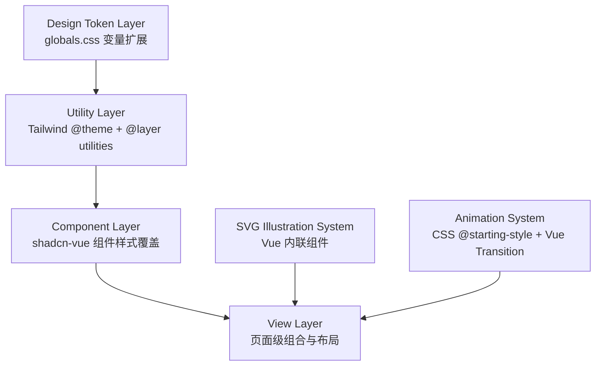

# Design Document

## Overview

本设计文档描述智能实训评价管理系统前端 UI 精致化改造的技术方案。改造目标是将现有功能完整但视觉扁平的后台管理界面，提升到 2025 年现代 B 端 SaaS 产品的设计水准。

核心设计策略：
- **Token-Driven**: 所有视觉增强通过 CSS 变量（Design Token）驱动，确保主题一致性
- **CSS-Only Animation**: 动效仅使用 CSS transitions/animations 和 Vue 内置 Transition，零 JS 运行时开销
- **Progressive Enhancement**: glassmorphism 等高级效果通过 `@supports` 优雅降级
- **Performance Budget**: 无新 JS 依赖，CSS 增量 < 5KB gzip

技术栈约束：Vue 3 + Vite + shadcn-vue + Tailwind CSS v4，不引入 GSAP/Framer Motion/anime.js 等动画库。

## Architecture

### 分层架构



### 文件结构

```
frontend/src/
├── styles/
│   └── globals.css              # 扩展：shadow/glass/gradient tokens
├── components/
│   ├── ui/                      # shadcn-vue 组件（样式覆盖）
│   │   ├── card/                # Card 阴影/hover 升级
│   │   └── button/              # Button 立体感升级
│   ├── illustrations/           # NEW: SVG 插画 Vue 组件
│   │   ├── IllustNoTasks.vue
│   │   ├── IllustNoNotifications.vue
│   │   ├── IllustNoEvaluations.vue
│   │   ├── IllustNoCourses.vue
│   │   └── IllustNoResults.vue
│   ├── business/
│   │   ├── EmptyState.vue       # 升级：支持 illustration prop
│   │   ├── StatCard.vue         # NEW: 带渐变色条 + 动效的统计卡片
│   │   └── AnimatedNumber.vue   # NEW: 纯 CSS 数字滚动组件
│   └── layout/
│       ├── TopNav.vue           # 升级：glassmorphism + 渐变活跃指示
│       └── AppShell.vue         # 升级：背景层次深度
└── views/
    └── LoginView.vue            # 升级：glassmorphism 表单 + 渐变背景
```

### 设计决策

| 决策 | 选择 | 理由 |
|------|------|------|
| 阴影实现 | 多层 box-shadow CSS 变量 | 比 filter: drop-shadow 性能更好，支持 inset |
| 毛玻璃实现 | backdrop-filter + @supports 降级 | 仅用于固定定位的 TopNav，避免滚动性能问题 |
| 入场动效 | CSS @starting-style | 零 JS 开销，浏览器原生支持，已在项目中使用（.anim-in） |
| 数字动画 | requestAnimationFrame + CSS font-variant | 轻量实现，不引入第三方库 |
| SVG 插画 | Vue SFC 内联组件 | 支持 tree-shaking，可引用 CSS 变量实现主题适配 |
| 渐变色条 | CSS linear-gradient + ::before 伪元素 | 不增加 DOM 节点，纯 CSS 实现 |

## Components and Interfaces

### 1. Design Token 扩展（globals.css）

```css
:root {
  /* === Soft Shadows (多层低透明度) === */
  --shadow-sm: 0 1px 2px rgba(0,0,0,0.03), 0 2px 6px rgba(0,0,0,0.04);
  --shadow-md: 0 2px 4px rgba(0,0,0,0.03), 0 4px 12px rgba(0,0,0,0.05), 0 8px 24px rgba(0,0,0,0.04);
  --shadow-lg: 0 4px 8px rgba(0,0,0,0.03), 0 8px 24px rgba(0,0,0,0.05), 0 16px 48px rgba(0,0,0,0.06);
  
  /* === Glassmorphism === */
  --glass-blur: 12px;
  --glass-bg: rgba(255, 255, 255, 0.72);
  --glass-border: rgba(255, 255, 255, 0.2);
  
  /* === Gradients === */
  --gradient-primary: linear-gradient(135deg, hsl(var(--primary)), hsl(213 52% 35%));
  --gradient-accent: linear-gradient(135deg, hsl(var(--accent)), hsl(22 89% 55%));
  --gradient-success: linear-gradient(135deg, hsl(var(--success)), hsl(142 50% 45%));
  --gradient-warning: linear-gradient(135deg, hsl(var(--warning)), hsl(32 80% 50%));
  --gradient-page-bg: radial-gradient(ellipse at 20% 0%, hsl(var(--primary) / 0.03) 0%, transparent 50%);
  
  /* === Transition === */
  --transition-fast: 150ms ease-out;
  --transition-normal: 200ms ease-out;
}

.dark {
  --shadow-sm: 0 1px 2px rgba(0,0,0,0.12), 0 2px 6px rgba(0,0,0,0.15);
  --shadow-md: 0 2px 4px rgba(0,0,0,0.15), 0 4px 12px rgba(0,0,0,0.2), 0 8px 24px rgba(0,0,0,0.15);
  --shadow-lg: 0 4px 8px rgba(0,0,0,0.15), 0 8px 24px rgba(0,0,0,0.2), 0 16px 48px rgba(0,0,0,0.25);
  
  --glass-blur: 12px;
  --glass-bg: rgba(15, 23, 42, 0.75);
  --glass-border: rgba(255, 255, 255, 0.08);
  
  --gradient-primary: linear-gradient(135deg, hsl(var(--primary)), hsl(215 36% 50%));
  --gradient-accent: linear-gradient(135deg, hsl(var(--accent)), hsl(22 70% 50%));
  --gradient-success: linear-gradient(135deg, hsl(var(--success)), hsl(142 40% 45%));
  --gradient-warning: linear-gradient(135deg, hsl(var(--warning)), hsl(32 70% 50%));
  --gradient-page-bg: radial-gradient(ellipse at 20% 0%, hsl(var(--primary) / 0.05) 0%, transparent 50%);
}
```

### 2. StatCard 组件

```typescript
// Props interface
interface StatCardProps {
  label: string
  value: string | number
  icon: Component
  trend?: { direction: 'up' | 'down' | 'neutral'; text: string }
  accentColor?: 'primary' | 'accent' | 'success' | 'warning' | 'danger' | 'info'
  animateValue?: boolean  // 启用数字滚动
  delay?: number          // staggered 入场延迟 (ms)
}
```

StatCard 渲染结构：
- 左侧 4px 渐变色条（`::before` 伪元素，使用 `--gradient-{accentColor}`）
- 入场动效通过 CSS `@starting-style` + `transition-delay` 实现 stagger
- hover 时 `translateY(-2px)` + shadow 从 sm 升级到 md

### 3. AnimatedNumber 组件

```typescript
interface AnimatedNumberProps {
  value: number
  duration?: number  // 默认 700ms (600-800ms 范围)
  format?: (n: number) => string
}
```

实现方式：`requestAnimationFrame` 驱动的纯数字插值，配合 `font-variant-numeric: tabular-nums` 防止布局抖动。不引入第三方库。

### 4. EmptyState 组件升级

```typescript
interface EmptyStateProps {
  illustration?: Component  // SVG 插画 Vue 组件
  icon?: Component          // 降级：无插画时使用图标
  title: string
  description?: string
  action?: { label: string; to?: string; onClick?: () => void }
}
```

### 5. SVG 插画组件规范

每个插画为独立 Vue SFC：
- 使用 `currentColor` 和 CSS 变量（`var(--primary)` 等）引用主题色
- 文件体积 ≤ 8KB（未压缩）
- 不使用外部图片引用（`<image>` 标签）
- 支持 `width`/`height` prop 控制尺寸

### 6. TopNav Glassmorphism 升级

```css
/* TopNav 样式变更 */
header.top-nav {
  background: var(--glass-bg);
  backdrop-filter: blur(var(--glass-blur));
  -webkit-backdrop-filter: blur(var(--glass-blur));
  border-bottom: 1px solid var(--glass-border);
  box-shadow: var(--shadow-sm);
}

/* 降级方案 */
@supports not (backdrop-filter: blur(1px)) {
  header.top-nav {
    background: hsl(var(--card));
  }
}

/* 活跃导航项 */
.nav-item-active {
  background: hsl(var(--primary) / 0.08);
  border-bottom: 2px solid transparent;
  border-image: var(--gradient-primary) 1;
}
```

### 7. AppShell 背景层次

```css
.app-shell-content {
  background-image: var(--gradient-page-bg);
  background-attachment: fixed;
}

/* 装饰性渐变球 */
.app-shell-content::before {
  content: '';
  position: fixed;
  top: -20%;
  right: -10%;
  width: 600px;
  height: 600px;
  border-radius: 50%;
  background: radial-gradient(circle, hsl(var(--accent) / 0.03), transparent 70%);
  pointer-events: none;
  z-index: 0;
}
```

### 8. Button 立体感升级

```css
.btn-primary {
  box-shadow: 
    var(--shadow-sm),
    inset 0 1px 0 rgba(255,255,255,0.12);  /* 顶部高光 */
  transition: all var(--transition-fast);
}

.btn-primary:hover {
  box-shadow: var(--shadow-md), inset 0 1px 0 rgba(255,255,255,0.15);
  filter: brightness(1.05);
}

.btn-primary:active {
  transform: scale(0.97);
  box-shadow: var(--shadow-sm), inset 0 1px 0 rgba(255,255,255,0.08);
  transition-duration: 100ms;
}
```

### 9. 登录页升级

登录页布局：
- 全屏渐变背景（primary 色系径向渐变）
- 左侧/背景：品牌 SVG 插画（学院建筑/代码元素组合）
- 中央：glassmorphism 登录表单卡片
- 暗色模式：渐变色调整为深色系，插画颜色通过 CSS 变量自适应

## Data Models

本特性不涉及数据模型变更。所有改造限于前端视觉层，不影响 API 接口、数据结构或业务逻辑。

涉及的前端数据结构：
- `StatCardProps` — 统计卡片组件 props 接口
- `AnimatedNumberProps` — 数字动画组件 props 接口
- `EmptyStateProps` — 空状态组件 props 接口（扩展 `illustration` 字段）

## Correctness Properties

*A property is a characteristic or behavior that should hold true across all valid executions of a system—essentially, a formal statement about what the system should do. Properties serve as the bridge between human-readable specifications and machine-verifiable correctness guarantees.*

### Property 1: Shadow transparency constraint

*For any* shadow token defined in the Design Token Layer (shadow-sm, shadow-md, shadow-lg), every rgba alpha value within the multi-layer box-shadow definition SHALL not exceed 0.08 in light mode.

**Validates: Requirements 1.1**

### Property 2: Theme token parity

*For any* visual enhancement token (shadow, glassmorphism, gradient) defined in the `:root` scope, a corresponding token with the same name SHALL also be defined in the `.dark` scope.

**Validates: Requirements 1.4, 10.1**

### Property 3: Visual layer distinction

*For any* pair of adjacent visual layer tokens (background → surface → surface-2), the HSL lightness difference between them SHALL be at least 1.5 percentage points, ensuring visible depth separation.

**Validates: Requirements 3.2**

### Property 4: Decorative element opacity constraint

*For any* decorative background element (gradient orbs, noise textures, radial gradients) in the AppShell, its effective opacity SHALL not exceed 0.05.

**Validates: Requirements 3.4**

### Property 5: SVG theme adaptability

*For any* SVG illustration component in the illustrations directory, all fill and stroke color values SHALL reference CSS custom properties (`var(--...)`) or `currentColor`, and SHALL NOT contain hardcoded hex/rgb color values.

**Validates: Requirements 4.3**

### Property 6: SVG file size budget

*For any* SVG illustration component file, its uncompressed source size SHALL not exceed 8KB (8192 bytes).

**Validates: Requirements 4.4**

### Property 7: Interactive element transition consistency

*For any* interactive element (button, link, clickable card) with a hover/active transition, the transition-duration SHALL be between 150ms and 200ms, and the timing function SHALL be `ease-out` or equivalent.

**Validates: Requirements 7.4**

### Property 8: Visual effects use CSS variables

*For any* new visual effect rule (shadow, glassmorphism background, gradient) added by this feature, all color and opacity values SHALL be expressed through CSS custom properties, enabling automatic theme adaptation on variable change.

**Validates: Requirements 10.1**

## Error Handling

本特性为纯视觉改造，错误处理策略聚焦于渐进增强和优雅降级：

### Glassmorphism 降级
- **触发条件**: 浏览器不支持 `backdrop-filter`（如旧版 Firefox < 103）
- **降级方案**: 通过 `@supports not (backdrop-filter: blur(1px))` 回退到纯色 `hsl(var(--card))` 背景
- **用户影响**: 导航栏失去毛玻璃透视效果，但功能和可读性不受影响

### CSS @starting-style 降级
- **触发条件**: 浏览器不支持 `@starting-style`（Safari < 17.5）
- **降级方案**: 元素直接以最终状态渲染，无入场动效
- **用户影响**: 失去 staggered 入场动画，但内容正常显示

### SVG 插画加载失败
- **触发条件**: 组件 tree-shaking 异常或动态导入失败
- **降级方案**: EmptyState 组件在无 `illustration` prop 时回退到 `icon` prop 渲染
- **用户影响**: 显示简单图标替代精致插画

### 暗色模式变量缺失
- **触发条件**: 新增 token 未在 `.dark` 作用域定义
- **防护措施**: Property 2（Theme token parity）在 CI 中验证
- **降级方案**: CSS 变量继承 `:root` 值（可能视觉不协调但不崩溃）

### 性能超标
- **触发条件**: CSS 增量超过 5KB gzip 或 LCP 增量超过 100ms
- **防护措施**: CI pipeline 中集成 gzip 大小检查和 Lighthouse CI
- **应对方案**: 移除低优先级装饰效果（如背景渐变球）

## Testing Strategy

### 测试分层

| 层级 | 工具 | 覆盖范围 |
|------|------|----------|
| Token 验证 | Vitest + CSS 解析 | 阴影透明度、主题对称性、变量引用 |
| 组件渲染 | Vitest + @vue/test-utils | StatCard/EmptyState/AnimatedNumber 渲染正确性 |
| SVG 合规 | Vitest + fs 检查 | 文件大小、颜色引用方式 |
| 视觉回归 | 手动对比 / Playwright screenshot | 整体视觉效果 |
| 性能预算 | Vite build + gzip 检查 | CSS 增量 < 5KB |
| 浏览器兼容 | @supports 降级验证 | glassmorphism/starting-style 降级 |

### Property-Based Testing

使用 **fast-check** 库（已在 Vitest 生态中广泛使用）进行属性测试。

**配置要求**:
- 每个 property test 最少运行 100 次迭代
- 每个 test 通过注释标注对应的 design property

**Tag 格式**: `Feature: ui-polish-refinement, Property {number}: {property_text}`

### 单元测试（Example-Based）

覆盖以下场景：
- Card 组件默认渲染包含 shadow-sm 类
- Card hover 状态应用 shadow-md
- StatCard 渲染渐变色条
- EmptyState 接受 illustration prop 并渲染
- TopNav glassmorphism 类应用
- TopNav @supports 降级规则存在
- AnimatedNumber 在 600-800ms 内完成动画
- Button primary 包含 inset shadow
- 登录页包含 glassmorphism 表单卡片
- 主题切换 transition-duration 为 200ms

### 性能测试（Smoke）

- `npm run build` 后检查 CSS 产物 gzip 大小增量
- 验证 package.json 未新增运行时动画依赖
- 验证 SVG 插画以 Vue 组件形式存在（支持 tree-shaking）

### 集成测试

- Lighthouse CI 验证 LCP 增量 ≤ 100ms
- 跨浏览器验证 glassmorphism 降级行为
