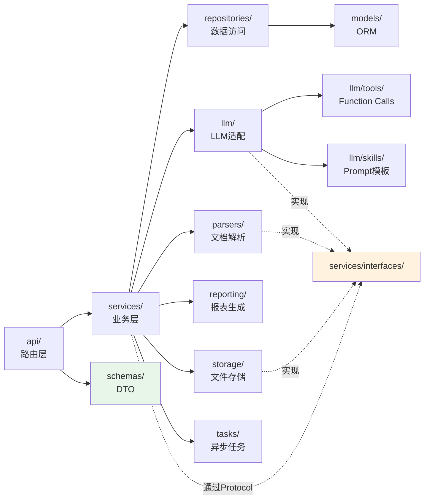

# 03 项目结构树

## 完整目录

```
training-evaluation-system/
├── backend/                          # 后端服务（Python）
│   ├── app/
│   │   ├── main.py                   # FastAPI 应用入口、生命周期管理、路由注册
│   │   ├── core/                     # 框架级基础设施
│   │   │   ├── config.py             # pydantic-settings 配置类（部署级）
│   │   │   ├── system_config.py      # DB 驱动的运行时业务配置（热更新）
│   │   │   ├── security.py           # JWT 编解码、密码哈希
│   │   │   ├── deps.py               # FastAPI 依赖项工厂（DB session/当前用户/权限）
│   │   │   ├── logging.py            # structlog 配置、trace_id 上下文
│   │   │   ├── exceptions.py         # 业务异常类层级
│   │   │   ├── middleware.py         # 全局中间件（CORS/trace_id/审计/限流）
│   │   │   ├── crypto.py             # AES-256 加密 API Key 等敏感字段
│   │   │   └── lock.py               # Redis 分布式锁封装
│   │   ├── api/                      # HTTP 路由层（仅做参数校验+服务调用+响应组装）
│   │   │   ├── __init__.py           # APIRouter 聚合
│   │   │   ├── auth.py               # /api/auth/* 登录、登出、刷新
│   │   │   ├── users.py              # /api/users/* 用户 CRUD
│   │   │   ├── orgs.py               # /api/courses /api/classes
│   │   │   ├── tasks.py              # /api/tasks/* 实训任务
│   │   │   ├── templates.py          # /api/templates/* 评价模板
│   │   │   ├── uploads.py            # /api/uploads/* 含断点续传
│   │   │   ├── evaluations.py        # /api/evaluations/* 含批量操作
│   │   │   ├── reports.py            # /api/reports/* PDF/Excel 导出
│   │   │   ├── profiles.py           # /api/profiles/* 薄弱点/教学画像
│   │   │   ├── similarity.py         # /api/similarity/*
│   │   │   ├── notifications.py      # /api/notifications/*
│   │   │   ├── chat.py               # /api/chat/* AI 问答
│   │   │   ├── audit.py              # /api/audit/*
│   │   │   ├── dashboard.py          # /api/dashboard
│   │   │   ├── imports.py            # /api/imports/*
│   │   │   ├── llm_config.py         # /api/llm/* 模型配置
│   │   │   ├── websockets.py         # /ws/* progress, notify, chat
│   │   │   └── _dev.py               # /api/_dev/* 仅 dev 启用的调试端点
│   │   ├── schemas/                  # Pydantic v2 数据传输对象（DTO）
│   │   │   ├── auth.py
│   │   │   ├── user.py
│   │   │   ├── org.py
│   │   │   ├── task.py
│   │   │   ├── upload.py
│   │   │   ├── evaluation.py
│   │   │   ├── report.py
│   │   │   ├── profile.py
│   │   │   ├── similarity.py
│   │   │   ├── notification.py
│   │   │   ├── chat.py
│   │   │   ├── audit.py
│   │   │   ├── dashboard.py
│   │   │   ├── llm.py
│   │   │   └── common.py             # PageQuery, PageResponse, ErrorResponse
│   │   ├── models/                   # SQLAlchemy 2.0 ORM 模型（typed Mapped）
│   │   │   ├── base.py               # DeclarativeBase + 公共字段（id/timestamps）
│   │   │   ├── user.py
│   │   │   ├── org.py                # Course, Class, ClassMembership
│   │   │   ├── task.py               # TrainingTask, Dimension
│   │   │   ├── template.py           # EvaluationTemplate, TemplateDimension
│   │   │   ├── upload.py             # Upload, ParseResult, VerifyResult
│   │   │   ├── evaluation.py         # Evaluation, DimensionScore, History
│   │   │   ├── similarity.py         # SimilarityRecord
│   │   │   ├── profile.py            # StudentProfile
│   │   │   ├── notification.py
│   │   │   ├── chat.py               # ChatSession, ChatMessage
│   │   │   ├── audit.py              # AuditLog
│   │   │   └── import_job.py         # ImportJob, ImportRecord
│   │   ├── repositories/             # 数据访问层（每个 model 一个 repo）
│   │   │   ├── base.py               # 通用 CRUD 基类（泛型）
│   │   │   ├── user_repo.py
│   │   │   ├── task_repo.py
│   │   │   ├── upload_repo.py
│   │   │   ├── evaluation_repo.py
│   │   │   ├── ...
│   │   │   └── audit_repo.py
│   │   ├── services/                 # 业务服务层（核心业务逻辑）
│   │   │   ├── auth_service.py
│   │   │   ├── user_service.py
│   │   │   ├── org_service.py
│   │   │   ├── task_service.py
│   │   │   ├── template_service.py
│   │   │   ├── upload_service.py
│   │   │   ├── parse_engine.py       # 解析引擎主流程
│   │   │   ├── verify_engine.py      # 核查引擎主流程
│   │   │   ├── evaluation_service.py # 评分计算（纯函数 + 调用 LLM）
│   │   │   ├── similarity_service.py # SimHash + pgvector 余弦
│   │   │   ├── profile_service.py    # 薄弱点 + 教学画像
│   │   │   ├── report_service.py     # PDF/Excel 生成
│   │   │   ├── notification_service.py
│   │   │   ├── chat_service.py       # AI 问答 + Function Calling 编排
│   │   │   ├── audit_service.py
│   │   │   ├── dashboard_service.py
│   │   │   ├── import_service.py
│   │   │   └── interfaces/           # 服务层 Protocol（解耦用）
│   │   │       ├── llm_provider.py   # LLMProvider Protocol
│   │   │       ├── ocr_engine.py     # OcrEngine Protocol
│   │   │       └── storage.py        # FileStorage Protocol
│   │   ├── llm/                      # LLM 抽象适配器
│   │   │   ├── base.py               # LLMProvider ABC + 数据模型
│   │   │   ├── openai_compat.py      # OpenAI 协议实现
│   │   │   ├── factory.py            # LLMFactory 单例工厂
│   │   │   ├── retry.py              # 指数退避 + 熔断器
│   │   │   ├── metrics.py            # 装饰器：耗时/tokens 记录
│   │   │   ├── tools/                # Function Calling 工具注册表
│   │   │   │   ├── registry.py       # ToolRegistry 单例
│   │   │   │   ├── base.py           # Tool ABC + 输入/输出 schema
│   │   │   │   ├── chat_tools.py     # 问答场景工具集
│   │   │   │   └── verify_tools.py   # 核查场景工具集（可选）
│   │   │   └── skills/               # LLM Skill 库（提示词模板）
│   │   │       ├── registry.py       # SkillRegistry 单例
│   │   │       ├── base.py           # Skill ABC + 输入/输出 schema
│   │   │       ├── parse/            # 解析类
│   │   │       │   ├── docx_to_structure.py
│   │   │       │   ├── pdf_to_structure.py
│   │   │       │   └── image_to_text.py
│   │   │       ├── verify/           # 核查类
│   │   │       │   ├── coverage_check.py
│   │   │       │   └── logic_audit.py
│   │   │       ├── score/            # 评分类
│   │   │       │   └── dimension_score.py
│   │   │       ├── profile/          # 画像类
│   │   │       │   ├── weakness_analyze.py
│   │   │       │   ├── learning_advice.py
│   │   │       │   └── teaching_summary.py
│   │   │       └── chat/             # 问答类
│   │   │           └── student_qa.py
│   │   ├── tasks/                    # Celery 异步任务
│   │   │   ├── celery_app.py         # Celery 实例 + 配置
│   │   │   ├── parse_tasks.py
│   │   │   ├── verify_tasks.py
│   │   │   ├── evaluate_tasks.py
│   │   │   ├── similarity_tasks.py
│   │   │   ├── profile_tasks.py
│   │   │   ├── notification_tasks.py
│   │   │   ├── deadline_reminder.py
│   │   │   ├── backup_tasks.py
│   │   │   └── matview_refresh.py    # 物化视图刷新
│   │   ├── parsers/                  # 文档解析器（非 LLM 部分）
│   │   │   ├── base.py               # Parser Protocol
│   │   │   ├── docx_parser.py        # python-docx
│   │   │   ├── pdf_parser.py         # PyMuPDF
│   │   │   └── ocr_parser.py         # Tesseract 包装
│   │   ├── reporting/                # 报表生成
│   │   │   ├── pdf_renderer.py       # WeasyPrint
│   │   │   ├── excel_renderer.py     # openpyxl
│   │   │   └── chart_renderer.py     # matplotlib（图嵌入 PDF/Excel）
│   │   ├── storage/                  # 文件存储抽象
│   │   │   ├── base.py               # FileStorage Protocol
│   │   │   └── local_fs.py           # 本地文件系统实现
│   │   └── utils/
│   │       ├── pagination.py
│   │       ├── trace.py              # trace_id 工具
│   │       ├── magic_check.py        # 文件头校验
│   │       └── time.py
│   ├── alembic/                      # 数据库迁移
│   │   ├── env.py
│   │   └── versions/
│   ├── cli/                          # 管理 CLI（典型脚本）
│   │   ├── main.py                   # typer App
│   │   ├── commands/
│   │   │   ├── seed.py               # tes-cli seed → 注入示例数据
│   │   │   ├── simulate.py           # tes-cli simulate-evaluation → 端到端演练
│   │   │   ├── reindex.py            # tes-cli rebuild-embeddings
│   │   │   └── audit_archive.py      # tes-cli archive-audit-logs
│   ├── tests/                        # 测试代码（与 app/ 平行）
│   │   ├── conftest.py               # 共用 fixture
│   │   ├── unit/                     # 单元测试（无 IO，纯逻辑）
│   │   │   ├── test_evaluation_calc.py
│   │   │   ├── test_weight_validator.py
│   │   │   ├── test_simhash.py
│   │   │   └── test_skills_render.py
│   │   ├── integration/              # 集成测试（含 DB/Redis）
│   │   │   ├── test_upload_flow.py
│   │   │   ├── test_evaluation_flow.py
│   │   │   ├── test_chat_function_calling.py
│   │   │   └── test_similarity_flow.py
│   │   ├── contract/                 # 契约测试（API schema）
│   │   │   └── test_openapi_schema.py
│   │   ├── e2e/                      # 端到端（黑盒）
│   │   │   └── test_happy_path.py
│   │   └── fakes/                    # 测试替身
│   │       ├── fake_llm.py           # 实现 LLMProvider，不调网络
│   │       ├── fake_ocr.py
│   │       └── fake_storage.py
│   ├── pyproject.toml                # 依赖、ruff、mypy、pytest 配置
│   ├── alembic.ini
│   └── .env.example
├── frontend/                         # 前端（Vue 3 + shadcn-vue + Tailwind CSS）
│   ├── src/
│   │   ├── main.ts                   # Vue 应用入口
│   │   ├── App.vue
│   │   ├── api/                      # 由 OpenAPI 自动生成的 client
│   │   │   ├── generated/            # openapi-typescript-codegen 输出
│   │   │   └── client.ts             # axios 实例 + 拦截器
│   │   ├── views/                    # 页面（路由对应）
│   │   │   ├── auth/
│   │   │   ├── admin/
│   │   │   ├── teacher/
│   │   │   ├── student/
│   │   │   └── shared/               # 跨角色共用页面
│   │   ├── components/
│   │   │   ├── ui/                   # shadcn-vue 拷贝进来的组件源码（可改）
│   │   │   │   ├── button/
│   │   │   │   ├── card/
│   │   │   │   ├── dialog/
│   │   │   │   ├── table/
│   │   │   │   ├── tabs/
│   │   │   │   ├── select/
│   │   │   │   ├── toast/
│   │   │   │   └── ...
│   │   │   ├── business/             # 业务组件（基于 ui/ 组合）
│   │   │   │   ├── FileUploader.vue  # filepond-vue 包装
│   │   │   │   ├── DataTable.vue     # TanStack Table + shadcn 表格样式
│   │   │   │   ├── ChartRadar.vue    # ECharts 雷达图
│   │   │   │   ├── ChartBar.vue
│   │   │   │   ├── ChartLine.vue
│   │   │   │   ├── ChartHeatmap.vue
│   │   │   │   ├── NotificationCenter.vue
│   │   │   │   ├── ChatDialog.vue    # AI 问答对话框（流式）
│   │   │   │   ├── ThemeToggle.vue   # 浅色/深色切换
│   │   │   │   └── BreadcrumbNav.vue
│   │   │   └── layout/
│   │   │       ├── AppShell.vue      # 总布局（侧栏+顶栏+主区）
│   │   │       ├── Sidebar.vue
│   │   │       └── TopBar.vue
│   │   ├── composables/              # Vue 组合式函数
│   │   │   ├── useAuth.ts
│   │   │   ├── useNotification.ts
│   │   │   ├── useWebSocket.ts
│   │   │   └── useTheme.ts
│   │   ├── stores/                   # Pinia
│   │   │   ├── auth.ts
│   │   │   ├── user.ts
│   │   │   ├── notification.ts
│   │   │   └── theme.ts
│   │   ├── router/                   # Vue Router 4
│   │   │   ├── index.ts
│   │   │   └── guards.ts             # 角色路由守卫
│   │   ├── lib/                      # 通用工具
│   │   │   ├── utils.ts              # cn() 函数（tailwind-merge 包装，shadcn 标配）
│   │   │   ├── date.ts
│   │   │   └── format.ts
│   │   ├── locales/                  # i18n（中文为主）
│   │   ├── styles/
│   │   │   ├── globals.css           # Tailwind 入口 + 全局变量
│   │   │   └── themes.css            # 浅色/深色主题色变量
│   │   └── types/                    # TS 类型
│   ├── tests/                        # Vitest 单元 + Playwright e2e
│   ├── components.json               # shadcn-vue 配置
│   ├── tailwind.config.ts            # Tailwind 配置
│   ├── postcss.config.js
│   ├── tsconfig.json
│   ├── package.json
│   └── vite.config.ts
├── deploy/                           # 部署脚本与配置
│   ├── install.sh
│   ├── systemd/
│   ├── nginx/
│   ├── postgres/
│   └── env/
│       └── .env.example
├── docs/                             # 设计与运维文档
│   ├── handbook/                     # 本手册
│   ├── adr/                          # Architecture Decision Records
│   ├── api-contract.md
│   └── operations.md
├── .kiro/specs/                      # 主规约
└── README.md
```

## 模块依赖图



## 依赖方向规则

- 上层（api/services）→ 下层（repositories/models），不允许反向
- service 之间通过 Protocol 接口或事件总线通信，不直接 import
- llm/parsers/storage 通过 `services/interfaces/` 中的 Protocol 暴露给 services，方便测试时替换

## 新增功能时的目录决策树

| 想做什么 | 应该改哪里 |
|---------|-----------|
| 加一个 HTTP 端点 | api/ + schemas/ + services/ |
| 加一个数据表 | models/ + alembic 迁移 + repositories/ |
| 加一个 LLM 调用场景 | llm/skills/{category}/ + 在 services 中调用 |
| 加一个 AI 问答工具 | llm/tools/chat_tools.py + 在 chat_service.py 注册 |
| 加一个异步任务 | tasks/ + 在 services 中 enqueue |
| 加一个全局配置项 | core/config.py（部署级）或 system_config 表（业务级） |
| 加一个测试 | tests/{unit\|integration\|contract\|e2e}/ |
| 加一个 CLI 命令 | cli/commands/ |
| 加一个前端页面 | frontend/src/views/{role}/ + router 注册 |
| 加一个 shadcn 基础组件 | `npx shadcn-vue add <name>` 自动拷贝到 components/ui/ |
| 加一个业务组件 | components/business/（用 ui/ 组合） |
| 加一个 Pinia store | stores/ |
| 加一个组合式函数 | composables/ |
