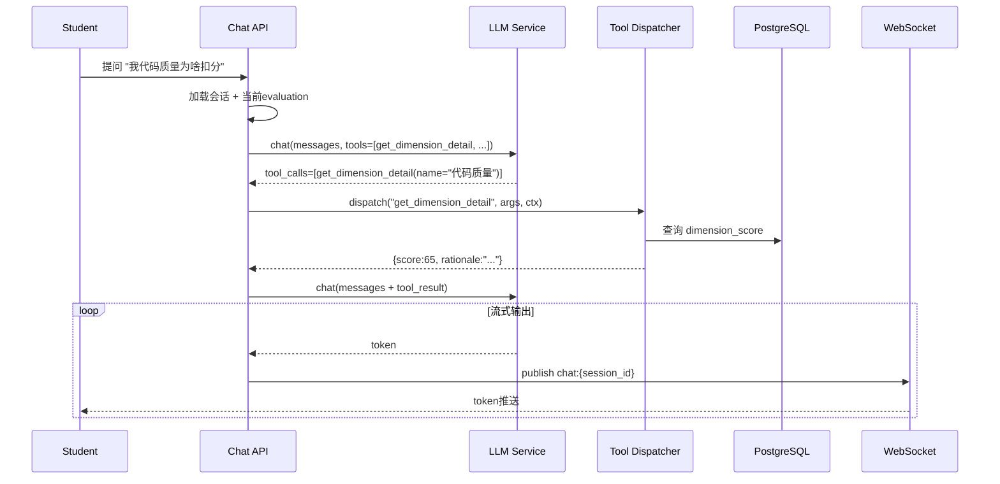

# 07 Function Calling 工具注册表

针对**多轮交互场景**（特别是 AI 问答助手，需求22），单纯的 prompt 注入会导致上下文膨胀且无法实时取数。系统采用 OpenAI Function Calling 协议（所有目标 LLM 厂商均已支持），让 LLM 在多轮对话中按需调用业务工具。

## Tool 抽象定义

```python
# app/llm/tools/base.py
class Tool(ABC, Generic[InputT, OutputT]):
    name: str                    # 必须符合 ^[a-z_][a-z0-9_]*$
    description: str             # 给 LLM 看的工具用途说明
    input_schema: type[InputT]   # 自动转换为 OpenAI tools schema
    output_schema: type[OutputT]
    requires_role: list[str]     # 仅这些角色可触发此工具
    
    @abstractmethod
    async def invoke(self, input_: InputT, ctx: ToolContext) -> OutputT:
        """ctx 提供当前用户、DB session、trace_id 等"""
        ...
```

`ToolContext` 内含调用方上下文，**禁止 Tool 内部直接读取全局状态**，所有依赖通过 ctx 注入。

## Tool 注册中心

```python
# app/llm/tools/registry.py
class ToolRegistry:
    _tools: dict[str, Tool] = {}
    
    @classmethod
    def register(cls, tool: Tool) -> None: ...
    
    @classmethod
    def to_openai_schema(cls, tool_names: list[str]) -> list[dict]:
        """生成 OpenAI tools 数组用于 chat.completions"""
        ...
    
    @classmethod
    async def dispatch(cls, name: str, args: dict, ctx: ToolContext) -> dict:
        """LLM 返回 tool_calls 时由编排器调用此方法分派"""
        ...
```

## AI 问答场景工具集

| 工具名 | 描述 | 输入 | 输出 |
|--------|------|------|------|
| `get_parse_segment` | 查询当前评价对应实训成果中某主题的原文片段 | topic: str, max_chars: int=500 | segments: list[Segment] |
| `get_dimension_detail` | 查询当前评价某维度的详细评分依据与扣分项 | dimension_name: str | rationale, score, deductions |
| `get_class_statistics` | 查询当前任务在班级范围内的统计（不暴露他人姓名）| dimension: str \| None | mean, median, p75, distribution |
| `get_dimension_history` | 查询学生该维度在过往任务中的得分轨迹 | dimension_name: str, limit: int=10 | scores: list[ScorePoint] |
| `get_excellent_sample_summary` | 获取该任务下匿名化的高分样例摘要 | top_n: int=1 | summaries: list[Summary] |
| `get_weakness_list` | 获取学生当前已识别的薄弱点列表 | - | weaknesses: list[Weakness] |
| `get_learning_resources` | 根据知识点关键词推荐学习资源 | keyword: str | resources: list[Resource] |

权限规则：所有工具的 `requires_role=["student"]`，且工具实现内部 hard check 学生身份与 evaluation 归属，防止越权（Property 7）。

## 调用流程



## 工具调用安全护栏

- **工具调用次数上限**：单条用户提问最多触发 5 次工具调用，超过则强制 LLM 总结作答（防止死循环）
- **工具结果大小上限**：每次工具返回 ≤ 8KB，超出截断并日志告警（防止上下文爆炸）
- **审计**：每次工具调用作为独立 audit 事件落库（who/when/tool/args/result_summary）
- **黑名单工具**：管理员可在 `system_config` 中临时禁用某工具，运行时生效

## Chat Service 编排循环

```python
# app/services/chat_service.py 简化逻辑
async def answer(session: ChatSession, user_msg: str, ctx: ToolContext):
    skill = SkillRegistry.get("chat.student_qa", "1.0.0")
    history = await self.repo.list_messages(session.id, limit=20)
    messages = skill.render_prompt(SkillInput(history=history, user_msg=user_msg))
    
    for round_idx in range(MAX_TOOL_ROUNDS := 5):
        resp = await llm.chat_with_tools(messages, tools=skill.openai_tools_schema())
        if resp.finish_reason == "stop":
            yield resp.content   # 最终回答，开始流式输出
            return
        for call in resp.tool_calls:
            result = await ToolRegistry.dispatch(call.name, call.arguments, ctx)
            messages.append(LLMMessage(role="tool", content=json.dumps(result)))
    
    # 工具循环达到上限仍未给出答案，强制总结
    messages.append(LLMMessage(role="user", content="请基于已有信息直接给出回答"))
    final = await llm.chat_stream(messages)
    async for token in final:
        yield token
```

## 添加新工具的步骤

1. 在 `app/llm/tools/` 下新建工具类继承 `Tool`，定义 `name / description / input_schema / output_schema / requires_role / invoke`
2. 在工具集模块（如 `chat_tools.py`）中调用 `ToolRegistry.register(YourTool())`
3. 在对应 Skill 的 `tools` 列表中加入新工具
4. 在 `tests/integration/test_chat_function_calling.py` 中加测试用例
5. 工具的所有外部访问通过 `ctx` 注入的 repository，禁止 Tool 内部直接 import 业务 service

## Function Calling 与传统 RAG 的对比

| 维度 | Function Calling（本项目） | 传统 RAG |
|------|--------------------------|----------|
| 数据源 | 结构化 DB 直接查询 | 向量检索拼上下文 |
| 准确性 | 高（精确字段匹配） | 一般（可能 retrieval 错位） |
| 时效性 | 实时（每次调用查最新） | 取决于索引更新频率 |
| 上下文长度 | 按需取，可控 | 容易塞满 |
| 适用场景 | 数据已结构化的业务 | 文档问答、知识库 |

本项目所有数据已结构化在 PostgreSQL 中，因此 Function Calling 是更优选择。
